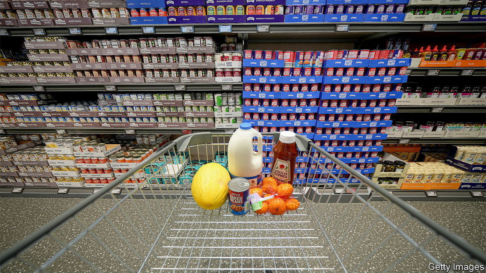
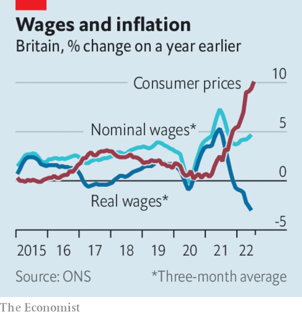

###### The world this week

# Business 

#####  

 

> Aug 18th 2022 

 


Britain’s annual  rate, as measured by the consumer-price index, jumped to 10.1% in July, the first time the country has hit double-digit inflation since 1982. Higher energy costs were the main factor behind rising prices, but transport and food also added to the squeeze on household bills. Calls to freeze the price cap on domestic energy are growing louder. An average household is expected to see its annual bill double to over £4,300 ($5,200) by January. On account of the cost-of-living crunch, real  fell by 3% between April and June, the most since records began in 2001. 

 was moribund in the second quarter, shrinking by 0.1% over the previous three months. Workers were given an extra day off in June to celebrate the queen’s jubilee, though the number-crunchers said that had little impact on growth.   expanded by 0.5% in the quarter, having registered zero growth at the start of year. The country’s economy is now back to its pre-pandemic size. 

Markets breathed a sigh of relief when  published a solid set of quarterly earnings. In July the retailer issued its second profit warning of the year, but revenue was up sharply in the latest quarter, reflecting the stiffer price of the average shopping basket. Walmart said customer behaviour had changed, with lower-income shoppers buying more canned meat and less deli produce, and that it was seeing more higher-income consumers in its shops.  reported a similar story, as it chalked up its highest-ever sales in a quarter. 

Prices of  surged again in Europe, amid more jitters about the reliability of Russian supplies, problems with gas-carrying barges navigating the Rhine and traders trying to shore up gas stocks ahead of the winter. Dutch front-month futures rose to €226 ($230) a megawatt-hour, close to the price in early March and ten times above the seasonal average. Natural-gas prices also rose sharply in America. Underground stockpiles have fallen there as power generators tap the gas to produce more electricity during the hot summer. 

, Germany’s biggest distributor of gas, reported a €12.3bn ($12.5bn) loss for the first half of the year. The company is getting only 40% of the Russian gas it has contracted for, and must turn to spot markets, where prices are higher, to cover the shortfall. 

A kingdom’s ransom

 reported another record quarterly profit. Saudi Arabia’s state oil company saw net income rise by 90%, year on year, to $48.4bn. That’s almost as much as the combined headline profits of bp, Chevron, ExxonMobil and Shell in the second quarter. Joe Biden and other world leaders have pleaded with the Saudis to raise oil production by a significant amount to reduce prices, which the Saudis have little intention of doing while they reap such huge rewards. 

The  reduced its medium-term lending rate slightly to 2.75%. The cut was unexpected and followed the release of disappointing retail sales and manufacturing data. Meanwhile, stocks in  companies surged amid reports that the government was planning to support the country’s stricken developers with a plan that would enable them to refinance their debt by ordering state organisations to underwrite their new bonds. 

 reported its first year-on-year quarterly decline in revenue. The Chinese tech giant has been ensnared in the government’s clampdown on big tech and has yet to receive a licence this year for any of its new video games, a big part of its business. The company is said to be hoping to sell all or part of its $24bn stake in Meituan, a food-delivery group.

Apple has reportedly told employees at its headquarters that they must at least three days a week from September 5th. The company has tried before to get staff back, only to have its plans upended by new covid outbreaks. Apple’s approach is stricter than that of its Silicon Valley peers. One senior executive has already left for Alphabet, apparently because of Apple’s lack of flexibility in its policy. 

Breaking the sound barrier

Flight times from New York to London could be cut to three and a half hours and from Los Angeles to Sydney to under seven hours when jets are rolled out for passengers in 2029. American Airlines this week placed an order for 20 of the aircraft, which can reach speeds of Mach 1.7 (Concorde’s cruising speed was just over Mach 2). United Airlines ordered 15 last year. It’s a big bet that the planes will take off. Boom is still in discussion with Rolls-Royce about the engines. 

The time saved flying in a supersonic jet will probably be spent waiting for your luggage at an airport.  has extended its cap of 100,000 passengers a day until October 29th because of a shortage of baggage handlers. 

