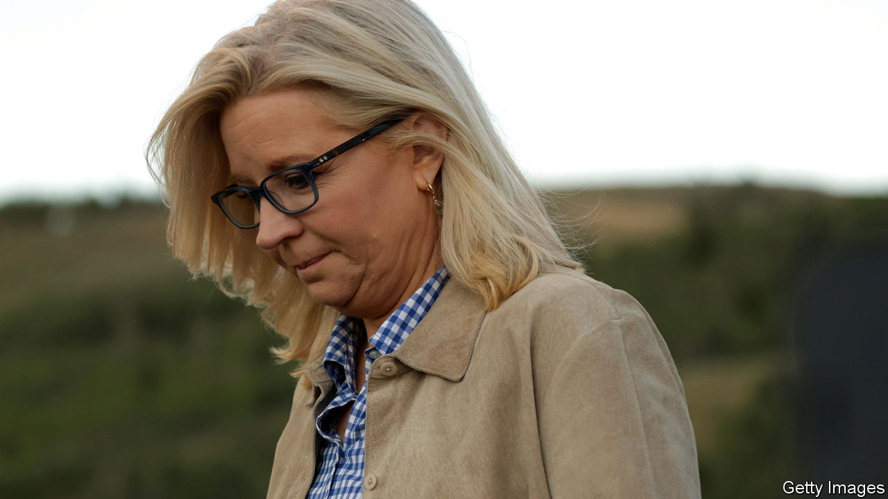
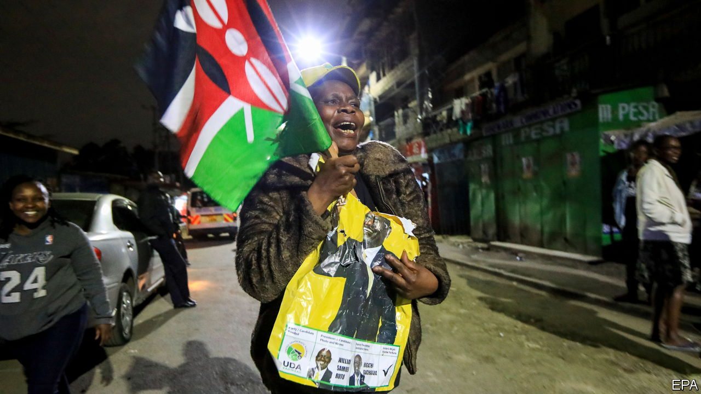

###### The world this week

# Politics 

#####  

 

> Aug 18th 2022 

 lost her battle to stay in Congress as Wyoming’s representative in the House, when Republicans in the state voted heavily against her in a party primary. Ms Cheney is one of the few outspoken Republican critics of Donald Trump, warning of the damage to democracy from his lies about a “stolen” election. Mr Trump made it his mission to kick Ms Cheney out after she supported his impeachment in 2021. The winner of the primary, Harriet Hageman, is a former Never Trumper who now thinks he is the best president of her lifetime. 

In Alaska’s primary election, was one of the candidates to make it through to November’s mid-terms, where they will vie for the state’s single congressional seat in the House. Ms Palin, John McCain’s running-mate in the election of 2008, is backed by Mr Trump. 

Republicans continued to push for the publication of the affidavit that sets out the case behind the fbi’s search of  home in Florida. The government argues that releasing the affidavit would compromise its investigation, as it could stop witnesses from co-operating. fbi agents removed various sets of documents from Mar-a-Lago, including papers marked “classified” and “top secret”. 

 attacked another Russian ammunition depot in Crimea, the latest in a series of assaults far behind Russia’s front lines. Both sides blamed each other for heavy shelling near the Zaporizhia nuclear plant in southern Ukraine. The United Nations has called for a demilitarised zone in the area to avert a nuclear disaster. 

Finland decided to reduce the number of visas it issues to Russians to a tenth of the current total in order to  using Helsinki airport as a gateway to European holiday spots. Ukraine wants the eu to ban Russian tourists altogether, as an extra means to press the Russian government to reverse the invasion of Ukraine. 

 conducted fresh military drills around  as the island’s president met members of an American congressional delegation. The drills were not as big as those held by China earlier this month after Nancy Pelosi, the speaker of America’s House of Representatives, visited Taiwan, which China claims. Meanwhile, China said its forces would take part in joint military exercises to be hosted by  at the end of August. Other countries, including Belarus and India, will also take part. 

The front line of free speech

 was reported to be “feisty” and “defiant” following surgery for injuries he sustained after being stabbed multiple times at an event in Chautauqua, a town in western New York. In 1989 Ayatollah Khomeini, Iran’s leader at the time, called on Muslims to kill Sir Salman for writing “The Satanic Verses”, a book the Shia cleric considered blasphemous. Iranian media described the assault on Sir Salman as “divine retribution”. America said such gloating was “despicable”. Sales of “The Satanic Verses” soared. 

 sounded hopeful that a deal to curtail its nuclear programme, which was first agreed in 2015 but later renounced by America, could be revived using new proposals put forward by the European Union. But Western diplomats expressed concern that Iran is dragging out the talks to avoid further repercussions. 

For the first time since the Communist revolution in 1959, the  said it would allow foreign investors to participate fully in wholesale retailing, and would “selectively” encourage foreigners to invest in ordinary retailing, as long as they comply with socialist aims. Cubans endure long queues for basic goods when they use the state-owned shops. The government hopes foreign investment will ease shortages. 

Thousands of federal troops were sent to border cities in northern , after a drug cartel threatened to attack residents if they did not stay home amid a feud sparked by the attempted arrest of one of its leaders. Tijuana practically shut down for two days. 

 


William Ruto, the deputy president who ran as the anti-establishment candidate and champion of the poor, was declared the winner of  by a narrow margin, defeating Raila Odinga, who disputes the result. Four of the seven election commissioners also disavowed the result, but gave scant justification for doing so. Uhuru Kenyatta, the outgoing president, is the third head of state in a row to honour term limits. 

Scott Morrison,  prime minister until he lost an election in May, came under pressure to resign from parliament, following revelations that he had secretly appointed himself co-minister of finance, health, home affairs, resources and treasury during the first year of the pandemic. Mr Morrison says he never used most of the powers he gained by the manoeuvre, but the current prime minister, Anthony Albanese, labelled it “tin-pot activity”. 

A court in added another six years to the various prison sentences imposed on Aung San Suu Kyi, the country’s leader until a military coup last year. That brings her total sentence to 17 years, which she is serving in solitary confinement. 

 conducted its first missile tests since early June. The tests came as prepared for its first big military exercises with America since 2017. America suspended such drills to show goodwill in talks with the North which ended in 2019. 

Yoon Suk-yeol, South Korea’s president, granted a  to Lee Jae-yong, Samsung’s de facto boss, for corruption, clearing the way for him to rejoin its board. Mr Lee was jailed for 18 months before being released on parole for his part in a bribery scandal that led to the downfall of Park Geun-hye as president in 2017. His pardon is a big blow for anti-graft campaigners. 

Two policemen who were guarding  vaccinators in north-west Pakistan were shot dead. Islamic militants routinely kill polio workers, whom they suspect of providing cover for some sort of anti-Muslim plot. 

“Sake Viva!”

In a novel approach to increase its tax take, the  backed a campaign to encourage Japan’s younger generations to drink more. People aged 20 to 39, a sober bunch by comparison with their forebears, have also been invited to come up with ideas for how to boost the drinks industry. The health ministry said it had not co-operated in the campaign. 

