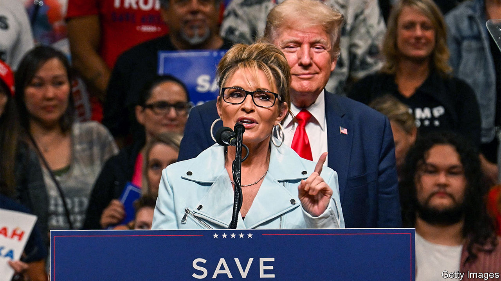

###### Alaska’s choice

# A new ranked-choice voting system hampers Sarah Palin’s hopes 

##### What happens when second preferences come into play 

 

> Aug 18th 2022 

There are few parts of America where the migration of salmon is a political issue. Alaska is one of them. On August 16th voters in America’s largest, wildest state went to the polls to elect their sole member of the House of Representatives, a seat vacant since the death of Don Young in March. Mary Peltola, the Democratic candidate, a fisheries manager, describes herself as the only politician “willing to fight back against the foreign and out-of-state trawlers that are decimating our king salmon”.

Ms Peltola’s chances, in what has been a reliable state for Republicans, have been improved by Alaska’s ranked-choice voting system, introduced by a referendum two years ago. Her Republican opponents are Sarah Palin, a former governor and vice-presidential candidate, and Nick Begich, a relative moderate from an Alaskan political dynasty. Mr Begich has called Ms Palin “self-aggrandising” and “uninformed”, accusing her of abandoning Alaska to “get rich and famous”. Ms Palin, who is backed by Donald Trump and the state party, has called him “Republican in name only”.

Such vitriol between the Republicans may weaken the party. Whoever comes third will have their second preferences redistributed to the remaining two. Ms Peltola will be hoping that she can sneak through if Mr Begich’s supporters give her their second preference over Ms Palin, says Amy Lovecraft of the University of Alaska. Predicting the outcome is hard. Such a system exists for congressional elections in only one other state, Maine, which first used it in 2020.

The new system, and the time it takes to collect absentee ballots, mean that the results may not be known for weeks. Whoever wins will not have long to settle in Washington. On the back of the ranked-choice ballot paper, voters also had one vote in a primary to pick who will make the final four when the seat is fought for again in November. The Begich-Palin-Peltola trio all made it through. So too, in the Senate primary, did Lisa Murkowski—one of seven Republican senators who voted to convict Mr Trump last year, and thus a prime Trump target.■


