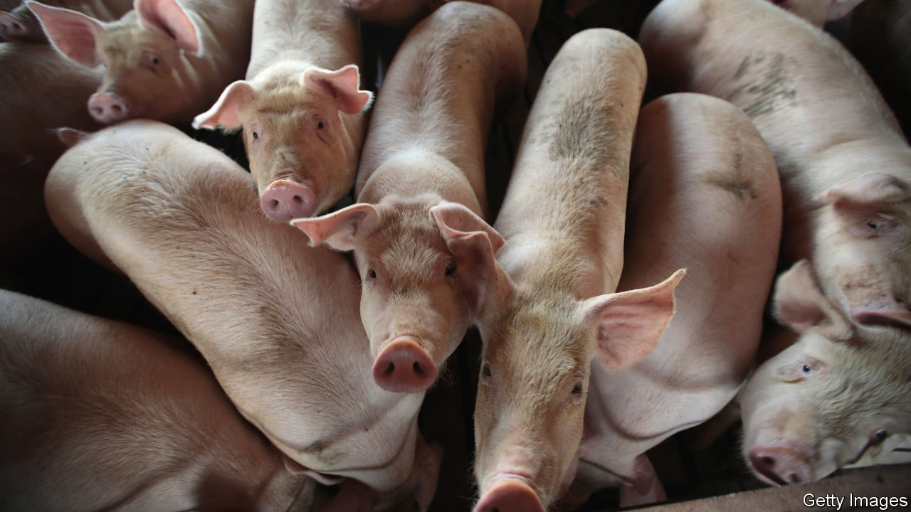

###### If pigs could fly

# A push for more space for America’s farm animals is thwarted 

##### Lobbying and litigation frustrate efforts to improve conditions for chickens, pigs and calves 

 

> Aug 18th 2022 

Meat production in America can be a controversial topic. The country has one of the highest meat-consumption rates per person in the world. For many the availability of cheap ribs, steaks and bacon is almost a basic right. But unease over the cramped conditions of many farm animals has grown. A legal row in Massachusetts shows the deep difficulty of reform.

In 2016 voters in the Bay State backed a ballot initiative to overhaul farm-animal welfare. The “Massachusetts Minimum Size Requirements for Farm Animal Containment”, also known as Question 3, banned the “cruel” confinement of chickens, pigs and calves, defined as housing that “prevents the animal from lying down, standing up, fully extending the animal’s limbs or turning around freely”. The measure passed with 78% support, and on August 15th the new pork rules were due to come into force. But a last-minute delay stopped them, perhaps indefinitely. 

A tangled web of lobbying, litigation and amendments around Question 3 has been spinning for nearly six years. Last December Governor Charlie Baker signed a bill which expanded the regulations for chickens to cover all egg products but also reduced the space requirement, from 1.5 square feet (0.14 square metres) per hen to just 1 square foot, provided the animals had access to “vertical” space. Some animal-rights groups praised its broadened scope, but Bradley Miller of the Humane Farming Association noted that the new space requirement enabled egg producers to “crowd 50% more hens into egg factories than current law”.

The outlook looks bleaker for the state’s pigs. The new rules were set to ban the sale of pork products within Massachusetts from animals “confined in a cruel manner”. This would in effect ban the use of “gestation crates’‘, where pigs are unable to turn round (the European Union banned these in 2013). In December, in the same bill that amended the rules for chicken, these pork regulations were delayed until August, ostensibly to stave off potential supply shortages. 

But the Supreme Court has meanwhile taken up a challenge to a similar law in California, “Proposition 12”, from the National Pork Producers Council (nppc). The space restrictions in both California and Massachusetts apply not just to in-state pork production but to the sale of pork from other states. The nppc argues that this violates the Dormant Commerce Clause by excessively restricting interstate commerce, and that voters in California are unfairly imposing pork conditions on other states, hindering billions of dollars of trade. On August 11th a district judge in Massachusetts agreed with a coalition of restaurant associations and the nppc to delay implementation of Question 3’s pig-housing rules until 30 days after the Supreme Court decides on the Proposition 12 case.

Mr Miller calls these delays “deeply troubling”. But Terry Wolters, president of the nppc, welcomed the “push to preserve the rights of America’s pig farmers to raise hogs in the way that is best for their animals and maintains a reliable supply of pork for consumers”.

In regulating not just local farm conditions but including sales from other states, have Proposition 12 and Question 3 crossed a constitutional line? The out-of-state impact would certainly be large. Iowa, America’s leading pork producer, holds more than 200 times as many pigs as Massachusetts and California combined. The Supreme Court will start grappling with the thorny question in October. 

The law may be murky, but one thing is clear: many voters are uncomfortable with the idea of pigs unable to move around or chickens pressed together in small cages. In probably the first poll of its kind, in 2019 a majority of respondents nationwide supported greater oversight of industrial animal farms, and 43% favoured a ban on new “concentrated animal feeding operations”, where the animals have no space to turn. Despite that, only eight states, containing just less than 3% of the national pig population, have banned the use of gestation crates. Solving this discrepancy democratically and constitutionally is proving a frustratingly difficult task. ■


