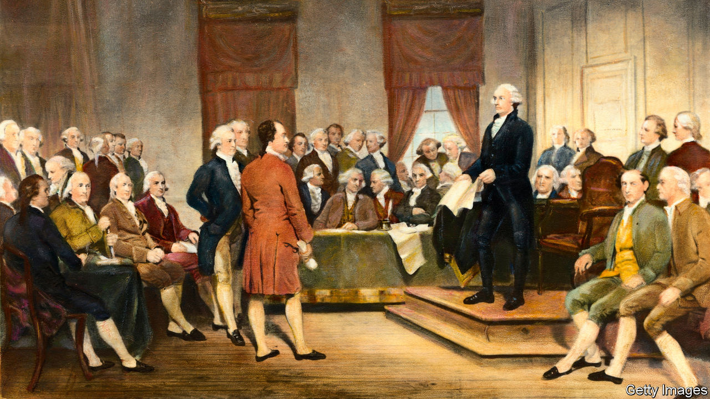

###### The Supreme Court

# America tussles over a newly fashionable constitutional theory 

##### “Originalism” is pushing the law to the right. Could it be a tool for progressives? 

 

> Aug 18th 2022 

In 1987, the last time the Senate voted to reject a president’s pick for the Supreme Court, a constitutional theory seemingly went down with the nominee. Robert Bork, Ronald Reagan’s ill-fated choice, told senators that judges should be guided not by their own lights but by the intentions of those who drafted the constitution. To read values into it that the framers “did not put there”, he said (referring to liberal rulings of the 1960s and 1970s, among others), is to “deprive the people of their liberty”. and rulings such as that protecting a right to contraception, were wrong or even “pernicious”: they had nothing to do with the true meaning of the constitution.

Thirty-five years on, that theory is enjoying a renaissance. Justices claiming the mantle of “originalism” have handed down decisions expanding gun rights, transforming the law on religious liberty and withdrawing the right to abortion established in . The core idea is powerful: judges should adhere to the constitution’s fixed meaning, not steer the law towards their preferred outcomes. But the theory serves more as cover than constraint. And it has been a moving target. Originalism has become, as Richard Primus of the University of Michigan Law School says, a “surname of a family of approaches to constitutional law” that might not recognise one another around the dinner table. 

In 1996 Antonin Scalia, an arch-conservative justice who died in 2016, proposed the first revision. He looked to “the original meaning of the text”, not Bork’s mind-reading criterion of “what the original draftsmen intended”. (Bork later noted he was persuaded by this move.) But when pressed to explain whether the text’s semantic meaning or its expected consequences should prevail, Scalia was cloudy. 

The constitution may be “dead, dead, dead”, as Scalia insisted, but its ghosts speak in various tongues. “New originalists” writing in the past two decades, unhappy with Scalia’s waffling, have sought to shore up an objective account of constitutional meaning. According to Randy Barnett of Georgetown University, judges should focus on what the constitution says, as opposed to what its drafters “expected or hoped” would flow from it. Some provisions, like the requirement that senators must be aged 30 or over, speak for themselves. Others, like the guarantees of “equal protection” or “due process”, may need “teleological or purposive considerations to determine their appropriate meaning” for a particular problem.

As the theory has become less dogmatic and more open to liberal results—some “new originalists” even argue that same-sex marriage and abortion-rights decisions cohere with the original meaning of the 14th Amendment—originalism has started to resemble the theory it arose to combat. In 1985 Justice William Brennan’s “living constitutionalist” approach noted that justices can read the constitution only as “20th-century Americans” asking: “What do the words of the text mean in our time?” For Eric Segall, of Georgia State University, newer forms of scholarly originalism are “indistinguishable” from the chief rival of their forebears. 

Theory and practice

At the Supreme Court, however, there has been no hint that the meaning of the constitution is up for debate. In the hands of the six conservative justices, originalism is consistently yielding conservative results. Reflecting on the  decision that ditched abortion rights, Reva Siegel, of Yale Law School, said in July that the majority’s originalism no longer seeks the separation of law and politics. It “has an aim” and serves as “an instrument of Republican will”. Justice Samuel Alito, in his majority opinion, had no qualms about focusing his analysis on a period when American women were second-class citizens, decades away from winning the right to vote.

In contrast to how it is often praised, Mr Primus observes, originalism does “not hold the law steady”. It permits—even demands—sweeping changes. The principle of  (standing by previous rulings) is a weak constraint. But the conservative revolution may be digging its own grave by offering progressives a model for undoing precedent. “As the Supreme Court consolidates more and more conservative doctrine”, Mr Primus predicts, originalism will become “more and more popular among liberals” envisaging a future court that takes an axe to decisions like 

Elizabeth Wydra, president of the Constitutional Accountability Centre, a law firm and advocacy organisation, is not waiting for liberals to take hold of the court. She finds powerful originalist sources for progressive causes—especially in the Reconstruction Amendments. These provisions, which ended slavery and guaranteed equal rights for formerly enslaved people, “reflect broad conceptions of equality, inclusion and liberty”. For true originalists, Ms Wydra says, “the 14th Amendment should matter just as much to you as the Second Amendment.”

This odd-bedfellows arrangement worries Mr Segall. “It’s very dangerous for progressives to adopt originalism,” he says; it risks giving credence to a theory that legitimises “racists and sexists”. Mr Segall also points out the difficulty of looking backwards in the service of progressive goals. But Ms Wydra presents the approach as both “right” and the only tactical choice. It is better to wage the battle over the meaning of the constitution on the same battlefield as conservatives, she says. The “second founding of the country” heralded “dramatic progressive changes” after the civil war. “We don’t cede that ground.” ■


