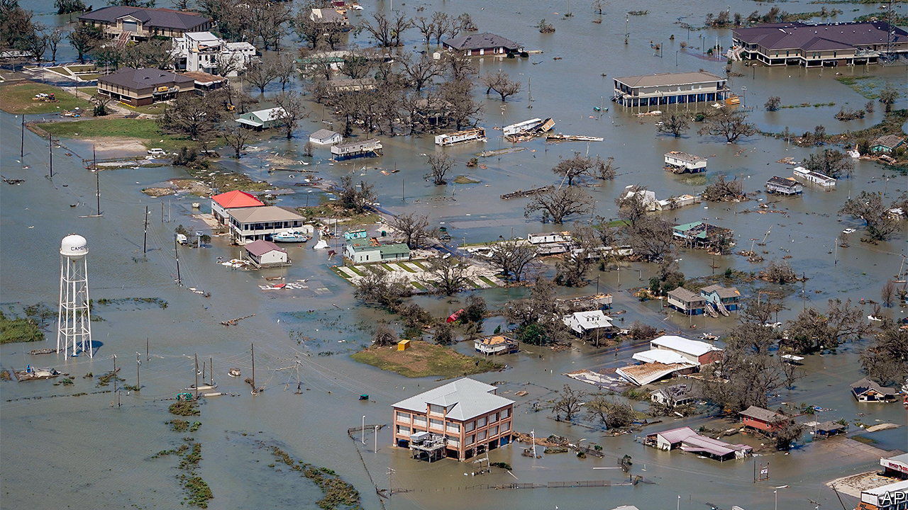
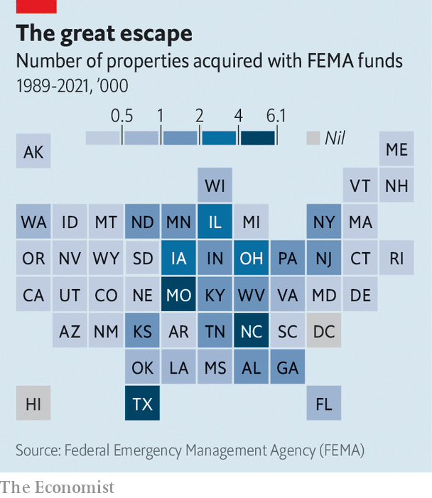

###### Responding to floods

# America’s government is buying vulnerable homes amid rising flood risk 

##### Some flood-prone places are being fortified, others abandoned 

 

> Aug 18th 2022 

The very year Bernadette Davis bought and remodelled her home in Lake Charles, in 2016, it was flooded. A nearby canal—what locals call a coulee—overflowed when a storm dumped up to 31 inches (79cm) of rain on parts of Louisiana. It flooded again the next year, from Hurricane Harvey, and in 2020 from Hurricane Delta. Then again last year, amid a torrential downpour in May. Once, when her elderly father refused to evacuate, rescuers arrived by boat. 

After four floods in six years, Ms Davis had had enough. In June she sold her home to the state in a voluntary buy-out scheme. Nearby properties have been acquired too. The surrounding streets, in a poor part of a pulverised city, look semi-deserted. 

 


Using federal aid, states and counties are acquiring flood-prone homes from willing sellers (see map) and converting the lots to open space. The properties must pass a cost-benefit test: projected future damages must exceed the buy-out price. More than 50,000 have been bought at their pre-flood value over the past three decades. 

Buy-outs remove people from harm’s way and let riparian areas soak up overflow during flooding. Building so close to rivers and bayous was always unwise. James Wade, who oversees buy-outs in the Houston area, says he is “correcting the problem” of development in the areas that should never have been developed.

Plenty of vulnerable places will not be abandoned amid flood risk, which is intensifying because of climate change. Areas with costly property and dense population are more likely to be fortified with seawalls and levees. After Harvey, Harris County, which includes Houston, required new structures to be built two feet above the expected level of inundation in a 500-year flood (in other words, one with a 0.2% chance of happening in any year), the strictest standard in the country. An estimated 84% of damaged homes would have been spared had they met that requirement. Such strategies make places safer, but not immune.

Retreat is the surest way to avoid damage. In rare instances whole communities pack up together. Thirty-seven households on the Isle de Jean Charles, in Louisiana, are moving 40 miles (64km) north with the help of a $48m federal grant awarded in 2016. Alaskan Natives in the village of Newtok, facing coastal erosion, are moving to a more stable site several miles away.

More typical is Manville, a working-class town in New Jersey named after a roof-insulation manufacturer whose factory there closed long ago. Overflow from the Raritan and Millstone rivers submerged buildings during Hurricane Floyd in 1999, Irene in 2011 and Ida last year. The Army Corps of Engineers refused Manville’s pleas to build a levee system.

The state resorted to buy-outs, targeting a neighbourhood known as the Lost Valley. Train tracks isolate it from the rest of town, but for a tunnel and a bridge. In floods those become impassable; emergency services cannot get in or out. Now the Lost Valley is a fragmented, hollowed-out community. Some homes have been razed or will be. Other owners are not leaving. They complain of rats from the abandoned properties. Sherri Brokopp Binder, an independent researcher, says that the remainers watch the “slow-motion decay” of their neighbourhood. Richard Onderko, the mayor, worries about Manville’s financial future. After about 170 buy-outs, the town has lost more than $1m in property taxes a year.

Buy-outs tend to take several years, and that deters some people. Unwilling to wait, they rebuild or sell to others. “Flood amnesia” sets in, says Mr Wade. To speed up the process, a bill in Congress would authorise the federal flood-insurance programme to buy insured homes that are repeatedly flooded in lieu of paying claims. A study of Staten Island’s buy-outs after Hurricane Sandy found that one in five occupants moved to areas of equal or greater flood risk, and almost all to neighbourhoods of higher poverty. Homes in vulnerable areas tend to be more affordable.

In her mother’s kitchen, a few streets from her former house, Ms Davis mulls her next move. She wants to be on higher ground. But she will probably not go far, to stay near family in Lake Charles. “It’s home. Where am I going to go?” ■


