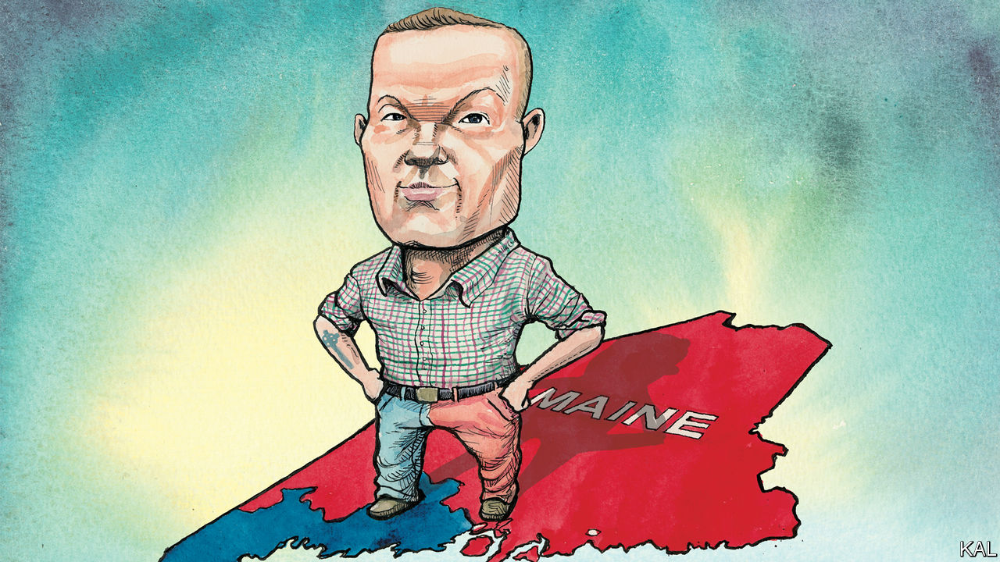

###### Lexington

# Democrats are wrong to give up on rural America 

##### Politicians like Jared Golden show they can win its support 

 

> Aug 18th 2022 

Maine’s 1.3m citizens are divided into just two congressional districts. The first is small, since half of Mainers live along the coast around Portland, a fizzy entrepot of lobster-and-scallop mousse and vegan doughnuts. But the second district, which stretches north to Canada, is vast, as big as Ireland. Its forests of pine and birch are so thinly settled that it counts as the second-most-rural district in America. Its people are whiter, older and poorer than Americans in general. The district tells the story of how Democrats lost their appeal to rural and working-class Americans, and with it at times majorities in Congress to match the party’s consistent majorities in the national vote. 

It also suggests how the Democrats might recover. Because whereas Donald Trump twice won the district easily in presidential elections, it has been represented in Congress for two terms by a Democrat, Jared Golden. Only seven Democrats represent districts won by Mr Trump, and none is more Trump-loving than Mr Golden’s, according to the , a non-partisan newsletter. Yet even some local Republican leaders expect Mr Golden to be re-elected in November.

“You’ve heard this—you know, ‘What’s the matter with Kansas?’” Mr Golden asked recently over a beer in Skowhegan, in central Maine. He was referring to an influential book from 2004 arguing that conservatives use cultural issues to fool rural Americans into voting against their own best interests. “Yeah, I hate that book,” he continued. “I think it’s so condescending.” He is sick of being asked about the theory outside his district. His response: “No, people are not voting against their own self-interest. They know what’s important to them.” The Democratic Party, he says, “has developed too much of an attitude that anyone that disagrees with us is just not smart.”

Mr Golden grew up in central Maine, joined the Marines after the terrorist attacks of September 11th 2001, and served in both Afghanistan and Iraq. Now, at 40, he is a trim man with a buzz cut and tattoos—the Celtic cross, a Devil Dog to honour the Marines. Mr Golden speaks and smiles sparingly. He is pro-labour, pro-choice, pro-police and pro-gun. He objects to the use of the word “assault” to describe a semi-automatic rifle, and he would also stick out like one at a Manhattan donor’s salon, unlike some recent, unsuccessful Democratic candidates in Maine. 

“If you were designing a Democratic prototype from the ground up to hold or win this kind of district,” says Mark Brewer, a political scientist at the University of Maine, “it’d look a lot like Jared Golden when you were done.”

Yet Mr Golden has been such a thorn in the side of the White House that one top aide to President Joe Biden suggested running another Democrat against him, according to “This Will Not Pass”, by Alexander Burns and Jonathan Martin. He says he is a Democrat because he believes government has a critical role to play in helping people. But he thinks his party has taken a grandiose view of that role, alienating rural voters by trying to dictate national standards that ignore local realities—such as unrealistic credentials for day-care teachers—and wasting money on people who do not need it. He supports anti-poverty initiatives like the child tax credit, but was outraged that Democrats continued permitting it to couples earning as much as $400,000 a year. (Mr Golden endorsed Lexington’s brother, Michael Bennet, a senator and proponent of the tax credit, when Mr Bennet ran for president in 2020.) 

Democrats and Republicans split rural voters as recently as 2009, according to the Pew Research Centre, a non-partisan think-tank. But by 2017 Republicans had a 16-point lead—and a 24-point one among rural white people. As Democrats lost ground, they took to lamenting Republican advantages in the electoral college and the Senate, where representation follows geography, not population. What Democrats have not done is compete harder. They instead condemn rural voters as mourning their white privilege in a diversifying country. Hillary Clinton consigned half of Donald Trump’s supporters to a “basket of deplorables”, and Barack Obama called small-town Americans bitter people who “cling to guns and religion or antipathy toward people who aren’t like them”.

Such generalisations may please some voters. But, conveniently for a party dominated by urbane elites, they ignore the role of class. (It was no coincidence that Mrs Clinton was speaking at a fund-raiser in New York and Mr Obama at one in San Francisco.) They overlook Mr Trump’s gains in 2020 with urban working-class voters of whatever race—and that Mr Obama himself carried Maine’s second district twice. Mr Golden worries that Democrats think they can write off rural voters and rely on demographic change to supply majorities by turning more of America into Portland. “I don’t know if that’s even true,” he says. “Secondly, even if it is, don’t you just want to do right by everybody?” 

A river runs through it

Mr Golden’s district has reeled for decades as textile and paper mills shut down, but he believes it is finding its feet again. The beer he was drinking was a brown ale from the Bigelow Brewing Company, started in a barn in Skowhegan a few years ago by a local teacher and millworker. They now sell in 700 stores and are turning the idled mill in town into a brewpub, hotel and apartments. 

The brewers want to help clean up the Kennebec river, which powered the mill, and enhance its rapids for water sports to give the young less cause to flee to Portland. That morning, two dozen leaders of the project—a car dealer, an insurer and a pizza-maker among them—had gathered to update Mr Golden. Their excitement about the future of their pretty, faded town was infectious. 

“I think my job is to try and connect them with as much help along the way or clear as many roadblocks as possible,” Mr Golden says. “I think they want to believe in a government that will help them do those things. But they’re very sceptical of it.” ■


