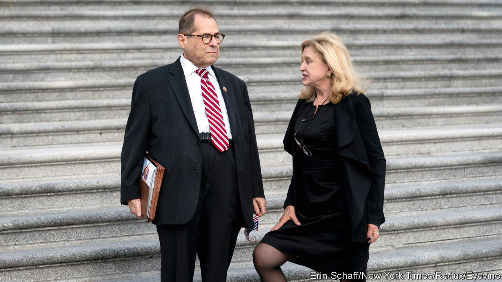

###### Primary pugilism

# In New York, once-friendly neighbours now battle it out 

##### Septuagenarian incumbents take on each other and a young challenger 

 

> Aug 18th 2022 

Al smith, a New York governor, unsuccessfully ran for president in 1928 with the campaign song “The Sidewalks of New York”, a popular tune but one with a peculiarly local theme. Its chorus includes the lyrics: “East Side, West Side, All around the town”. The candidates running in New York’s 12th congressional district might consider adopting the old campaign song. Because of redistricting, for the first time in decades the seat unites Manhattan’s East and West Side. As a result, two high-ranking Democratic incumbents are now fighting each other for political survival, in a primary election to be held on August 23rd. Carolyn Maloney, who has represented much of the East Side since she was elected in 1992, is pitted against Jerry Nadler, who has represented much of the West Side for three decades in the 10th congressional district. Both are entrenched in their neighbourhoods.

The contest is fierce. Once congenial allies who worked together on bills such as the one granting compensation to New Yorkers who fell ill after the attacks of September 11th 2001, they are no longer pulling punches. Mr Nadler happily reminds voters that Ms Maloney voted for the Iraq war and opposed President Barack Obama’s Iran deal. She, meanwhile, says he is lying when he takes credit for securing funding she says she was responsible for. 

No matter who wins, New Yorkers will lose at least one powerful representative with decades of institutional knowledge. It is hardly the first time that two incumbents of the same party have run against each other. But at this level of seniority, according to Dave Wasserman of the , a non-partisan newsletter, “it is unprecedented”.

Ms Maloney is one of the most powerful women in Congress. She is the first woman to chair the House Committee on Oversight and Reform, the main investigative one. Her hearings on gun control, with testimony from mass-shooting victims (including an 11-year-old survivor of the massacre in Uvalde, Texas), played a critical role in persuading the Senate to pass the most sweeping gun reform in decades. She recently held hearings on the loss of abortion rights. In a campaign advertisement, Ms Maloney says: “You cannot send a man to do a woman’s job.” 

Mr Nadler chairs the influential House Judiciary Committee. He was closely involved in the first impeachment of Donald Trump. He is ahead in the most recent poll and has received the endorsements of the  and of Chuck Schumer, the Democratic leader in the Senate.

During a debate Mr Nadler said, “With seniority comes clout and the ability to get things done,” a dig at another candidate, Suraj Patel, a former Obama campaigner with Kennedy-esque hair. Unlike many other upstarts, he is not from the left of the party. The 38-year-old is a centrist, as are his two septuagenarian opponents. 

What he offers is his youth. At campaign events, he calls for generational change. His debate zingers brought more money into his coffers and more interest in his campaign, he says. Mr Patel has faced Ms Maloney before, nearly beating her in the primary in 2020. But most of the areas he won are no longer in the district. Ms Maloney says this is not a time for rookies: “The stakes are the highest they’ve ever been in my life, really.”

New York’s Democrats helped to create the primary animosity. To add more Democratic congressional members to the state’s roster, they drew maps and used a redistricting process that New York’s top court ruled violated the state constitution. A court-appointed official redrew the district maps. The 12th, which once ran along Manhattan’s East Side as well as across the East River in Queens and Brooklyn, now extends from the East River to the Hudson, the width of Manhattan. The new borders meant that Mr Nadler lives in the 12th district and not in the 10th, which is now made up of parts of Brooklyn and Lower Manhattan. Instead of running in the 10th, which many pundits think he would have won, he decided to compete in the 12th, infuriating Ms Maloney. She told that Mr Nadler even advised her to move districts.

Mr Nadler’s choice left open the 10th. More than a dozen hopefuls threw their hats in the ring, including (briefly) Bill de Blasio, a former mayor. The front-runner is Dan Goldman, an heir to the Levi Strauss fortune who served as a lawyer in the first impeachment of Donald Trump. He faces, among others, Mondaire Jones, an incumbent who currently represents a suburban district. Mr Jones moved to Brooklyn to avoid running against Sean Patrick Maloney (no relation to Carolyn), another incumbent, in the redrawn 17th district.

Redistricting caused chaos. In a report on reforming New York’s elections the Manhattan Institute, a think-tank, suggests that all registered voters, regardless of their party, should vote for candidates in a primary. The top four would then advance to the general election in November. 

New York might also consider moving its primary back to September. Unusually, this summer it has two dates for primaries. The first, in June, was for statewide offices and the Assembly. Turnout in the August batch is sure to be low, with many of the 12th district’s constituents on holiday or at their summer houses in the Berkshires or the Hamptons. As Bruce Gyory, a Democratic strategist, notes: “There is no turnout template for an August primary”. ■


