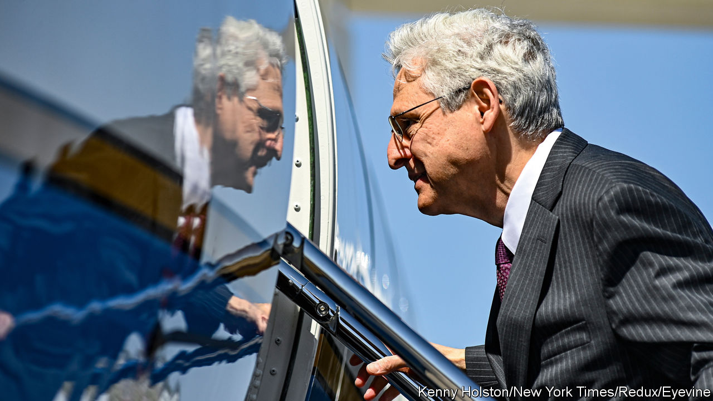

###### A paranoid style

# Merrick Garland is not naive about political violence 

##### The attorney-general’s work on the Oklahoma City bombing may offer clues about his investigation of Donald Trump 

 

> Aug 17th 2022 

America’s attorney-general has reason to be haunted by the country’s latent capacity for political violence. Merrick Garland was a senior official in the Justice Department on April 19th 1995, when a bomb exploded beneath a federal building in Oklahoma City, killing 168 people, including 19 children. Mr Garland, who had young children himself, implored his boss to send him to Oklahoma. Eleven years later, sitting for an oral history about the bombing and the investigation into it that he led, he choked up when he recalled the “gaping hole” he saw when he reached the scene of what remains the deadliest act of domestic terrorism in America. “And the worst part was being told…[that’s] where the kids had been,” he said. 

Now Mr Garland’s decision to obtain a warrant to search ’s Florida home, , is roiling some of the same currents of anti-government paranoia and hate that led to the bombing in 1995. Threats against the fbi and other law-enforcement officials have surged. Three days after the search, which took place on August 8th, an armed man in body armour tried to break into the fbi’s office in Cincinnati. He died in a shoot-out with police. 

On August 15th another man was charged in federal court in Pennsylvania with “influencing, impeding or retaliating” against a law-enforcement officer. Authorities said the man had posted threatening messages on Gab, a far-right social-networking site, including one reading, “I sincerely believe that if you work for the fbi, then you deserve to DIE.” The federal complaint said he also wrote that he knew he would die at the hands of law enforcement but “my only goal is to kill more of them before I drop”. In Florida, the federal magistrate who signed the warrant, along with his children and synagogue, came under a hail of anti-Semitic threats. His synagogue cancelled a planned outdoor service.

Mr Trump himself said that “the temperature has to be brought down in the country”. But in practically the same breath he tried to turn it up, in an interview with Fox News on August 15th. “There has never been a time like this where law enforcement has been used to break into the house of a former president of the United States,” he said, “and there is tremendous anger in the country—at a level that has never been seen before, other than during very perilous times.” Mr Trump suggested the fbi might have planted evidence at his home. 

Documents unsealed by the federal magistrate hint at the legal jeopardy Mr Trump may be in. An inventory kept by investigators showed that they took 20 boxes of items from Mar-a-Lago, including documents of varying levels of classification. Four sets of documents were labelled as top secret, and one carried an even higher classification applied to information considered critical to national security.

Mr Trump and his allies claim that none of the information is now classified, because Mr Trump issued a standing order that documents he took home were automatically declassified. It is an imaginative defence, and also possibly an irrelevant one. The warrant, at least in part, sidesteps the question of classification. 

It shows that investigators are looking into possible crimes including removal or destruction of documents, obstruction of justice or violations of the Espionage Act. Documents covered by the Espionage Act must relate to matters of national defence, but they do not have to be classified. The concern about possible obstruction could relate not to the documents themselves but to false information provided about what was being held at Mar-a-Lago. 

In one of the curious inversions that are becoming more common as America’s politics grows ever more polarised, the search of the former president’s premises has put the Democrats in the position of defending law-enforcement officers and set Republicans against them. A number of Republican politicians have called for “defunding” or even abolishing the fbi, playing off calls by Democrats two years ago to “defund the police”—for which Republicans are still criticising them. (On August 17th Mike Pence, the former vice-president, cautioned that “calls to defund the fbi are just as wrong as calls to defund the police.”)

Democrats and Republicans have also swapped poles on the matter of handling classified information itself. Six years ago, Democrats were defending Hillary Clinton after the fbi found she had handled some classified information improperly as secretary of state while using a private email account for communicating with her staff. Mr Trump called her “guilty as hell” and led crowds in chants of “Lock her up!”

Strictly by the book

Some responses to the current drama have been more measured and substantive. In one bipartisan step, the chairman and the ranking member of the Senate Intelligence Committee—Mark Warner of Virginia, a Democrat, and Marco Rubio of Florida, a Republican—sent a letter on August 14th to Mr Garland and Avril Haines, the director of national intelligence. They asked for members of the committee to get a look, on a classified basis, at the seized documents, and for an evaluation of the possible risks to national security of their mishandling. 

It is not yet known whether Mr Garland or Ms Haines has responded. Mr Garland has resisted sharing further information publicly, including the affidavit supporting the search, saying that to do so would compromise the investigation. But his handling of the Oklahoma City bombing investigation might provide some hopeful clues about his approach. 

Recognising that a secretive and sloppy investigation would feed the very paranoia about government overreach that he was trying to stem, Mr Garland emphasised transparency, speed and co-ordination. When the suspect, Timothy McVeigh, was caught, Mr Garland rejected efforts to keep the press away from his arraignment, insisting on an open hearing. He insisted that his investigators should scrupulously follow proper procedure to acquire each piece of evidence, to ensure that its use could not be successfully challenged in court, and even the lead defence lawyer said he succeeded. After listening to 22 days of testimony in 1997, a jury deliberated for 23 hours over four days before convicting McVeigh on all counts. He was executed by lethal injection in 2001. ■


