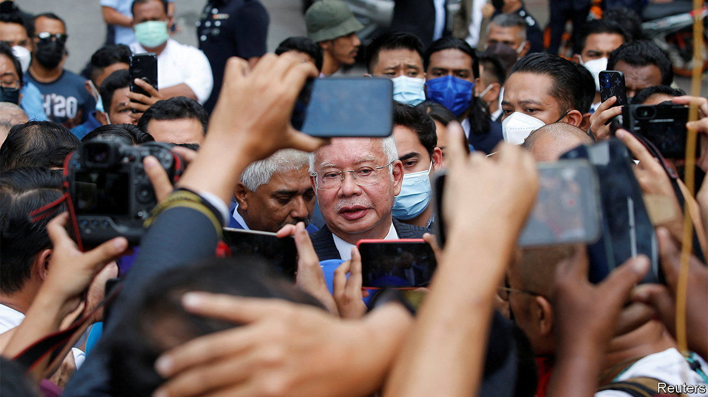

###### 5-0

# Malaysia’s disgraced former prime minister is going to prison 

##### Najib Razak is out of appeals and out of luck 

 

> Aug 23rd 2022 

The case before Malaysia’s highest court on August 23rd was not just about the fate of one man. It was also about the kind of country Malaysia wants to be. A five-member bench ruled decisively—and unanimously. Despite threats against judges, the court upheld the conviction of Najib Razak, a former prime minister, for abuse of power, criminal breach of trust and money laundering.

Mr Najib started his 12-year prison sentence immediately. He must also cough up a 210m-ringgit ($47m) fine. The verdict ejects him from the national parliament and bars him from returning for a time. It at last delivers the justice that millions of Malaysians voted for when they kicked Mr Najib out of office in 2018, ending the six-decade rule of his party, the United Malays National Organisation (umno). 

The party’s fall from grace came after revelations of Mr Najib’s involvement in a megascandal surrounding 1mdb, a state investment fund. Some $4.5bn went missing from its coffers between 2009 and 2015; it was spent on famous artwork and diamond jewellery, among many other things. 

More than $700m of the $4.5bn, the court heard, passed through a personal account of Mr Najib’s. The scandal eventually led to investigations in at least six countries. In 2020 Goldman Sachs, a bank, settled with Malaysia for $3.9bn for its role. But Mr Najib has long insisted that he believed the money in his account was a gift from the Saudi royal family. Failing to declare such gifts is not contrary to Malaysian law, .

Faced with the task of convicting a suspect hitherto considered untouchable, prosecutors crafted a deliberately modest case. They accused Mr Najib of laundering a mere 42m ringgit in two accounts in 2014 and 2015. That sum had been pilfered from a loan from the state-workers’ pension fund to a unit of 1MDB, which went through only after Mr Najib had persuaded the cabinet to guarantee it.

Mr Najib was  in 2020. He has been appealing the decision ever since, with little success. Last year an appeals court dismissed his claim of a Saudi gift as “a concoction that is completely bereft of any credibility”. Rather, it said, Mr Najib displayed a “wilful blindness” as to the origins of the money while using it for “his personal benefit” and “political purposes”.

None of which stopped Mr Najib from seeking political redemption. Many wrote him off when he was defeated electorally and then charged in 2018. But his victorious critics made a mess of governing, with two successive coalitions falling apart in just over three years. umno returned to power at the head of a third coalition last year. Bossku (“my boss”), as Mr Najib is known among his supporters, has made a point of  on the campaign trail and pressing the flesh, a tactic that has helped deliver  for umno in recent state elections.

That has created a rivalry in umno between the prime minister, Ismail Sabri Yaakob, who runs the government and manages its spoils, and Mr Najib and his old gang, which includes the party president, Ahmad Zahid Hamidi. Mr Najib’s faction has spent months lobbying for an early election, which must be held by September 2023, apparently hoping to stretch out his appeal until after it was concluded. 

A delayed trial, combined with a new, handpicked attorney-general, might have delivered for Mr Najib a more favourable verdict. That helps explain why the courtroom to the very end saw all manner of procrastination. Mr Najib sacked then later unsacked his legal team so as to request time for his lawyers to catch up with proceedings. The team accused the chief justice of the Federal Court, Maimun Tuan Mat, of unconscious bias and asked her to recuse herself, on the basis that her husband had expressed elation at Mr Najib’s election loss back in 2018. Judges dismissed all this time-wasting. 

Mr Najib has not been acting like a man whose political career is over. Online, he has rebranded himself as a humble man of the people about to lose everything except his faith. Recent Facebook posts show him sitting on a tree stump washing his feet before prayer, and taking the, an Islamic oath of innocence. Many among Malaysia’s increasingly devout Muslim population care more about what is said before the Almighty than what is decided in court, notes a political operator. Mr Najib would like to make his martyrdom an article of faith among party members, says Bridget Welsh of the University of Nottingham Malaysia. 

Some had expected a bigger showdown. Pressure, including death threats, had been piling up on judges. Some umno apparatchiks had urged the government to intervene. But the prime minister, Mr Ismail Sabri, sat back and let events unfold. He may have been happy to watch the fall of a rival. Or perhaps he was mindful of a backlash against meddling with the judiciary. In any case, his inaction helped notch up a victory for the rule of law. 

Mr Ismail Sabri may calculate he can ride out whatever fuss Mr Najib’s allies now make. Time is on his side. More corruption cases are in the works against his factional enemies. Mr Najib has another four still to come. Verdicts may soon be reached in a corruption case against his wife, Rosmah Mansor, and in one of Mr Zahid’s trials, where he faces 47 graft charges. (Both of them deny the charges.) Mr Ismail Sabri is said to favour an election early next year. By then he hopes to have vanquished an earlier, dirtier generation of umno leaders. If he does, he will have a chance to shape the party as he sees fit. 

After Mr Najib’s conviction Mr Ismail Sabri took to Twitter—to welcome  back from a trip to Turkey. The niceties were not just a diversion. The monarch is Mr Najib’s last hope: he could in theory issue a royal pardon and expunge his conviction. The king, too, will have to decide what kind of country he wants Malaysia to be.■

