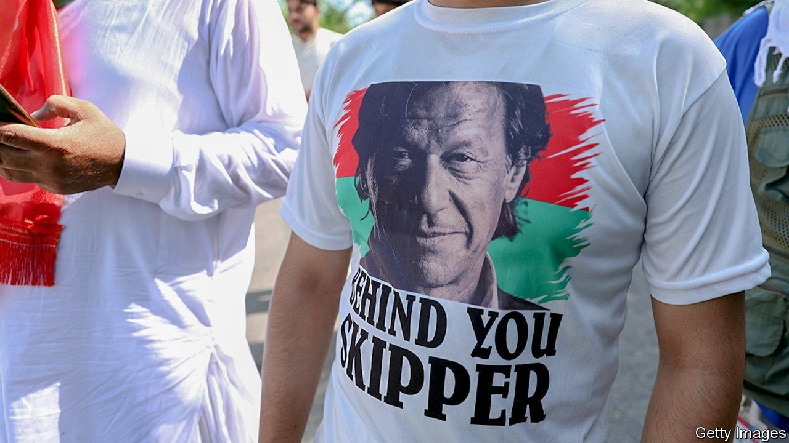

###### On the back foot

# Pakistan’s government wields anti-terror laws against Imran Khan 

##### The former prime minister has made powerful enemies since he was booted from office in April 

 

> Aug 25th 2022 

It looked, for a brief period earlier this year, as though Imran Khan, Pakistan’s former prime minister, was history. Ousted in a vote of no confidence in April after falling out with the country’s powerful army, Mr Khan took to  in the streets. But he has been regaling his supporters with fantastical conspiracy theories, which seems to have worked. The rallies have allowed him to stage a remarkable comeback, winning a slew of important by-elections—including in Punjab, Pakistan’s most populous province—and eclipsing Shehbaz Sharif, his successor as prime minister, in popularity. 

That success may now cost him. Mr Sharif’s government, seemingly spooked by , appears intent on halting it by any means necessary. This week it opened a police case against Mr Khan under an anti-terrorism law, potentially leading to a long spell in prison. Mr Khan’s alleged crime is to have threatened a magistrate and senior police officials. (He has yet to be formally charged)

The case against Mr Khan is the latest salvo in a three-way struggle for power. It pits Mr Khan and his Pakistan Tehreek-e-Insaf party against Mr Sharif’s Pakistan Muslim League-Nawaz and also General Qamar Javed Bajwa, the chief of the army, which is . Mr Khan alleges that General Bajwa engineered his removal from power (which is plausible) by plotting with America (which is not). Mr Khan has presented no evidence for this conspiracy (America and the army both deny it). But the claims have left the general embattled and widely unpopular, including inside the army. 

On August 8th Shahbaz Gill, an aide to Mr Khan, took advantage of the army’s struggles during an appearance on a popular television channel, calling on officers to disobey unlawful commands by their superiors. The army immediately denounced Mr Gill’s suggestion as tantamount to inciting mutiny. 

The government jumped at the opportunity to ingratiate itself with the brass and strike at Mr Khan. Mr Gill was arrested the next day. The news channel was taken off the air in much of the country. Then Mr Khan got involved. After Mr Gill was arrested and, his party alleges, tortured in the custody of the federal police, Mr Khan issued an ominous warning while addressing a rally in Islamabad, the capital. The magistrate and police officers responsible for Mr Gill’s ordeal would not, he declared, go unpunished. The government says that amounts to threatening the police and judiciary with unlawful retribution, justifying the terrorism charges. Mr Khan has since repeated his statements.

It is unclear whether the government actually plans to prosecute Mr Khan with a view to barring him from contesting elections. Deploying anti-terrorism laws is a sign of the government’s desperation, reckons Faisal Fareed, Mr Khan’s lawyer. “Imran Khan is winning by miles; that’s what the government is afraid of,” he says. “They can’t beat him in elections, so they’re going to try dirty tricks.”

The anti-terror machinations are not the only threat to Mr Khan. He faces contempt proceedings for his remarks against the magistrate. The Election Commission ruled earlier this month that his party received illegal campaign contributions from abroad a decade ago, which the government could use to disqualify Mr Khan and his party. And Mr Sharif’s ministers regularly vow to start new investigations into Mr Khan’s time in government. 

Respite is unlikely. A series of by-elections are scheduled, including one in late September in which Mr Khan himself will simultaneously contest an unprecedented nine seats to the National Assembly. A general election must be held by autumn next year, after parliament completes its five-year term. In November the government must choose between offering General Bajwa a third term and appointing a new army chief. Mr Sharif may calculate that keeping his political nemesis at war with a weakened army chief is the best way to remain in power himself. ■

