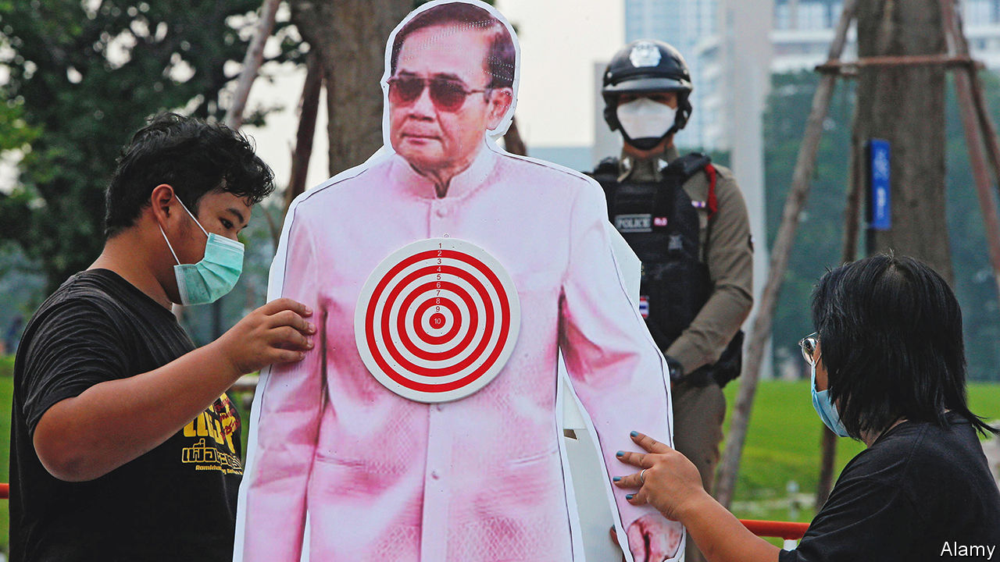

###### Uncertain terms

# Thailand’s constitutional court suspends the prime minister 

##### Prayuth Chan-ocha has run the country for eight years. Or is it five? Maybe three? 

 

> Aug 25th 2022 

No one could accuse Thailand’s constitutional court of shying away from the big calls. In the past two decades it has binned the results of two elections, disbanded three  and declared homosexuality to be “against the natural order”. These decisions have tended to serve the political establishment and helped ensure the army’s grip on power. So eyebrows twitched on August 24th when a decision by the court went firmly against a member of the establishment.

Prayuth Chan-ocha, a 68-year-old former general who took power in a military coup in 2014, has been suspended as prime minister while the court hears an opposition-party petition against his rule. The constitution decrees that the prime minister “shall not hold office for more than eight years in total”. Mr Prayuth (pictured, in cut-out) has held the post since August 24th 2014. But he would prefer to start the timer from 2017, when the new constitution was enacted, or 2019, when parliament  him to the post.

The court will now consider which of those dates makes the most sense. But no immediate crisis beckons. Mr Prayuth, who will stay on as defence minister, accepted the ruling graciously. Had he stayed in office, an eventual decision against him may have cast doubt on the legitimacy—and legality—of government business in the interim. Prawit Wongsuwan, another ageing general and the top-ranking of six deputies, will act as prime minister. 

The ruling may make Thai politics more stable rather than less, reckons Korn Chatikavanij, a former finance minister who now heads Kla, an opposition party. It appears to be a decent advertisement for the separation of executive and judicial power. And it might dissipate public disillusionment at the continued rule of Mr Prayuth, who survived four no-confidence votes in parliament in his eight-year stint. Dissipate, but not eliminate. 

It will take more than the replacement by the courts of one ex-general with another to get democracy activists popping corks. Elections in 2019 were beset by restrictive rules and irregularities in the vote-count, and in any case a senate appointed by the army holds a veto over elected lawmakers. The government has cracked down on protesters and since the start of the pandemic has  more than 200 people under lèse-majesté laws, which forbid criticism of the all-powerful king. Despite a firm hand when it comes to stifling dissent, the generals are “on autopilot” when statecraft is needed, says Pavin Chachavalpongpun of Kyoto University. Household debt is spiralling and the cost of living is getting steeper.

The government will hope to have its house in order well before November, when the summit of the Asia-Pacific Economic Co-operation, a big forum, rolls into Bangkok. The army’s party, Palang Pracharath, must in any case pick a prime ministerial candidate before the next election, scheduled for early next year. The opposition will have its tail up, even if it fears that the vote will be just as flawed as the last one. It dreams that Thai voters, not the court or the army, might for once be allowed to make a big call all on their own.■

