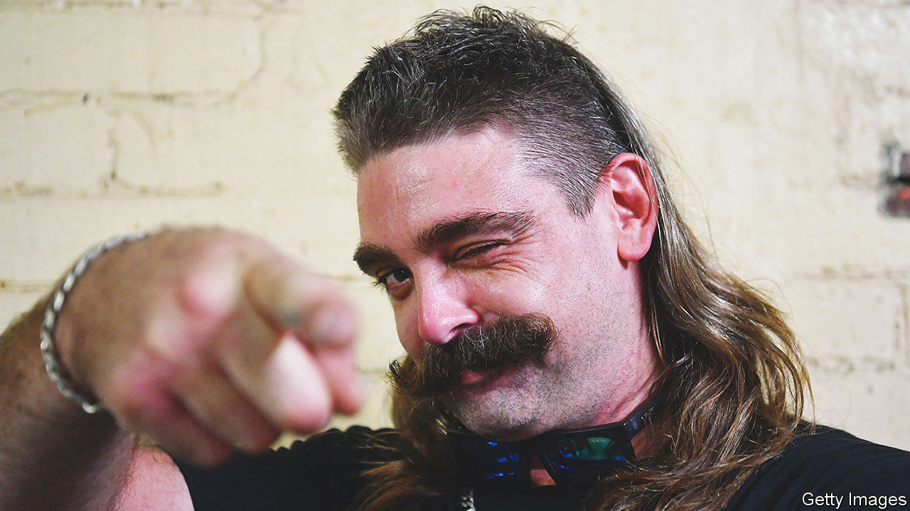

###### Party in the back

# The mullet’s resurgence divides Australia 

##### The controversial hairstyle is either an embarrassment or a point of national pride—or both 

 

> Aug 25th 2022 

Consider the mullet, a hairstyle that has a good claim to being Australia’s national do. It comes in various shapes and sizes. The mullet can be “extreme”—shaved bare on top. Or it can be spiked up like a mohawk. It is sometimes “grubby” and dreadlocked. And then there is the “ranga” mullet, meaning red-headed (it’s an abbreviation of “orangutan”), which is always a crowd-pleaser. 

Since 2018, fans have convened every year for Mulletfest, a competition to find the most outrageous examples. “A lot of people wear this hairstyle and have a dirtbag lifestyle,” muses Timmy Pinger, a mustachioed coalminer whose long, straight mullet carried him to victory in Mulletfest’s heats in Dubbo, a small city in New South Wales, on August 20th. But Australia is full of “sophisticated, hard-working, honest-living” mullet-wearers too, he says.

The reviled style is a hallmark of small towns down under. To some fans, it is seen as a badge of country culture. “It’s a unique Australian invention—one we should be selling to the world,” Mark McGowan, the self-professed “pro-mullet” premier of the vast and sparsely populated state of Western Australia, claimed last year. (In fact, mullets probably predate modern Australia.) 

Recently, however, the style has staged a wider resurgence, invading hipster hangouts in urban centres and re-entering the mainstream through the medium of sports. Aussie rules football and rugby league pitches are overrun with them. Cameron Smith, a golfer, sports a lengthy specimen, occasionally with the letters “aus” shaved into the sides. He is celebrated as a “very cashed-up bogan” (a term which loosely translates as “wealthy redneck”) by his coach. 

“The mullet was seen as so bogan, but it has reached a point of acceptance,” says Laura Johnson, Mulletfest’s founder. This “has got everything to do with our Aussie larrikin sense of humour”, argues Mr Pinger, referring to Australia’s favourite national myth: that it is a country of good-at-heart mischief-makers. Think  (a cricketer who made his international debut sporting a mullet). 

Not everyone appreciates the joke. Mullets have become so trendy with teenagers that several private schools have banned them. They are “untidy, non-conventional and not acceptable”, griped the masters of Trinity College, a boy’s school in Perth, last year. Some snooty pubs and bars in Western Australia have caused a ruckus by turning away mulleted men, ostensibly for failing to adhere to dress codes. 

This debate has reached the country’s top brass. “Taking the shears to freedom of expression” is “a snip too far”, said Bill Shorten, a former leader of the Labor Party, last year. Oppressing mullet-wearers might lead to an uprising or “mullet spring”, he suggested. “I think you should be free to have a mullet and go to the pub,” Mr McGowan has proclaimed. Mullet-wearers, he says, should “rise up and rebel against these extreme rules”.

