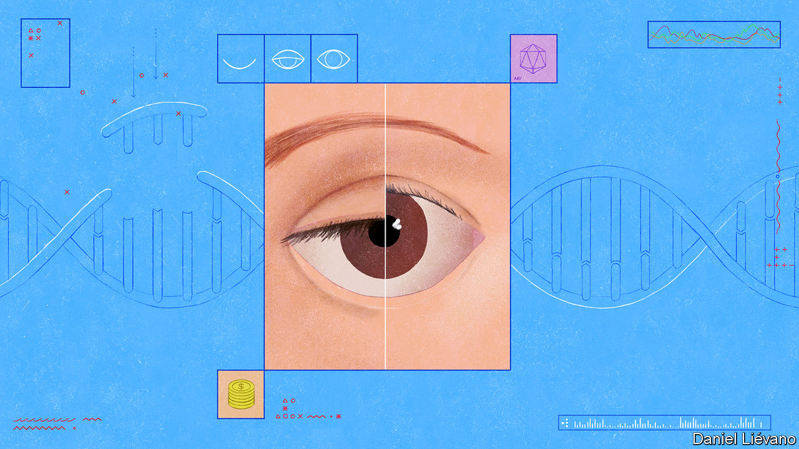
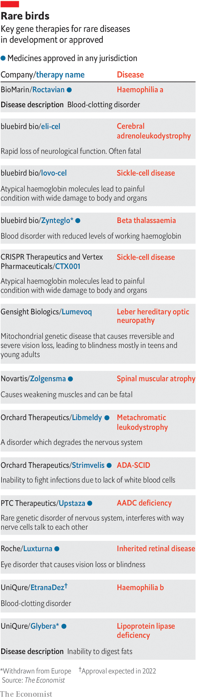
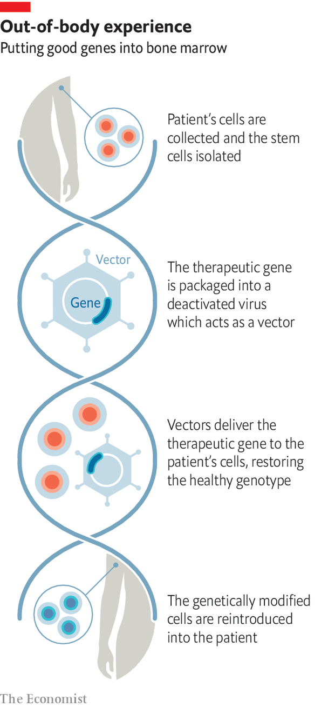

###### Genetic therapy

# Gene therapies must become miracles of medicine 

##### Otherwise they might end up a niche treatment for a small number of patients in rich countries 

 

> Aug 25th 2022 

In 2018, when he was 13, Ethan Ralston’s eyesight started to get blurry. The diagnosis was devastating. He had been born with Leber Hereditary Optic Neuropathy (lhon), a rare genetic disorder that eats away at the cells of the optic nerve until it causes blindness.

Given that America and Europe between them see just 800 cases of lhon a year young Mr Ralston was very unlucky. In another way, though, he could be counted fortunate. GenSight, a French biotech company, had for years been working on a gene therapy for lhon. The condition is caused by a mutation in a gene called nd4 which causes the body’s cells to make a faulty protein. The therapy, called Lumevoq, sought to resolve the problem by adding the canonical version of nd4 to cells in the retina and optic nerve. By 2018 Lumevoq was in clinical trials. Shortly after his diagnosis Mr Ralston was treated with it. 

Today his eyesight has almost returned to normal. He can work on a computer, drive a car, go bowling with his friends. He would seem to be cured. 

Such stories are becoming increasingly common. In the 2010s a whole year might see only one new gene-therapy approval from regulators. This August alone saw two, one for beta thalassaemia and one for haemophilia a, both diseases of the blood. The Alliance for Regenerative Medicine, an international industry group for cell and gene therapies, says that 1,369 groups are developing such treatments and just over 2,000 clinical trials are under way. Most of those in their earliest stages and may well progress no further: many are cell therapies which do not require changes to the patient’s genes. Still, according to scientists from the Centre for Biomedical Innovation in Cambridge, Massachusetts, there are enough trials under way that 40-50 new gene therapies could be approved for clinical use by 2030. 

 


A lot of these will be used in the fight against cancer. Removing from the body some of the t-cells which the immune system uses to fight cancer, giving them a gene that lets them recognise a cancer-specific trait and putting them back is the basis of car-t therapies, one of the hottest approaches around (the car stands for “chimeric antigen receptor”). But there will also be lots that tackle inherited diseases. There are clear signs that this surge has begun. Janet Lambert, the boss of the Alliance for Regenerative Medicine, anticipates that Europe and America will see a record number of such gene therapies approved this year (see table). 

In a world where saying that something is in some person or other entity’s dna has become a shorthand for seeing it as part of their very essence, dealing with inherited diseases this way looks truly revolutionary. It is “one of the most compelling concepts in modern medicine” as a recent review paper put it. The ability to provide someone with a single treatment that will alleviate a terrible condition for a decade or more—perhaps even for life—is an intervention without any obvious parallel. 

But it comes with a number of challenges. The techniques being used still carry risks. The therapies themselves are enormously expensive, not just because of the research required to develop them—that is expensive all across the biotech world—but because the cost of making them is particularly high. What is more, some may face stiff competition from other approaches, some of them equally novel. These may allow some of the conditions gene therapy seeks to fix to be treated in cheaper ways. 

This raises the possibility that, impressive as they are, gene therapies might be relegated to a niche treating a small number of patients in rich countries. That would be a poor outlook for millions around the world who suffer from more common genetic diseases, such as sickle-cell disease, and other conditions. It could also scupper the chances of gene therapy moving beyond the realm of single-gene disorders to tackle more complex conditions. For many more people to experience the sort of benefits that have changed Mr Ralston’s prospects, the ability to produce miracles will not be enough. They have to be produced affordably in ways that can be adapted to conditions far removed from the elite hospitals where trials typically take place today. 

Vector displays

To design a gene therapy, you need a gene you want to add to the patient’s cells and a way of getting it into them. Finding the first is, in principle, easy: thousands of diseases, most of the worst thankfully rare, come about because of a garbled copy of a single gene. That means they might in principle be alleviated by the addition of the normal version. The second is normally the job of a modified virus that can no longer reproduce but that can get a new gene into its target cells: a viral “vector”. 

 


Sometimes cells are taken out of the body, transformed by a vector and put back in, as they are in car-t cancer therapies. Zynteglo, a gene therapy for beta thalassaemia made by bluebird bio, a startup with an aversion to capital letters, works this way. On August 17th it became the third gene therapy for an inherited disease to be approved by America’s Food and Drug Administration (fda). In other cases the vector does its work inside the body. Lumevoq—approved by the European Medicines Agency (ema) in 2021, but not yet by the fda—was injected directly into Mr Ralston’s eyes.

The first gene-therapy trial, which treated a single child with a specific and severe immunodeficiency called ada-scid, got under way in 1990. It did not lead quickly to a commercial product (a different gene therapy for ada-scid, Strimvelis, was eventually approved in 2016) but it paved the way for a number of successors. Unfortunately in 1999 the nascent field was rocked by the death of Jesse Gelsinger, an 18-year-old, four days after he had been given a gene intended to fix his inherited inability to metabolise ammonia.

His death was caused by his immune system’s response to the adenovirus used as a vector. That knowledge drove the hunt for safer vectors; James Wilson, a gene-therapy pioneer at the University of Pennsylvania, where the trial during which Mr Gelsinger died was based, uncovered the potential of adeno-associated viruses (aav). These are widespread in humans and are not known to cause any sort of disease; they provoke little or no immune response. That is one of the reasons that they have also been taken up by vaccine-makers. The Oxford AstraZeneca covid-19 vaccine works in this way, using an aav to put dna describing a telltale viral protein into the body’s cells. 

For gene therapies, aavs have the big advantage of coming in more than 100 different flavours, or serotypes, each of which has different preferences when it comes to which sorts of cell to infect. Vectors derived from aavs are able to home in on specific tissues such as the optic nerve, or the central nervous system, or the muscles. 

However, aav-based vectors are not without problems. A recent analysis of almost 150 gene-therapy trials using them found that 35% had seen “serious adverse events”, including brain-imaging findings of “uncertain significance”. Large doses of the vector have also been linked to safety concerns. In 2018 Dr Wilson warned that high doses of aav caused life-threatening toxicity in piglets and monkeys. At the same time he resigned from the scientific advisory board of Solid Biosciences, a gene-therapy firm focused on muscular dystrophy, citing emerging concerns about the possible risks of too much aav. The firm says his resignation was due to findings in experiments that were unrelated to its work. Nonetheless its regulatory filings acknowledge that the high dosing requirements for the therapy it is developing may increase the risk of side-effects.

In August Novartis, a Swiss drug company, reported two liver-related deaths in children who were treated with its gene therapy for spinal muscular atrophy (sma). Trials of a therapy being developed by Astellas, a Japanese drug company, for a rare muscle disease called x-linked myotubular myopathy produced some spectacular results, but also saw three children die with sepsis and gastrointestinal bleeding as a consequence of liver failure and a fourth from other liver-related complications. 

Hard choices

Bernhardt Zeiher, who is about to retire as Astellas’s head of development, recently told , an online publication, that the company thinks the deaths were caused by a combination of a reaction to the aav vector used and an underlying risk of liver disease. The transformational nature of the therapy itself, he added, means that the firm is committed to finding a way forward in the field. 

There have also been concerns over the potential for some vectors to trigger cancers in the long term. “You are giving [patients] quadrillions of vector particles,” says David Lillicrap, a professor at Queen’s University in Kingston, Ontario, who works on haemophilia. “A very, very small percentage are going to get into the host genome [in] susceptible areas.” In 2020 a patient who was being treated for ada-scid with Strimvelis, which uses an rna-based retrovirus as a vector, developed leukaemia. Orchard Therapeutics, the company marketing Strimvelis, has said it “may be attributable” to the way the gene integrated itself into the genome. 

Nicole Paulk of the University of California, San Francisco, says that despite some worrying headlines the aav vector is “extraordinarily safe”. She says it has been or is being used in over 250 clinical trials with tens of thousands of patients, and that, compared with cancer drugs, it has been remarkably well tolerated.

Given that patients can have terrible experiences with cancer drugs that might not seem reassuring. But there are two other factors to bear in mind. One is that the patients in gene-therapy trials are often very unwell to begin with, and may come into them on other quite arduous treatment regimes. Adverse events are to be expected. More importantly, they may have little if anything by way of other options. 

Breaking barriers

Karen Pignet-Aiach is the founder and boss of Lysogene, a French gene-therapy firm which concentrates on errors in the central nervous system. Firms like hers, she says, have to battle to make sure that regulatory agencies stick to the principle that the risks attached to a treatment have to be balanced against the benefits that a therapy for something lethal and untreatable could bring. In 2020 Lysogene had to deal with the difficult death of a child during a trial, putting a temporary halt to its clinical work. Ms Pignet-Aiach says the death may have been caused by medication given outside the trial but that there was no link with the treatment that was actually being investigated. As to the possible benefits, when she says “Our patients have nothing [else] available” she knows what she is talking about: she lost a daughter to Sanfilippo syndrome, one of the disorders the company is tackling.

Hold-ups when patients die are understandable, but they increase the cost, and risk, of developing these medicines. And there are other hurdles. Because no one yet knows how many years of duty can be expected from gene therapies, long-term studies are needed; regulators will often insist on them continuing after approval. Because the conditions involved are often progressive and untreatable by other means there are real ethical concerns about randomising trials, something often seen as the best way to clear-cut results.

These problems go some way to explaining the remarkable price of the therapies which make it to market—and which, because of those prices, sometimes leave it soon afterwards. When Glybera, a therapy developed by uniQure, a Dutch company, to address an error in the way fat is processed in a particularly rare condition, got the nod from the ema in 2012 it became the first gene therapy to be approved by a stringent regulator. It also became the first medical treatment with a price tag of $1m. The first approval by the fda, in 2017, was for Luxturna, a gene therapy to prevent another form of progressive vision loss. Roche, a big-pharma company, priced it at $425,000. Per eye. In 2019 Zolgensma, Novatis’s treatment for sma, went on sale at $2.1m. Last year the mother of a baby being treated with Zolgensma remarked that everyone who touched the drug, or was around it, had to be trained to handle it: it was “like carrying gold”. Libmeldy, approved by the ema in 2020 to treat a disorder which degrades the nervous system, costs £2.8m ($3.3m) a dose. 

Pharmaceutical companies do not discuss the basis of drugs’ prices. In America the approach is typically taken to be an assessment of what the market will bear, which has led to an environment accustomed to high prices. The problem with gene therapies is that the price being charged seems in some cases well beyond what the market will bear. 

Take Glybera, the first-approved therapy. Only a single dose was ever sold. It has been withdrawn from the European market. According to , another online publication, after the ema approved Zynteglo in 2019 bluebird bio offered it in Germany for $1.8m a treatment; Germany offered to pay $950,000 in cases where it worked, $790,000 when it didn’t. The firm subsequently withdrew it from the European market; it has done the same with eli-cell, which treats an irreversible nerve disease. The price it has set for Zynteglo in America is $2.8m.

Some companies are getting out of the market altogether, suggesting they see no way forward. Amicus Therapeutics, a biotech firm which had been working on a number of gene therapies at one point, got out of the field completely earlier this year. Within two years of having put the ada-scid therapy Strimvelis on the market in Europe, gsk, a big drug company, offloaded the treatment to Orchard. 

If the makers are worried, so are the buyers. Health systems and insurance firms can cope with one or two such therapies at the far end of the price spectrum. Britain’s nhs, quite capable of ruling out therapies on the basis of cost, has bought both Zolgensma and Libmeldy (it negotiated a significant discount). But as the number of approved treatments grows the economics are looking more challenging. 

Million-dollar Mom and Pop shops

A study published this February by the Aspen Institute, a think-tank, and the Blue Cross Blue Shield Association, an association of American insurance companies, looked at the expected arrival of 90 gene therapies and cell therapies. By 2031 the annual acquisition cost for 550,000 patients would be $30bn. With the country’s total prescription-drug bill currently at $577bn, that is relatively small; but it is still significant. Virtually all the buyers for health care in America have warned about the cost burden they expect as the numbers of these products grow. 

“I think everyone agrees that the pricing of gene therapies is a crisis,” says Dr Paulk. The crisis has two main drivers: the amount of work needed to develop and make the therapies and the lack of good models for pricing one-off interventions which could obviate the need for lifelong treatment.

The costs of gene therapies are not just down to arduous research and development and long-drawn-out trials. Making the material which gets put into the patient is “not for the faint of heart” says Jay Bradner, president of the Novartis Institutes for BioMedical Research. Gene therapies are “like snowflakes”, says Dr Paulk. “Every aav program and every lot is completely unique”. Bespoke, though, does not mean small scale. She says that for diseases where you need to get the vector into a particularly large number of cells, such as Duchenne muscular dystrophy, “It is not uncommon that we need to use at least a 50 litre, if not a 200 litre, bioreactor to make a single dose for a single patient.” 

Analysts at the Boston Consulting Group recently estimated that the cost of manufacturing gene therapies ranges from $100,000 to $500,000 per dose. A lot of this manufacturing is done by third parties, and the difficulties of the process can be seen in the limited capacity they offer. Biotech firms that want to get into gene therapy can have to wait up to three years for manufacturing capacity to become available, according to insiders. 

Look out behind you

On the other side of the coin is the difficulty of calculating benefits. If a $2m treatment really does provide decades of life then the cost per year is down in the tens of thousands of dollars—hardly out of line with many other modern therapies. This has led some to suggest that payment might be in annual instalments. In the long term that could make the total larger, but it would spread it out. Another possible innovation is to couple such an approach with the option of stopping paying if the therapy stops working. 

The question as to whether the therapy is worth the price has to be answered in the context of what if anything the competition can offer. Take sma, which is caused by a faulty version of a gene called smn1. Zolgensma treats this problem by providing cells with an extra copy of smn1 which works. A treatment called Spinraza uses a method that increases the amount of protein made from a very similar but normally much less productive gene, smn2: its active agent is a molecule called an “antisense oligonucleotide”. 

Antisense treatments are being tried against various conditions which look as if they can be alleviated by getting an existing gene expressed more or less. They are not permanent; Spinraza needs to be administered every four months. Moreover, although the cost of manufacture is far lower than for gene therapies, they are still not cheap. Biogen, the biotech company that makes Spinraza, charges up to $125,000 per dose. But such treatments may well be easier to scale up, and thus see their costs reduced. 

Haemophilia, for a form of which Roctavian, made by Biomarin, a biotech company, received ema approval on August 24th, is another condition where alternative approaches have made huge strides, according to Dr Lillicrap. One of the newest antibodies used in its treatment needs to be given only every two to four weeks, rather than every few days, as used to be the case. Artificial versions of the clotting factors haemophiliacs cannot make have been engineered so as to last longer in the blood. There are also clever new ways of lowering the expression of proteins which suppress coagulation.

It is not just what the competition can offer now that matters. It is what it might offer in five or ten years’ time. Spending a lot on a gene therapy today may prove a good investment if it provides many years of reasonably healthy life. But at the same time it is a bet against the real possibility that a cheaper and possibly better treatment is on the way. 

The answer to that conundrum is to make sure that gene therapies get better and cheaper, too. Various companies are looking at ways to improve manufacturing. 64x Bio, based in San Francisco, is testing millions of possible cell lines to try and find those that will grow vectors like aav most efficiently. Others are looking at the vectors themselves, trying to make them less arousing to the immune system, better targeted and more likely to actually carry the gene of interest. Current procedures leave a lot of the vectors empty; increasing the proportion that is filled would reduce dose size and costs.

Ideas for making better things to put in the vectors abound. The field started with basic tools; would-be therapists could put a gene into the genome but had little control over where it went and thus how it might be controlled and what collateral damage it might cause. In the past decade, though, great advances have been made in gene editing, a set of techniques which allow the message in an existing gene to be rewritten. As Fyodor Urnov, a professor at the University of California, Berkeley, puts it, gene therapy is like adding a fifth wheel to a car with a flat tyre; gene editing is repairing the flat. 

 


At present, gene editing is a particularly promising route for therapies in which blood-cell-making stem cells are removed, fiddled with and reinserted into the patient’s bone marrow. Two clinical trials in which this sort of editing is used against sickle-cell disease, which is brought about by mutations in haemoglobin which make red blood cells deformed and defective, are already well under way. One is for a treatment from Vertex Pharmaceuticals, based in Massachusetts and crispr Therapeutics, the other is by bluebird bio. 

More than a dozen patients are reported to have been cured, and it is possible that one of the treatments could be ready for approval next year. There are other gene therapies for the condition at earlier stages. There is also, again, competition from other approaches. On August 8th Pfizer, another big drug company, announced its intention to acquire Global Blood Therapies, a biotech company, for $5.4bn. For that it gets Oxbryta, a drug that stops the mutant haemoglobins from sticking together, and some other therapies. 

Cured eyes on the prize

A similar gene-therapy approach is being used to tackle aids by editing into cells traits that make them immune to hiv. But here the price issue, already confounding, becomes all but lethal. Most people with aids, like most people with sickle-cell disease, live in low- and middle-income countries. According to Mike McCune of the Bill &amp; Melinda Gates Foundation, in countries where antiretroviral therapy for aids costs between $70 and $200 a year an all-out cure for the disease, even if it were possible, would need to come in at $2,000 or less.

If this sounds staggeringly unlikely, it is worth considering that there is a partial precedent. The cost of making target-specific “monoclonal” antibodies was enormous when they were first developed. But between 1998 and 2009 manufacturing improvements brought about a 50-fold reduction in the cost of goods. Matching that would allow gene therapies to move into middle-income countries, if not low-income ones. 

As Mr Ralston can testify, gene therapies border on the miraculous. But they remain miracles of science, their creation “incredibly time-intensive [and] people-intensive,” as Dr Paulk puts it. Now they must become routinely applicable miracles of medicine. That requires extending the range of conditions they address, learning how long they last and expanding the number of patients they help. In many ways that effort will be more demanding than the work to date. It will have to go well beyond the labs currently tinkering, the charities currently raising funds for rare diseases and the companies desperately trying to find a way to sell the remarkable things they have created. But their remarkable work has made it possible for that second miracle-making effort to begin. ■

