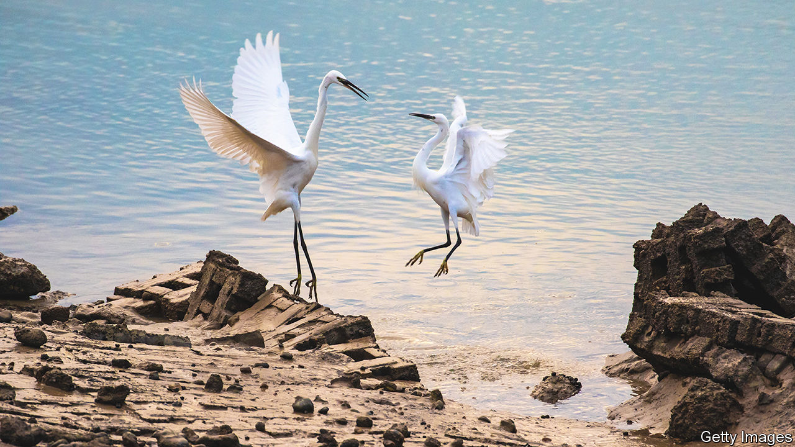
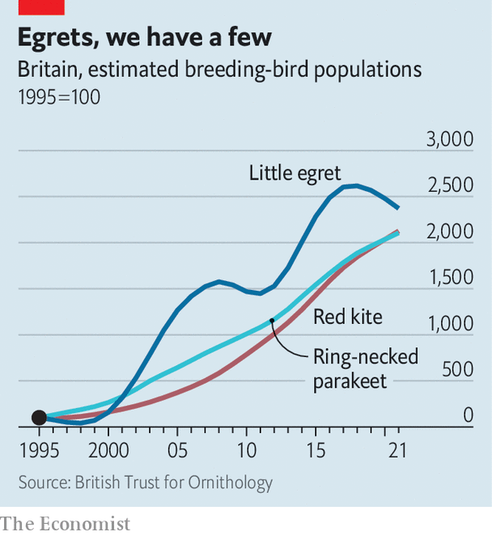

###### Highly successful birds

# A few bird species are faring amazingly well in Britain 

##### That seems to be making them unpopular 

 

> Aug 25th 2022 

Phil hyde was walking in Norfolk in 1979, feeling rather disconsolate after missing a rare rose-coloured starling, when a little egret suddenly appeared, to excited shouts from other birders. The white, heron-like bird was then highly unusual: the British Birds Rarities Committee tallied just 14 in the whole year. But that soon changed. In 1991 the committee stopped recording little egrets because they had become too common. These days, in parts of England, you can see 14 little egrets without moving your feet. (And you can see two of them in the picture above.)

 


Britons care a good deal about wild birds. The Royal Society for the Protection of Birds has 1.1m members, more than all political parties put together; almost 700,000 people take part in its annual garden birdwatch. In some ways it is a gloomy enthusiasm. The populations of many bird species, especially those found on farmland, have crashed over the past few decades. But there are a few startling exceptions (see chart) which reveal as much about Britain as the country’s avian failures do. 

Immigrants are the biggest winners, in proportionate terms. Little egrets arrived of their own accord from France and have spread through Britain. Red kites were carefully reintroduced to southern England from 1990. Like little egrets, since the mid-1990s their numbers have risen by 20 times or more. Ring-necked parakeets probably escaped from cages and started breeding. Their population has risen similarly. Some other species that have become more common in Britain, such as blackcaps and chiffchaffs, have stopped migrating south in winter, says David Noble of the British Trust for Ornithology, a charity. 

Mr Hyde says that birders have welcomed little egrets as new additions to Britain’s avifauna. “It helps that they are beautiful,” adds Mr Noble. But then, so are other species. Red kites, now a whistling, fork-tailed fixture of southern skies, are a rich reddish-brown. Ring-necked parakeets are shockingly green, with red beaks. Britons have their doubts about both. 

Last summer the residents of Henley-on-Thames, in Oxfordshire, wrote to their local newspaper with accounts of kites stealing food out of people’s hands. Elsewhere, kites are said to have dropped raw meat on people’s heads and eyed up a small dog hungrily. In July Oxfordshire Live, a news website, reported that a kite had pinched a steak from a child’s plate. The boy’s grandfather commented that there are “too many of them now” and that they are “getting braver around people”.

Ring-necked parakeets, which have established noisy colonies as far north as Glasgow, are suspected of muscling other birds out of nesting holes—for which there is some evidence from Belgium. The , a newspaper that amplifies British anxieties, has called their squawking call “a harbinger of doom for native birds”. Their evident foreignness offends. “Yes, they look spectacular on bird tables,” wrote a columnist for the , a Birmingham newspaper. “But so would a Bengal tiger on your patio.” 

“People can start to despise birds that become abundant,” says Mark Cocker, who has written many books about birds and people’s attitudes to them. They particularly object to successful species that are noisy, bold and adaptable—in short, birds with human characteristics. Hostility can linger long after a bird ceases to thrive. Mr Cocker says that many old people continue to dislike starlings, which thrived in the 20th century before declining alarmingly. Their number is thought to be less than half of what it was in the mid-1990s. 

Red kites were common in 16th- and 17th-century London. Although some welcomed them as rubbish-removers, others detested their habit of taking human food and killing chickens. “Our good Housewives are very angry with them, and of all birds hate and curse them most,” wrote one ornithologist. They were eventually poisoned to near-extinction in Britain.

But a repeat of that cycle of success, resentment and eradication seems unlikely. Environmental laws have become stronger and people more squeamish. The government has pondered a mass cull of ring-necked parakeets but has not gone ahead (monk parakeets, also newcomers, with an unfortunate habit of nesting in power lines, were not spared). Given the generally degraded state of nature in Britain, it is likely that people prefer thriving, boisterous new arrivals to silence.■

