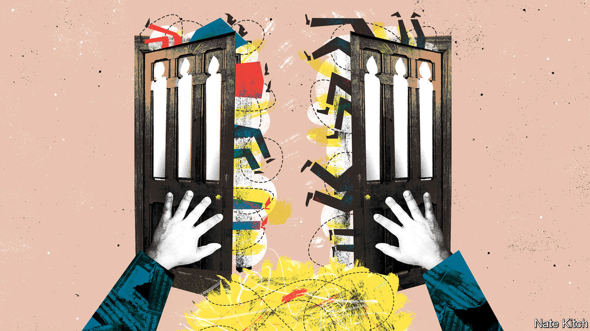

###### Bagehot

# Boris Johnson is likely to create many new peers 

##### And in doing so make the House of Lords worse 

 

> Aug 25th 2022 

The toilets in the House of Lords are telling. Push open the heavy oak door marked “ladies”—for once the word is being used with precision, not mere politesse—and you find yourself in magnificent, ornate rooms. A chaise longue stands against one wall; an oriental screen against another. Each of the massive marble washstands (such creations resist the mere word “sink”) has a tiny portcullis crest between the taps. 

Turn and peep into the cubicles, however, and the picture changes. Some are fitted with grab handles on the walls; one is all but encrusted with mobility aids. In the halls outside, moth traps dangle from grand Gothic furnishings. This, then, is the House of Lords: an odd blend of the genteel and the geriatric; of past grandeur and present decay; a place that is one part opulent palace, two parts eccentric old-people’s home. 

The House of Lords, as every Briton knows, is ridiculous. Westminster’s second chamber has variously been described as “absurd”; an “anachronism” and as the “best day-care centre for the elderly in London”. Its members have not always helped to dispel such attitudes. In the 1980s one lord argued that mere insanity should not bar peers from taking part. Read transcripts of debates and it is clear that it often didn’t. During a debate in 1974 on aid policy for victims of crime, the fourth Earl Russell stood to explain that the House of Lords was the true heir to the Soviet Union and that “naked bathing on beaches or in rivers ought to be universal”, before going on to add the engaging observation that Britain was currently governed by “spiritless papal bum-boys”. 

Perhaps this is why, after it was reported that Boris Johnson is intending to ennoble 30 of his chums when he at last departs from Downing Street in September, the news was greeted less with unbounded outrage than a shoulder-shrug of indifference and an aura of what-does-it-matter-anyway? 

Some, it is true, balked at the sheer number on Mr Johnson’s alleged list. The House of Lords is already far too big: with 800-plus members it is one of the largest legislative assemblies in the world. As many point out only China’s National People’s Congress is larger. And 30 new peers is a lot. Margaret Thatcher ennobled only seven in her leaving list; Harold Macmillan a minimalist one. 

Others expressed alarm at the quality. The idea that Nadine Dorries—culture secretary, cabinet toady and author of soupy historical sagas (“Lord FitzDeane of Ballyford falls deeper under her spell…”)—might become a peer of the realm distressed many. But generally the reaction was apathetic. 

This is certainly not unprecedented. In the 1970s Harold Wilson’s infamous “lavender list” of appointments (so called as it was allegedly drawn up by his political secretary on lavender notepaper) ennobled his raincoat-maker. In the 1920s David Lloyd George flogged honours so openly that an unofficial tariff was recognised: £10,000 for a knighthood; £50,000 (£2m, or $2.4m, today) for a peerage. Baronetcies, as one P.G. Wodehouse character noted despondently, “have gone up frightfully nowadays”. 

But that doesn’t mean that another scandal doesn’t matter. It does. Compared with those that have gone before, Mr Johnson’s appointments are likely to be worse both quantitatively (if he adds 30, he will have created peers at a faster rate than any prime minister in the past half-century) and qualitatively (he has previously elevated his own brother, generous donors to his party and the son of a former kgb officer). 

Moreover the Lords is far more valuable than it is often given credit for. True, it contains some silly appointments. But it also contains incalculably good ones. Sitting on its tiered seats are former heads of mi5, the army and the police; veteran politicians, qcs and academics; and the nation enjoys their expertise for £323 a day, a fraction of the fees that their Lordships might earn elsewhere—and some don’t even claim it.

Undoubtedly, the Lords is easy to mock. Its traditions date back to Norman times; its ceremonies feature robes that date from 1850 and flunkies in tights. Its operation involves an unconscionable number of wigs, and far too many ruffles. 

But tradition, slowness and even stasis can be invaluable. It has been said that one of the most malevolent constitutional instruments in the country is the Downing Street removal van, which arrives the morning after an election to transport the new prime minister to their official residence. There, they must make decisions of national import while their blood is still filled with adrenaline and removal boxes are still filled with their socks. Democracy is chaotic and dramatic. That is its job.

The House of Lords, by contrast, is stable to the point of staid. Step through the peers’ entrance, just off the main street outside Parliament, and you find yourself in yet another grand room, with vaulted ceilings and mullioned windows. This is the Lords’ cloakroom, and in it stand rows of coat racks with names in brass holders: here is “Baroness Redfern”; there is “Lord Taylor” and there, by that brolly, “Lord Tebbit”. The overall atmosphere is one of quiet order: this day-care centre takes good care of its inmates.

Tenure and tenacity

Such cosiness might be mockable: it is also powerful. Peers are protected by their lifetime employment: they cannot be as easily bullied as mps into agreeing to legislation they dislike. In recent decades the Lords has defended trial by jury and opposed infringements of civil liberties. And peers are far less cosseted than their fancy surroundings might make you think. Inspect the loo roll in those toilets and you find that it is, as it were, bog-standard.

The House of Lords is without a doubt odd. That does not mean it is worthless. One of the greatest dangers of the miasmatic Mr Johnson is not merely that he taints all he touches. It is that he makes everyone believe that what he spoils wasn’t worth very much in the first place. But the House of Lords was, and still is.■


