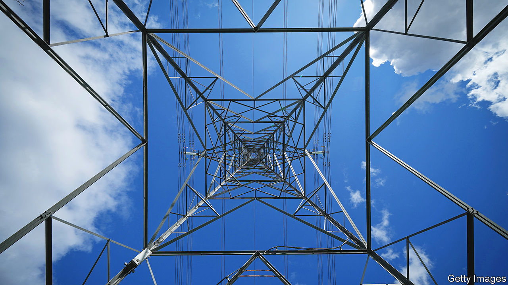

###### Electric shock

# Britain’s government wants to reform power markets 

##### It would eventually bring down energy bills, but won’t help this winter 

 

> Aug 25th 2022 

Bad news is no more welcome for being expected. On August 26th Britons learn just how high the regulatory “cap” on electricity and gas prices will be from October. The average household’s monthly bill is likely to rise to about £300 ($355), more than three times what it was a year ago. Another leap, to £355, is likely in January. Businesses, which have no cap, have been suffering even higher increases.

Energy bills have climbed with wholesale gas prices, which the war in Ukraine has lately pushed to new heights. (European gas futures reached another record this week.) The link to gas bills is clear, if indirect. That to electricity bills, less so.

The wholesale power market runs on a “merit order” principle, under which the price paid to the costliest generator needed to meet demand is paid to all. That is usually a gas-fired power station, even though renewables and nuclear plants supply around 60% of Britain’s electricity and renewables’ running costs are often virtually nil. Sparked by soaring prices, the government launched a review in July. It thinks that if some clean generators were paid less, electricity bills could be slashed.

One idea is to pay all generators the average bid. Another is to pay each what it bids. A third is localised pricing, which would mean lower bills for people living near wind farms, say. All these ideas have their flaws. Costly generators would make losses under average pricing, yet are sometimes needed to keep the lights on. Paying what is bid could give generators an incentive to inflate their bids. Localised pricing might skew generators’ decisions on where to build capacity. 

A more radical notion is to split the market between renewable energy, priced at its average cost (far below the current wholesale price) and fossil fuels. The idea is that prices would be pulled lower, closer to the cost of renewable generation.

Some are sceptical about how far splitting the market would cut prices. Breaking it up “doesn’t make sense”, says Rahmat Poudineh of the Oxford Institute for Energy Studies, a think-tank. The price of much renewable energy is already in effect fixed. Roughly 20% is sold via “contracts for differences”; generators bid into the merit order but eventually receive a pre-agreed price. Only renewable capacity built before 2017, which sometimes gets a subsidy on top of the wholesale price, really rakes it in. The  has reported that Kwasi Kwarteng, the business secretary, is keen to see more such generators sign fixed-price deals. 

Eventually, “someone has to pull the plug and make price equal cost”, says Sir Dieter Helm, an economist at Oxford University. “The wholesale market is a 20th-century answer to a 21st-century market,” one designed for fossil fuels with high running costs rather than renewables. In a merit order with no high-marginal-cost stations, the wholesale price can also crash to zero. That’s of little use to renewables firms; and investors will be put off by volatility in prices. 

A thorough redesign, fit for a net-zero age, could take years. Immediate balm for consumers, an urgent task for the next prime minister, will meanwhile have to come via lower taxes, higher benefits or subsidies to bills. But there are no painless answers. The head of one energy supplier has reportedly suggested freezing the cap for two years, with the state stumping up £100bn—which would be repaid by consumers over decades. ■

