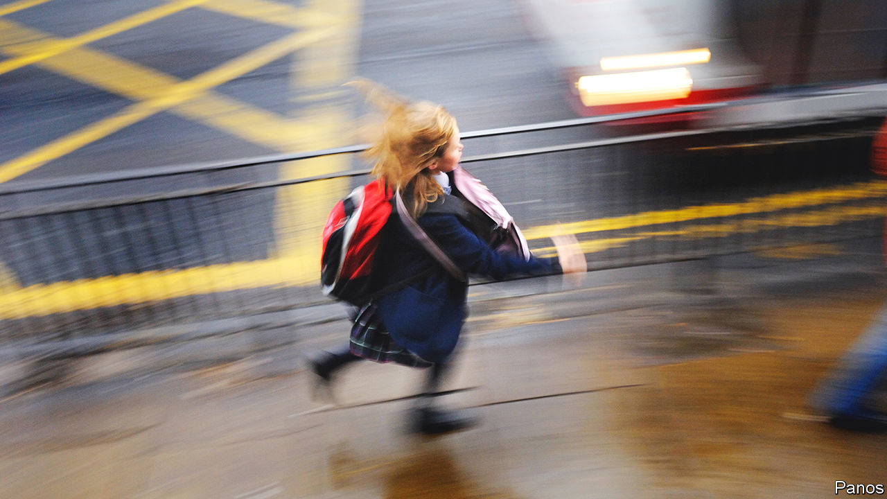

###### Back to school

# British parents need more help than ever to afford school uniforms 

##### Schools, suppliers and charities are trying to help 

 

> Aug 25th 2022 

“Everyone is having to tighten their belts,” explains Siobhan Phillips, who runs the Schoolwear Centre, in Margate in Kent. To help families afford new uniforms she offers payment plans and discounts. She sells second-hand items, collected from school lost-property boxes, for £2.50 ($3) to cover cleaning costs. She gives uniforms away to those social services and schools identify as most in need. They “are our family”, she insists. “We have to help them.”

Almost all Britain’s schools have uniforms, for which parents must usually pay. In 2020 the Children’s Society, a charity, calculated the annual cost of a state secondary-school pupil’s uniform, including pe kit, coat, bag and shoes, at £337. (A survey of retailers, by the Schoolwear Association, an industry body, focusing on compulsory items, put the cost at just £100.) With annual inflation over 10%, family budgets are tight as the new school year starts. Mrs Phillips sees ever more working families choosing something second-hand.

Last year the Department for Education in England issued its first statutory guidance on the cost of uniforms, reinforcing previous recommendations. For instance, schools should not insist on items available from one supplier. Schools are “expected” to adhere to the rules by this September and must do so by next year. 

The guidance will make it easier for parents to buy cheap, generic schoolwear from high-street shops and supermarkets (though specialists say their clothes are better and will last longer). The industry wants the government to scrap vat on all uniforms, which is levied at 20% on clothes for children over 14.

It is too soon to know what savings the guidance has yielded. The many schools run by “academy trusts” rather than local authorities are likelier to have formal uniforms, such as blazers and ties, rather than polo shirts and jumpers. Some of them are making their uniforms simpler. The Outwood Grange Academies Trust, in northern England, provides free uniforms to all its pupils. Some schools have also replaced unusual colours with commoner, cheaper ones. 

Geoff Barton, the general secretary of the Association of School and College Leaders, expects that finding ways to meet the cost of uniforms “will become more pressing”. In Northern Ireland, Scotland and Wales poorer families can apply for small grants, but few local authorities in England offer such help. Some direct families to charities.

Organisations that pass on uniforms are scaling up. Since 2016 a “swap shop” run by the Generations Church in Louth, in Lincolnshire, has distributed items to more than 1,000 families. This summer it is busier than ever and has expanded to nearby Grimsby. Linda Hardwick, a volunteer, recalls one little boy being so chuffed that he fished into his pocket. “That’s for my school uniform,” he said. “It’s my favourite rock. You can have it.”

