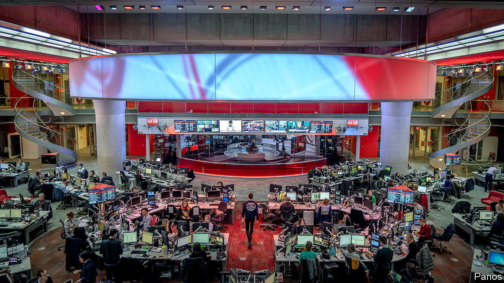
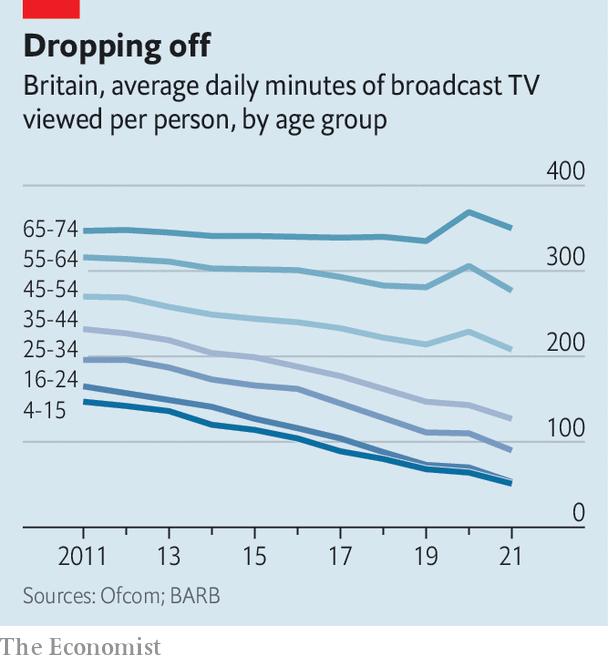

###### The bill for the box

# Who should pay for the BBC? 

##### The century-old funding mechanism for Britain’s public broadcaster is under attack 

 

> Aug 22nd 2022 

A lanky bronze George Orwell, cigarette in hand, guards the headquarters of the British Broadcasting Corporation. An accompanying inscription declares: “If liberty means anything at all, it means the right to tell people what they do not want to hear.” The public broadcaster has done plenty of that: Boris Johnson has called it the “Brexit-Bashing Corporation”. His advisers once promised to “whack” the bbc’s source of funding.

Now the prime minister is heading for the door, just in time for the broadcaster’s centenary celebrations in October. Yet any relief that bbc executives feel may be temporary, for the corporation must confront more serious challenges than the huffing and puffing from Downing Street. Like other European public broadcasters, the bbc faces uncertainty about its role in an era of Netflix and YouTube. Inside and outside the bbc, thoughts are turning to where its future funding may come from.

The bbc’s revenue model is much the same as in 1923, when the Wireless Telegraphy Act introduced a fee of ten shillings a year (roughly £21, or $25, in today’s money) for homes with radio sets. Today the licence fee is £159, payable by any household that watches live tv or uses iPlayer, the bbc’s online catch-up service. (There are exceptions, such as poor elderly folk.) Last year the fee raised £3.8bn, 74% of the bbc’s revenue; the rest was from commercial activities like selling shows abroad.

 


The near-universal charge has been justified by near-universal consumption. Every week 90% of British adults tune in to the bbc’s eight national TV channels, 50-plus radio stations and sprawling website. But with competition from Hollywood and Silicon Valley, viewers are changing channel. Broadcast tv’s share of British video consumption fell from 97% in 2010 to 70% in 2021, according to Enders Analysis, a research firm, which predicts a drop to around 60% in the next five years. Streaming is “stretching the tv generation gap”, noted Ofcom, the communications regulator, in a report on August 17th that showed that the youngest adults watch one-seventh as much broadcast tv as the eldest. One in five 16- to 34-year-olds consume no bbc content at all in a typical week.

This is making the universal £159 fee harder to defend. So is the streamers’ sheer value for money. The bbc provides plenty of things that Netflix and Co never will, from news (notably this year the Ukraine war) to education (80% of secondary pupils used the bbc’s “Bitesize” classes during the pandemic). But the streamers’ scale and ability to borrow mean that they can offer more for less. Disney+ costs half as much as the licence fee, yet Disney’s content budget last year was more than five times as big as the bbc’s. Amazon spent slightly more on its forthcoming “Lord of the Rings” series than the bbc did last year on all its film and drama combined.

Such comparisons have focused minds. The bbc’s royal charter, which sets out its remit for the next decade, is up for renewal in 2027. Ahead of that the government has ordered a review of the licence fee, expected to run from September for about a year. The two candidates to succeed Mr Johnson, Liz Truss and Rishi Sunak, have yet to show their hand. But Ms Truss, the favourite, raised eyebrows on August 19th when she told gb News, a right-wing tv channel: “It’s not the bbc, you know. You actually get your facts right.” She is said to be considering hanging on to Nadine Dorries, Mr Johnson’s culture secretary, who declared in January that the bbc’s latest licence-fee settlement “will be the last”.

Yet criticising the licence fee has long been easier than replacing it. Margaret Thatcher, who grew to loathe the bbc for its coverage of the Falklands war and Northern Ireland, thought the corporation should live off advertising, like Britain’s other public-service broadcasters. But the review she commissioned in 1985 to endorse this idea warned her off, for reasons that remain true today. Advertising would generate a third less revenue than the licence fee, estimates Ampere Analysis, a research firm. It might divert the bbc from its public-service mission. And other ad-funded media—including the bbc’s strongest critics in the press—oppose the idea, fearing competition for ad sales.

More recently, critics of the fee have proposed a subscription model, so that people might opt in or out of the bbc as they do with Netflix. Like ads, subscriptions would struggle to raise as much as the licence fee: even if the bbc persuaded two-thirds of fee-payers to opt in it would have to charge them 50% more to match its current revenue. And chasing subscribers would introduce the same commercial incentives as chasing advertisers.

Continued public funding of some kind thus seems inevitable. But the method could change. Of the 56 markets in the European Broadcasting Union, a group of public-service broadcasters, only 20 rely mainly on a licence fee. Some, including the Netherlands and Iceland, fund their broadcasters from general taxation. This month France said it would follow suit. Billing the taxpayer for public goods like Bitesize may be fairer than charging viewers, as well as more progressive. The main objection is that closer government involvement threatens broadcasters’ independence. On August 24th Emily Maitlis, a former bbc presenter, said the bbc’s board already had an “active agent of the Conservative Party”, in the shape of a former head of communications at Downing Street. 

One way around that would be a new, earmarked source of income. Finland and Sweden have a hypothecated income tax. In 2013 Germany ditched its licence fee for a property charge, which broadened the base of collection and thereby lowered individual bills. In July a House of Lords committee suggested a top-up to council tax, a charge on households. That would save on administration—collecting the licence fee cost the bbc £136m last year—and could be more progressive, since the tax is split into bands based on property values.

Ms Dorries is said to be interested in the household levy. But it is hard to imagine a Conservative government introducing a new “bbc tax”. It would go down badly with hardcore bbc refuseniks, who at present can opt out if they promise they do not watch any live tv or iPlayer. Nearly 2m households claimed as much last year, 270,000 more than in 2020. 

With no alternative very palatable, Claire Enders of Enders Analysis suspects that “where this review is heading is where all the reviews have always headed”—that is, a recommendation that the licence fee should remain. That may not be the end of it: the Lords committee argued that the bbc’s funding model should be made fairer, which could suggest more means testing. Discounts could be extended to households on universal credit, say, with the rich making up the shortfall.

Bigger decisions lie ahead. Public broadcasters may ultimately face a choice between beefing up to compete with the streamers, or slimming down to eat-your-greens content, leaving entertainment to Hollywood. That is particularly tricky for the Tories, whose elderly voters love to criticise the bbc but are also addicted to watching it. So far the government has defaulted to moaning about the licence fee. But for a century that is one thing that has proved surprisingly hard to whack.■

