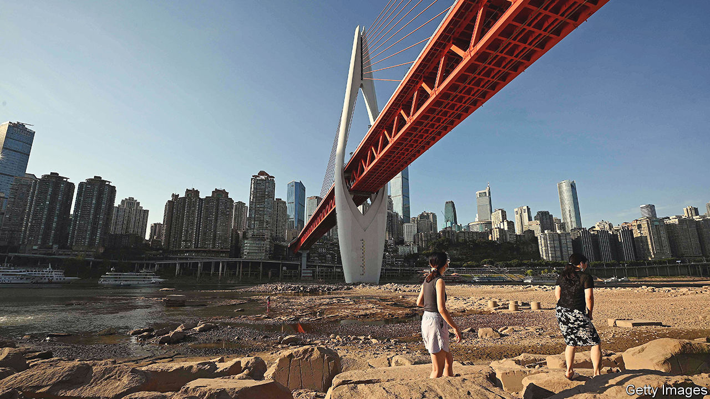

###### Heated exchange

# A drought in China hits industry 

##### The ill effects of hot weather and drought 

 

> Aug 25th 2022 

A city rivalry is heating up between Shanghai and Chengdu. The highest temperatures and lowest rainfall since records began 60 years ago have led to severe power shortages across the south-western province of Sichuan, where Chengdu is located, and in its neighbouring municipality, Chongqing. As a result Sichuan has been forced to curb energy use at thousands of industrial firms. That in turn has threatened the supply of parts to carmakers, such as Tesla in Shanghai. 

In a recent letter, Shanghainese officials urged the heat-struck region to guarantee supplies to feed their production lines. The has led to an outpouring of anger in Sichuan. The letter, which circulated widely on social media, listed the phone numbers of several officials in Shanghai. Some Sichuanese have taken to texting or calling them to complain about their lack of concern for residents’ well-being, and then sharing the conversations online. “Who is Tesla to you?” complained one resident after their electricity had been shut off for an hour and a half every day. 

In what may have been a gesture of solidarity, Shanghai switched off many of the bright lights of its famous skyline on August 22nd-23rd. But the rupture between the two cities reveals how far the drought is rippling through supply chains. China is in the midst of what is being called the worst heatwave ever recorded. The south-west has also been hit with a devastating drought. Rainfall in Chongqing is down by 60% from seasonal norms. 

The combination of heat and drought has increased demand for energy while also greatly reducing hydroelectric generation, on which the region relies. Dams make up about 80% of Sichuan’s power generation and nearly 15% nationwide. Hydroelectric output in Sichuan has halved compared with last year. Local governments have prioritised residential needs, although some homes now lose power for several hours a day. But officials in Sichuan told up to 16,000 industrial consumers to shut down between August 15th and 25th. Sichuan and Chongqing produce about 6% of China’s industrial output.

The power cuts have shut down operations in the region at firms such as Toyota, a Japanese carmaker, and Foxconn, one of Apple’s main suppliers. But the impact is also being felt much further downstream. In Wuhan, about 900km east of Chongqing, low water levels on the Yangzi river have prevented the passage of ocean-bound cargo ships. Many companies based across China are losing access to components usually supplied by manufacturers based in the south-west. 

China faced a crippling power crunch last year after the government curbed the use of coal in order to hit climate targets. Since then central planners have worked out some of the bottlenecks in the power supply. And a sluggish economy has also lessened demand. Perhaps the lessons learned last year will stop the crisis in the south-west from spreading nationwide. Even so the drought and heatwave have given Chinese policymakers an unwanted glimpse of problems they may face more regularly in coming years.■


