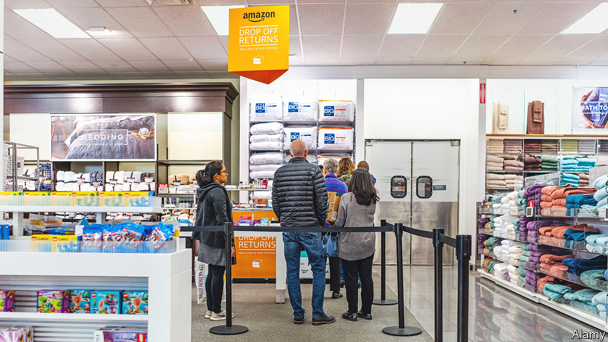

###### Sending it back

# A tidal wave of returns hits the e-commerce industry 

##### For retailers it is a tricky and expensive problem 

 

> Aug 25th 2022 

Getting a package delivered is easy. Sending it back is not. Repacking, printing labels and shipping it back up to the seller is an increasingly familiar experience for online shoppers. In America 21% of online orders, worth some $218bn, were returned in 2021, according to the National Retail Federation, up from 18% in 2020. For clothing and shoes it can reach around 40%. It is a headache for retailers. 

The problem has its roots in the birth of e-commerce. To compete with bricks-and-mortar sellers and make consumers comfortable with ordering online, e-commerce firms offered free returns. Consumers came to expect it. The scale of returns has been amplified by the covid-induced boom. In America online-shopping now makes up 15% of retail sales by value, up from 10% at the start of 2019.

Returns could grow as nervous consumers cut spending. In May, Boohoo, a British online fashion firm, forecast lower profits for the year, in part because of a higher return rate. In June, Asos, a rival, did the same. Overstocking, as retailers miscalculate changing demand, adds to the problem. Steve Rop of gotrg, a startup which helps retailers sort returns, notes an uptick in returns of discounted goods as consumers realise they don’t want them. 

Each step of the process is costly. Retailers have to pay for goods to be picked up or posted. Processing returns is labour-intensive, explains Zac Rogers who worked as a returns manager at Amazon and is now at Colorado State University. The outbound system is highly automated and streamlined; a return must be opened and someone has to decide what to do with it. “A worker in an Amazon warehouse can pick 30 items in a minute, but a return can take ten minutes to process,” says Mr Rogers. 

Once processed, only 5% of returned goods can be resold immediately by retailers. Most go to liquidators at knock-down prices or are thrown away. Retailers typically recoup about a third on a $50 item, says Optoro, a firm that helps with returns. 

One solution involves adding friction. Last year Uniqlo, a Japanese fashion brand, became one of the first retailers to levy a small fee for posted returns. Zara, a rival, followed suit in May. Other firms, including Amazon, are selling more refurbished goods as a way to cut losses. 

Startups are getting in on the action. Using artificial intelligence to help retailers decide what to do with the returned goods, taking into account factors such as price trends in second-hand markets, is the brainchild of gotrg. Happy Returns, another startup bought last year by PayPal, a fintech firm, helps with logistics. It has 5,000 drop-off points for returns across America, mostly in chain stores. The returns are aggregated and sent back to retailers all at once, saving up to 40% of postage costs, says David Sobie, the firm’s boss. 

Some are experimenting with virtual reality (vr). Over half of items are returned because they are the wrong size. In June Walmart said it will buy Memomi, an augmented-reality (ar) startup that lets shoppers virtually try on glasses. Walmart also offers ways to try on clothes and arrange furniture in rooms using ar. Amazon recently launched a vr feature that lets users try on shoes. Retailers will now try virtually anything to cut down on returns.■


