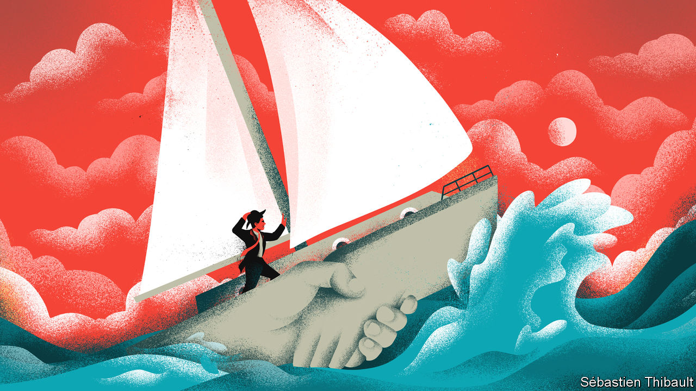

###### Blasted are the dealmakers

# Firms’ unwise addiction to mergers and acquisitions 

##### A bumper year for dealmaking is likely to result in a painful hangover 

 

> Aug 24th 2022 

The death knell for corporate America’s greatest individual experiment in mergers and acquisitions sounded in November 2021 when General Electric announced its intention to split in three. A thousand deals were struck by Jack Welch, its notoriously gung-ho boss, who ran the American industrial and financial giant between 1981 and 2001. The pace did not slacken under his successor, Jeffrey Immelt. The result has been a monumental destruction of shareholder wealth. The firm’s market value peaked at $594bn in 2000. Today it is a relatively measly $83bn.

 


This lesson notwithstanding, bosses just cannot shake the need to shake hands. In 2021 the urge reached fever-pitch: a record $5.9trn-worth of deals were announced globally, $3.8trn by operating companies and the balance by private-equity funds and special-purpose acquisition companies (see chart). Competition for assets was fierce and due diligence frenetic. The cost of capital was historically low and purchasers paid top-notch prices, at a record median valuation of 15.4-times earnings before interest, tax, depreciation and amortisation (ebitda), according to Bain, a consultancy. The number of deals for highly-valued technology firms soared, accounting for a quarter of the total volume.

If history is any judge, many of these deals will destroy value. It is easy to identify disastrous deals: large goodwill write-downs or even bankruptcy are useful signposts. But measuring the performance of the average deal is tough; relative share price performance is a quick but noisy measure and asking a counterfactual “what if” question is crystal-ball stuff. A recent review of academic literature by Geoff and J. Gay Meeks at Cambridge University estimates that only a fifth of studies conclude that the average deal produces higher combined profits or increases the wealth of the acquirer’s shareholders. McKinsey, another consultancy, reckons that firms pursuing large deals between 2010 and 2019 had only a coin-flip chance of creating excess shareholder returns. Enough to put average Joes off dealmaking, but not budding Neutron Jacks. 

Those chances of success are further reduced by the circumstances in which the latest crop of deals were struck. Times of frenzy, like last year, are particularly bad for matching suitable buyers and sellers. Dealmaking tends to snowball as chief executives, keen to expand their dominions (and compensation), watch others make their moves and are unable to stand idly by while competitors make hay. Unprecedented competition from private-equity funds only intensifies the urge to move fast. Compounding their zeal are the middlemen. Investment bankers, who get paid by the deal rather than by the hour, convince them anything is possible: flattery is hard currency in the market for advice.

There are few brakes on this train. Where activist investors might agitate on the sell-side of a transaction for a higher price (often successfully), this kind of scrutiny is less common on the buy-side. Strong shareholder dissent in reaction to Unilever’s abortive $66bn bid for gsk’s consumer health-care division in December 2021 is an all-too-rare example of owners holding trigger-happy management to account. Today the division, called Haleon, is listed on the London Stock Exchange, valued at around half of Unilever’s offer.

The result has been ambitious deals made at high prices. Lower asset values are already exposing the flawed logic of some struck at the top of the market. In August Just Eat Takeaway.com, a European food-delivery firm, announced a write-down of the value of Grubhub, its distracting American misadventure, by $3.3bn, barely a year after completing the $7.3bn deal.

As equity markets tumbled this year, the shotgun weddings announced in 2021 were being consummated. After the thrill of courtship begins the hard task of post-merger integration. This complex process is the domain of consultants, organisational charts and budgeting, rather than clandestine negotiations and punchy projections. It is being turned on its head by a mix of inflation and slowing growth. Bosses bet big that high prices would be justified by higher profits. They are now running new businesses in a new world. 

Buyers tend to overestimate the operational benefits of lumping two firms together (“synergies” in corporate speak). Often promised but seldom fully delivered, these projections persuade bosses that the pin factory is better in their hands than those of private-equity’s financial wizards. Scale was the  of dealmaking during 2021. Such deals are usually predicated on heavy cost-cutting, which is far harder while inflation rages. Add current supply-chain chaos to yo-yoing input costs, and managers soon find their powers waning. 

That difficulty is apparent at Warner Bros Discovery, an American media giant formed in April 2022 through the merger of Discovery and WarnerMedia. In an industry among the worst at realising such targets came a promise of $3bn of annual savings. Rising costs and cyclical pressures on advertising revenue mean that integration will be more difficult than planned. Expectations for ebitda in 2023 are now $12bn, rather than $14bn when the merger was announced. The response of David Zaslav, the firm’s boss, has been to tighten the screws . 

Labour is often the first cost bosses turn to, even if lots of layoffs raise the chance of rifts between new bedfellows. Many of the most spectacular blow-ups have involved cultural transplant-rejection at the highest levels, though as in aol and Time Warner’s ill-fated $165bn tie-up in 2001 this is usually a symptom rather than cause of strategic mismatch. Yet the real risks occur further down the food-chain, as labour markets continue to convulse. The ability to retain good workers (“talent” in the integration dictionary) is critical. It comes high on the list of reasons why deals succeed in a recent survey conducted by Bain.

The war for talent has quickly turned into a great hiring freeze in the technology sector, but elsewhere labour shortages are the norm. Significant challenges await the integration of Canadian Pacific Railway and Kansas City Southern, a $31bn deal announced in September 2021 which is awaiting its final regulatory stamps. The merger in 1968 of Pennsylvania and New York Central Railroad provides a warning from history. Shortly before the new entity’s bankruptcy in 1970, an internal report laid bare the role of high staff turnover in its failed integration: 61% of train masters, 81% of transport superintendents and 44% of division superintendents had been in their job for less than a year.

The dealmakers of 2021 entered the present inflationary period with a high bar to clear in order to justify the top-of-market deals they struck. As of now the mega-disasters of this wave of mega-deals are matters of speculation, though no one doubts they will emerge. Even this will not be enough to convince bosses to kick their dealmaking habit, at least while corporate balance-sheets remain strong. Activity has been remarkably resilient in 2022. Until bosses can be persuaded of other uses for their profits, new challenges mean only new types of deals. At least this year there may be a few bargains to be had. ■


