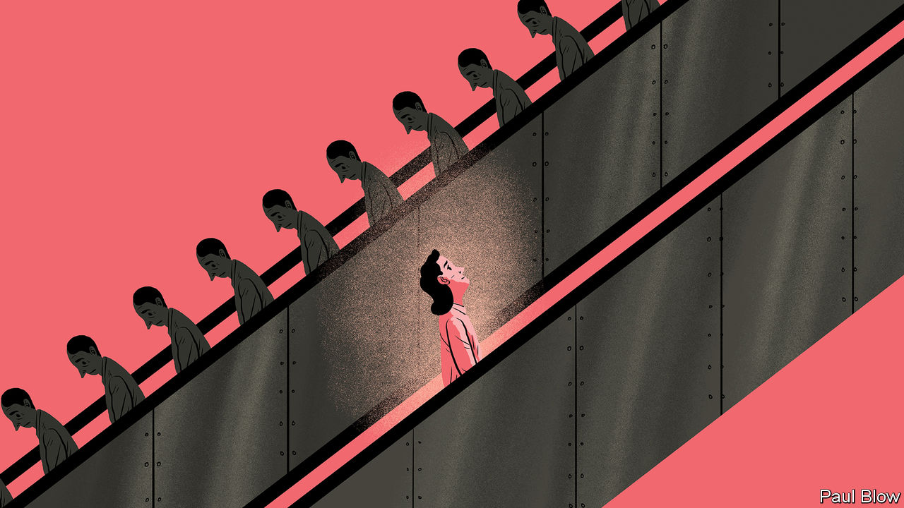

###### Bartleby

# Is travelling to work always a waste of time? 

##### In defence of commuting 

 

> Aug 25th 2022 

Americans are “always in a hurry”, wrote Alexis de Tocqueville in “Democracy in America”, his opus published in 1835. Until the covid-19 pandemic, nowhere was this more evident in recent decades than in packed trains at peak times as people commuted to work. 

Almost 75% of professionals in America say the journey is what they dread most about going back to the office. Working remotely a few days a week is here to stay. Rush-hour traffic, overcrowded trains and transport strikes (like those on London’s tube in the past week) all argue for working from home. Across America and Europe rising fares eat into people’s salaries. The outcry for lower carbon emissions adds additional weight to the argument for millions of employees not undertaking unnecessary journeys. In some emerging cities, getting to work involves honks and epic gridlock as well as accidents.

Every now and again, most people will nevertheless need to make the trip to the office and back. Whether you are walking, cycling, on a Vespa, taking the bus, the tram or the subway, the range of options is wide, and rich in texture and colour. Some people will insist that no commute is ever worth the trouble. With the right attitude, though, it does not have to feel like temporary brain damage. This guest Bartleby, who takes the underground to ’s London office three times a week, finds it both useful and oddly fulfilling. 

Just how useful and fulfilling will depend on what exactly your commute looks like. But unless you hop into your car on your driveway and hop out at your company car park, it will involve at least some physical activity. If you are cycling, or just picking up your walking pace to catch that bus or train, you combine being outdoors with an element of struggle—a healthy amount of which can be invigorating, not draining. And if you don’t catch it, don’t worry. Your hours have almost certainly become more flexible than the previous nine-to-five routine. That next train may anyway be less like a cattle car.

Like all dislocations, even regular and predictable ones, the daily commute is also a time and place where you are more exposed to physical and psychological elements from which you are shielded at home or at work. In “Falling in Love” a film released in 1984, Meryl Streep and Robert De Niro meet as they commute on the same train month after month from the suburbs to New York City, until, one day, they embark on an emotional affair. The plot is banal and the dialogue dim but the idea that a journey injects a sense of risk and possibility is both deep and real.

Public transport, which a lot of commuting involves, remains the most democratic way of going to work. As chairman of the Federal Reserve from 1979 to 1987, Paul Volcker travelled coach class on the shuttle from New York to Washington, dc, and took the bus in both cities. As a public servant embodying civic duty, the central banker was known for his financial discipline in personal affairs, as well as monetary policy. At a time when greed was good, and limos, helicopters and private jets were great, frugality from “the custodian of the nation’s money” sent a strong message. As companies bracing for a recession tighten their belts, Volcker’s example seems particularly relevant. 

Perhaps most important of all in an era of remote work, the commute helps mark out the mental distance between home and the office, which disappears when the kitchen table has become your work station. It offers a useful buffer—a liminal space separating the personal and the professional. 

Getting ready to leave for work in the morning involves an element of planning—sometimes even anticipation. Stepping out of your home, and your comfort zone, you feel more alive by default. When walking to the train station, purpose is externalised and compressed. In the afternoon, you can use that time as a curtain to separate the day from the rest of the evening, probe into those pieces of inner life that nag and still feel connected to the world. Bartleby lets her thoughts meander while on the move. Time wasted is time gained. 

Few people relish holing up in one place for ever. Working remotely from a secluded village in Italy may sound like a treat for a while. Yet like all sameness, it soon begins to feel stifling. In a modern world where de Tocqueville’s words ring true of everyone everywhere, it may seem strange to add to the hurriedness. But not if you think of the commute as punctuation in the larger tale.


