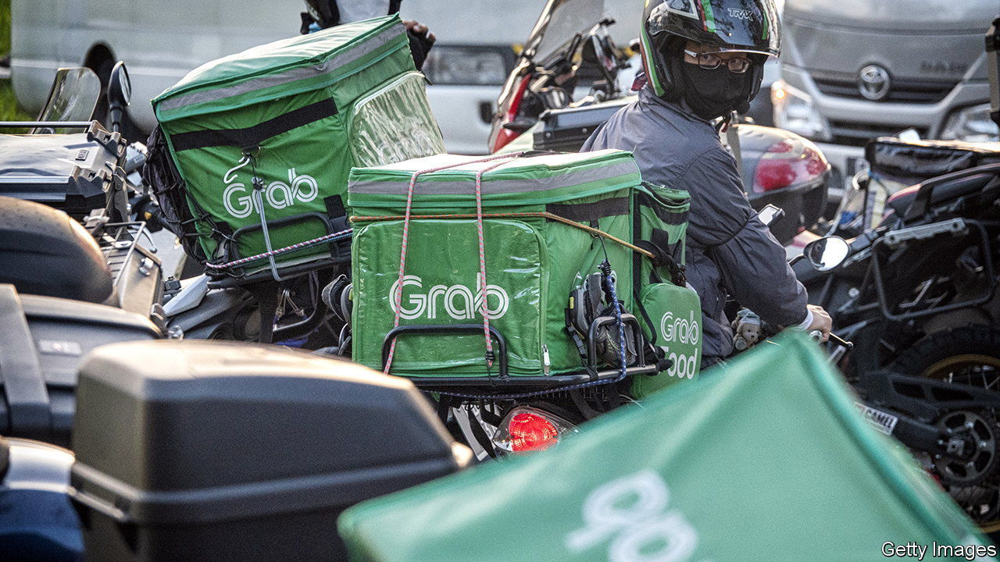
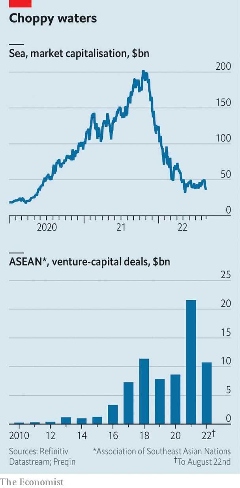

###### Tropical Depression

# South-East Asia’s tech firms take a battering 

##### Low investment is compounded by turn against unprofitable growth stocks 

 

> Aug 25th 2022 

Investors couldn’t get enough of South-East Asia’s consumer-technology giants a year ago. This year, they have been unable to log off quickly enough. Tech firms across the region are suffering. They have been buffeted by the same forces that have sent tech stocks globally tumbling by more than 20% this year. On top of this, surging inflation and the expectation of higher interest rates have diminished the appeal of companies which aim for rapid growth in the present with reliable profits only arriving sometime in the future.

South-East Asia’s giants not only have to cope with the ills besetting tech firms worldwide, but also face a “last-in-first-out” problem. The region is not a large part of the allocation of many global portfolios, and investors who piled in at the later stages of the boom may have lost their appetite. This has pushed down valuations further than the global slump. Sea, the region’s largest listed tech firm, is a case in point.

Sea’s market capitalisation is now $36bn, down from over $200bn late last year. The firm’s share price recorded another steep decline after it released quarterly results on August 16th. Revenues, mostly generated by Shopee, its e-commerce subsidiary, and Garena, its video-gaming arm, rose more slowly than expected, up by 29% year-on-year to $2.9bn. Tech companies globally are being punished for an inability to produce reliable income by investors now monomaniacally focused on cash generation. Sea’s free cashflow in the second quarter ran to minus $607m, the largest negative figure on record. 

 


Sea is not alone in its struggles. Grab, a Singaporean superapp offering deliveries, ride hailing, financial services and more, listed publicly in December. Its shares have since tumbled. Bukalapak, an Indonesian e-commerce firm which also listed last year, has seen its valuation drop by two-thirds over the past 12 months. GoTo, the Indonesian holding company that owns Gojek and Tokopedia after their merger in 2021, avoided the rout but its shares have languished in recent months.

Grab’s second-quarter results, due after  is published, and GoTo’s, unveiled on August 30th could bring better news, but Sea’s recent experience shows that the three firms’ ambitious plans for payments and financial technology, which require big investments and many years to grow, do not suit impatient investors.

Amid the gloom there are some reasons for cheer. Emerging-market equity-fund allocations to the region have risen slightly this year, notes Steven Holden of Copley Fund Research, as fund managers have looked for alternatives to Russian equities. China’s crackdown on its tech companies also leaves investors looking for other places to park their money. 

Beyond listed firms, venture-capital activity has slowed but not collapsed. Capital raised for funds focused on the region this year stood at $8.3bn on August 22nd, compared to $13.2bn for all of last year, according to Preqin, a data provider. The sum invested in vc deals this year runs to $10.7bn, already more than the total for all but two previous years—2018 and 2021. Sustained interest in smaller, private companies is good news for South-East Asia but does little for the pain of the larger listed ones. ■


