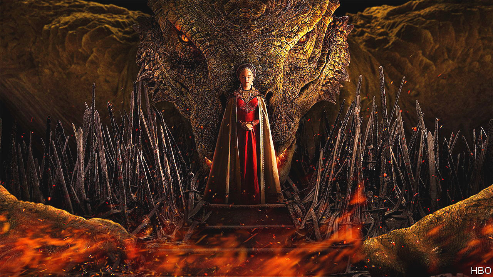
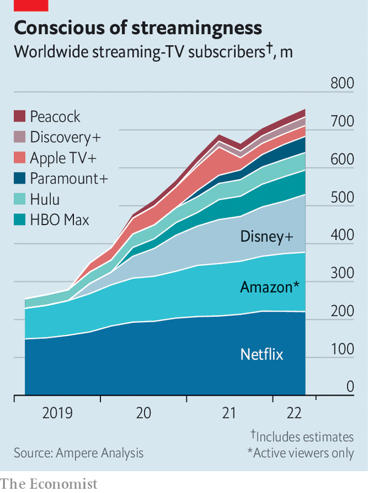

###### Dragons against hobbits

# “Game of Thrones” v “Lord of the Rings”: a tale of old v new Hollywood 

##### A century-old studio wages a big-budget war against a streaming upstart 

 

> Aug 21st 2022 

Half a billion dollars’ worth of swordplay, sorcery and sex is on its way to a small screen near you. On August 21st Warner Bros Discovery launched “”, a spin-off from its racy smash-hit, “Game of Thrones”, made at a reported cost of over $150m. Hot on its heels, on September 1st Amazon Prime Video will release “The Rings of Power”, a more chaste but pricier drama based on the “Lord of the Rings” books. With a rumoured pricetag of $465m, Amazon’s offering will be the most expensive piece of television ever made.

This will make for an epic ratings battle. But it is also part of a longer-running war that pits old Hollywood studios against new streaming upstarts. Warner Bros will celebrate its 100th birthday next year. Amazon, which makes its money from e-commerce and cloud computing, launched its video sideline only five years ago. As the  intensify, each side believes it has the advantage.

Lately the dragons of old Hollywood have gained ground. Investors flocked to streaming specialists during lockdowns, but have lost interest as . Netflix, which once talked of a potential market of 800m households, appears to have stalled at 220m and has seen its share price fall by 60% this year. On August 10th old Hollywood claimed a symbolic victory when Disney announced that it had overtaken Netflix, with 221m streaming subscriptions. That figure double-counts subscribers to Disney’s various services, and ignores the fact that many are in low-paying countries like India. But it has banished any doubt that ageing studios can play the streaming game.

 


Hollywood’s old hands are also refocusing on the business of making money, after two expensive years of chasing subscribers. Disney says its main streaming service, Disney+, will see its losses peak this year before turning a profit in 2024. A steep price rise, beginning in December, will help. On a recent earnings call David Zaslav, Warner’s new boss, bluntly criticised the old approach of “spend, spend, spend and then charge very little”. Warner will aim for its streaming business to generate a gross operating profit of $1bn by 2025, he said. “If we do that, I don’t really care what the [subscriber] number is…We want to make sure we get paid.”

Old media formats will play a role. Cinemas, whose worldwide takings fell by 80% in 2020, are open again. The box office is still not what it was: Cineworld, the world’s second-largest theatre chain, said on August 22nd that it was considering filing for bankruptcy. But Paramount, a 110-year-old Hollywood dragon, held back the release of “Top Gun: Maverick” during the pandemic and was rewarded in May with a box-office run of over $1bn. Warner, which in 2021 released all its films on its streaming platform at the same time as they launched in cinemas, has gone back to exclusive theatre runs.

Theme parks are full again, too, with Disney’s American ones generating record revenues and margins. Even broadcast and cable tv, long in decline, look like relative havens as the streaming business gets tougher. “We effectively have four, five or six cash registers,” Mr Zaslav told investors. “And in a world where things are changing, and there’s a lot of uncertainty and there’s a lot of disruption, that’s a lot more stable and a lot better than having one cash register.”

That may be a convincing argument against an upstart like Netflix, which depends on streaming. The trouble for old Hollywood is that some of its new competitors have bigger and more varied cash registers. Warner’s path to profit involves drastic cuts—it has already scrapped its streaming news service, cnn+, and canned unfinished productions including “Batgirl”. Amazon shows no sign of belt-tightening. Besides “Rings of Power”, it  Metro Goldwyn Mayer, the studio behind “James Bond”, for $8.5bn and acquired rights to America’s National Football League for a reported $1bn a year. Morgan Stanley, a bank, estimates that it will spend $16bn on media content this year. Netflix spent $14bn. Next year Amazon’s spending could reach $20bn.

Unlike the old Hollywood dragons, some new streamers don’t even need to get paid, in Mr Zaslav’s words. Amazon Prime Video exists to keep people signed up to Prime, whose main benefit is free delivery of Amazon purchases. Apple’s steadily expanding tv+ service is geared towards keeping customers in its ecosystem of phones and computers, where the firm makes its real money. The video services from Amazon and Apple also provide real estate for advertising, a business in which both have ambitions to grow.

Old Hollywood is fighting back, offering viewers bigger “bundles” of content at a reduced cost. Warner plans to combine its main streaming service, hbo Max, with Discovery+ next summer. Disney is experimenting with discounted packages of services like espn+ and Hulu; some wonder if entry to its parks could one day form part of a Disney mega-bundle.

Yet Hollywood’s new rivals offer bundles of a different sort. Apple’s video vault is far smaller than that of Disney or Warner, but its “Apple One” package includes not just tv but music, games, storage, news and fitness. Amazon Prime comes with a similarly eclectic bunch of benefits. As households look for savings, deals like these may prove tempting.

That may be why some old Hollywood dragons are doing business with the upstarts. On August 15th Paramount announced a deal with Walmart, a giant retailer, in which members of Walmart+, the store’s answer to Amazon Prime, will get free access to the Paramount+ streaming service. Walmart also sees media as a way to keep customers loyal to its main business. It recently added music to its bundle, via a deal with Spotify.

As competition for viewers intensifies, the battle between old and new Hollywood is proving as bloody as an episode of “Game of Thrones”. For consumers, who have more choice and more deals than ever, it is just as entertaining.■


