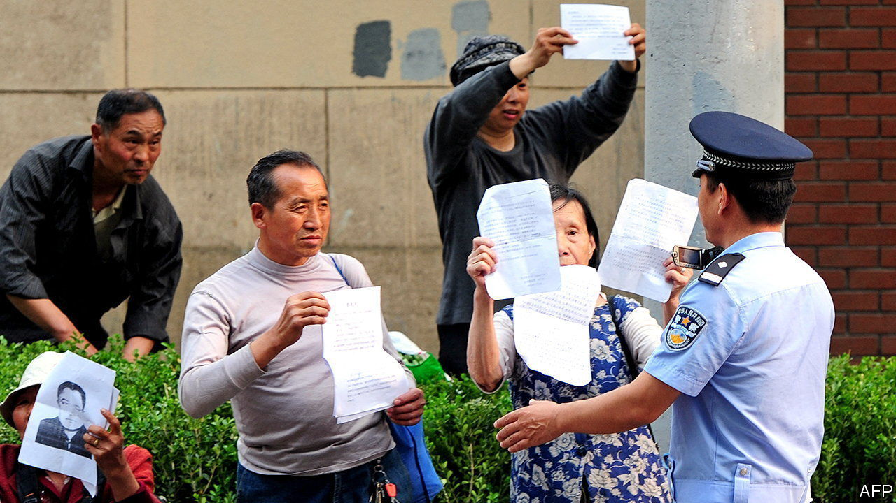

###### Grumble at your own risk

# China’s Communist Party says it welcomes complaints 

##### Just don’t go too far 

 

> Aug 25th 2022 

“Grim” is a word often used these days by officials responsible for handling petitions submitted by aggrieved citizens. They apply it to the task they face as the Communist Party prepares to convene a five-yearly congress later this year. The last thing they want is embittered people making a fuss as the party gets ready to reanoint its leader, Xi Jinping. 

Imperial China had a tradition of allowing citizens to petition officials about injustices. The party has adopted it. The National Public Complaints and Proposals Administration—and numerous other offices—annually handle millions of letters, visits, calls and online submissions from people seeking redress for everything from unpaid wages to eviction from their homes. Mr Xi, though a ruthless suppressor of dissent, has called the petition system a “beneficial supplement to socialist democracy with Chinese characteristics”. 

The advantages, officials say, include providing the party with a “window” onto public opinion and a means to “unite the hearts of the people”. But they clearly see drawbacks, too. In the build-up to the congress, local governments are under strict instructions to ensure public order. They have been told to step up efforts to resolve petitioners’ complaints, as well as to keep potential troublemakers under control. As usual, officials often seize petitioners from the provinces who turn up in Beijing and escort them home. Some are jailed. 

Official hagiographies of Mr Xi describe how, as party chief of the city of Fuzhou in the 1990s, he and colleagues met more than 700 petitioners in two days. As one account put it, the officials solved many of the complainants’ problems “on the spot”. Since Mr Xi took over as general secretary in 2012, the public complaints office has been sending him select letters. He “reads them every time and writes comments on them,” said the office’s chief in 2015. 

But Mr Xi has stepped up efforts to ensure that petitions are handled locally and that complainants do not gather in public. In recent years party-led committees have been set up at lower levels to co-ordinate efforts to handle grievances and ensure the police are aware of potential unrest. Under Mr Xi, the national public complaints office has been led by law-and-order types. The current chief was previously a spy. 

Officials have also made it clearer that petitioners who travel to higher-level jurisdictions to submit their complaints could face punishment. In June fury erupted over allegations that officials in Henan province had changed the health codes on hundreds of people’s covid-19 apps so they were quarantined and could not converge on the provincial capital to protest about a banking scandal. Five officials were punished. The authorities later crushed the unrest using thugs. 

The pandemic has added to the burden of complaints-handlers. People have been petitioning about being forced into quarantine without cause and loss of income caused by lockdowns. This month more than 200 tourists submitted petitions in the province of Hainan, grumbling about not being allowed to return to their homes during a local covid outbreak. Officials have called for a “sense of urgency” this year among bureaucrats who handle petitions. They dare not complain. ■

