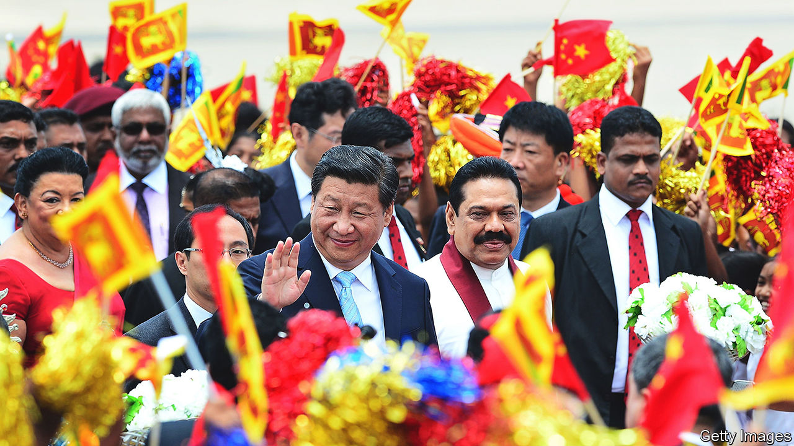
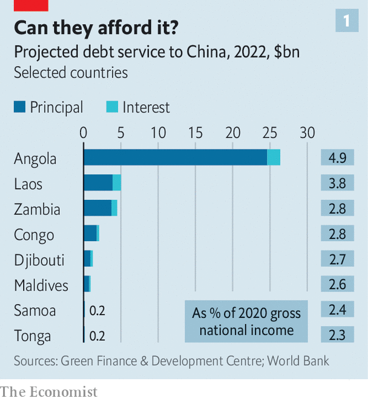
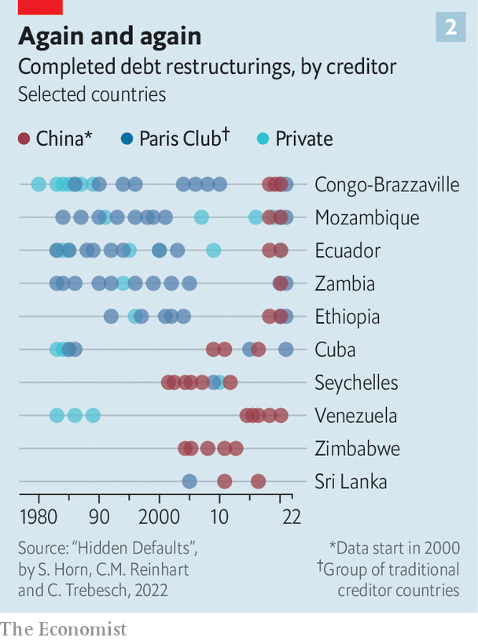
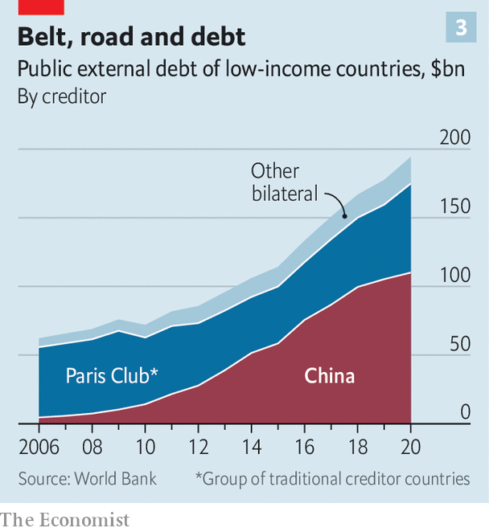

###### Party’s over

# Faced with an overseas debt crisis, will China change its ways? 

##### It may have no choice 

 

> Aug 24th 2022 

Few moments better encapsulate the hope and hubris of China’s Belt and Road Initiative, a global infrastructure binge, than the inauguration of Sri Lanka’s Colombo Port City in 2014. Xi Jinping, China’s president, attended in person, nodding approvingly as a project manager introduced the $15bn plan to build a high-tech offshore financial centre with a marina, hotels and luxury homes on 665 acres (269 hectares) of land reclaimed from the sea off Sri Lanka’s capital. Local officials likened the project to Dubai and Singapore. Mr Xi (pictured on his visit to Sri Lanka) called it a “major hub” of the 21st Century Maritime Silk Road—the part of Belt and Road that aimed to reshape ocean trade by financing ports and related infrastructure without the pesky conditions that Western and multilateral lenders demand. 

Flash forward to August 2022 and the future of Sri Lanka—let alone Colombo Port City—hangs in the balance. Crippled by fuel and food shortages, the country is seeking a bail-out from the International Monetary Fund after defaulting on its debt in May. Pakistan, another big borrower, is also in the midst of an imf bail-out and dozens more Belt and Road countries are facing debt distress. The extent to which China, the world’s biggest official creditor, bears responsibility is hotly debated. But what matters now is how it responds. Sri Lanka will be a critical test of Chinese willingness to co-ordinate with other lenders, potentially at the expense of Mr Xi’s original geostrategic goals.

Central to the issue is China’s relationship with the Paris Club of 22 mostly Western creditor countries. It is an “ad hoc participant” in the group but has refused invitations to join. One reason is the club’s close connection to the imf and World Bank, which America dominates. Another is its commitment to consensus, information-sharing (China likes to keep loan terms secret) and “comparable treatment” for all creditors. China wants to be prioritised and favours negotiating debt relief bilaterally: many of its loan contracts include clauses to that effect. Besides, adopting the group’s standards would undermine Mr Xi’s talk of a superior alternative to Western development finance.

Yet there are signs that China is slowly, if reluctantly, adjusting that position, as covid-19, inflation and the war in Ukraine amplify the debt problems many poorer countries faced before 2020. In May that year the g20, which includes China, established the Debt Service Suspension Initiative (dssi), under which official bilateral creditors temporarily suspended interest and principal payments from any of the world’s 73 poorest countries that requested such relief. China said in late 2020 that it had deferred at least $2.1bn in payments from dssi countries.

In November 2020 China also backed the “Common Framework” agreement between the g20 and the Paris Club to co-operate on debt treatments for poor countries. The first deal under that framework came in July 2022 when, after months of testy negotiations, official creditors agreed to provide relief to Zambia, unlocking a $1.4bn imf bail-out—although details are still to be finalised. China, Zambia’s biggest official creditor, initially resisted co-ordinating with other lenders but in May agreed to co-chair a creditor committee with France. The two countries also co-chair a creditor committee for Ethiopia. 

 


China’s shift appears to be driven, in part, by the size of the problem and increasing international scrutiny of its lending. Chinese data are murky, but the World Bank provides debt statistics for 68 countries eligible for the dssi, some 60% of which are at high risk of, or already in, debt distress. In 2020 those countries owed $110bn to China—more than all other official bilateral creditors combined, according to researchers at Fudan University in Shanghai. They say that in 2022 China is due to receive 26% of debt-service payments from those 68 countries. Eight, such as Angola and Laos, will spend more than 2% of gross national income making those payments to China (see chart 1). 

 


There may also be many more “hidden” problems linked to China. Economists at the World Bank, Harvard University and the Kiel Institute, a German think-tank, estimate that half of China’s lending abroad is unreported, and that between 2008 and 2021 the country quietly arranged 71 distressed-debt restructurings—more than the Paris Club—often following a long spell of default. Restructuring almost always involved lengthening maturities or grace periods, rather than reducing principal. Some countries, including Venezuela and Zimbabwe, restructured Chinese loans five times or more (see chart 2).

Some detect echoes of emerging-market debt crises in the 1980s and 1990s, when Paris Club members obscured lending details and repeatedly rescheduled loans, leading to a lost decade of low growth. The shift towards writing down debt came only after America’s Brady Plan in 1989 and the Heavily Indebted Poor Countries initiative in 1996. In a recent paper Ye Yu and Zhou Yuyuan of the Shanghai Institutes for International Studies (siis) called for a “new version” of the Brady Plan, urging China to be more transparent about its lending and to co-ordinate more with America and other Paris Club members to ensure “equitable and fair burden-sharing among all categories of creditors”.

 


China’s evolving position may also be linked to its recent efforts to provide emergency lending as some borrowers have struggled to service its infrastructure loans. State-owned Chinese banks made nearly $24bn in balance-of-payments loans to Pakistan and Sri Lanka in the past four years, according to AidData, a research lab at William and Mary, an American university. “China has dabbled with this idea that they could be an alternative to the imf,” says Bradley Parks of AidData. “What we&#39;re watching now is a period of real-time learning and adaptation, where I think they&#39;re having second thoughts.”

In Sri Lanka alarm over Chinese infrastructure loans first flared in 2017, when the government, struggling to service its debts, granted a Chinese state company a 99-year lease on a port that China helped to finance and build. As other Chinese projects faltered, China’s state banks pivoted towards emergency lending, providing $3.8bn between October 2018 and March 2022, according to AidData. Most observers agree that China’s lending did not cause the crisis: they blame Sri Lanka’s government for slashing taxes in 2019 and covid for crushing tourism in 2020. But Sri Lankan former officials say China’s liquidity injections persuaded them to reject advice to approach the imf much earlier. 

The hope now for Sri Lanka is that Zambia’s deal has set a precedent for China to co-ordinate with other creditors, even though the island’s middle-income status excludes it from the Common Framework. Ranil Wickremesinghe, Sri Lanka’s new president, declined to discuss details in an interview with  but appeared confident of a deal. One proposal under discussion is for China, as Sri Lanka’s biggest bilateral creditor, to co-chair a creditor committee with Japan, the second-biggest (and a Paris Club member). India could join, too. The aim, says one adviser, is “ad hoc” Common Framework treatment. 

The geopolitical landscape, however, is even trickier than it was for Zambia. China’s relations with Japan and India are at a low: in August China fired missiles into waters near Japan during drills around Taiwan, and its forces have clashed with Indian troops over a disputed border since 2020. America continues to accuse China of “debt-trap diplomacy”, citing Sri Lanka as evidence. China denies that, noting (correctly) that most developing countries, including Sri Lanka, borrow more from multilateral and private lenders. It also points to its bilateral debt relief, including a pledge on August 18th to forgive 23 interest-free loans to African countries (it didn’t state their value, but China’s interest-free loans are typically small).

Sri Lanka is also confronting many of the same issues that delayed the Zambia deal. America and China both worry that restructuring will favour the other. The Paris Club wants more transparency from China, and more Chinese bank loans treated as official debt. China wants multilateral and Western commercial lenders to take a bigger haircut. It is also wary of setting a precedent for other borrowers—and stirring public anger at home. “China&#39;s money doesn’t fall from the sky: it’s earned by the Chinese people’s hard work,” Liu Zongyi of siis told a nationalist Chinese news website on August 15th. 

To avoid the delays that Zambia faced, some advisers are urging Sri Lanka to begin debt-restructuring talks with China at an earlier stage, and before the Paris Club. The imf has called for such talks, but it is unclear if they have started at a high enough level. Zambia is “a warning and a lesson”, says Shanta Devarajan, a former World Bank official advising Sri Lanka. “We’re still applying the same principles and trying to reach this intercreditor equity. But the sequence in which you discuss it might be important.” He predicts an imf bail-out by year’s end. Others expect a longer wait. 

The imf says its staff are visiting Sri Lanka from August 24th to 31st to discuss reforms needed for the next step—a staff-level agreement on a bail-out. But the fund also stressed that final approval for the bail-out will require “adequate assurances&#39;&#39; from creditors on restoring debt sustainability. Even the staff-level agreement will require painful reforms, possibly including adjustments to Colombo Port City, such as scrapping investor tax breaks. That may confound Mr Xi’s vision of a maritime Silk Road metropolis. But it would arguably offer more hope for Sri Lanka—and dozens more debt-ridden countries. ■

