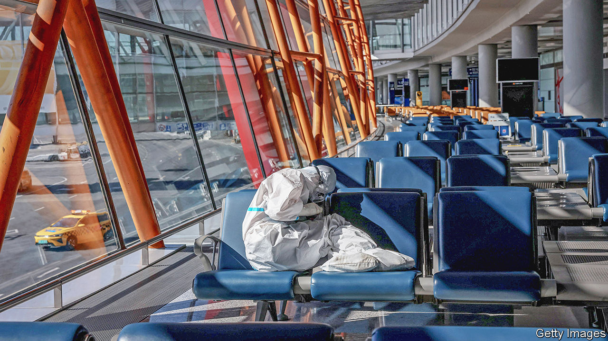

###### No-fly zone

# Most flights into and out of China remain grounded 

##### While the rest of world is flying again 

 

> Aug 25th 2022 

The scene on one side of Beijing’s Capital International Airport is normal. Countless passengers sit under its vast curved roof waiting for their domestic flights. Shops cater to anyone in need of high-end sunglasses or perfume. But on the international side, things are eerily quiet. Staff in full-body suits deal with the passengers on flights into and out of China. They have little to do.

Before the covid-19 pandemic, the airport ranked as the world’s second-busiest. Today, not so much. Domestic air travel is humming. But the number of international air passengers across all of China’s airports has fallen from 74m in 2019 to 1.5m last year. In Beijing, until recently, there were hardly any international arrivals at all under what one foreign-airline executive called the “forbidden-city policy”.

Most of the world has chosen to live with covid, allowing international travellers to take flight again. The number of people whizzing around the globe is expected to reach 69% of its pre-pandemic level in 2022. But China has a “zero-covid” policy that makes it wary of travellers from abroad. That has come at a huge cost to multinational firms, people with relatives abroad and so on. Also, the company that operates the airport in Beijing has lost nearly 4.7bn yuan ($685m) since 2020.

Anyone hoping to fly into China from, say, America faces challenges. First, find an open seat on the tiny number of flights still operating. Then pay an exorbitant fare. A recent search for direct flights from San Francisco to Shanghai (one-way, economy class) found prices ranging from $7,000 to $9,000. One can find cheaper, indirect routes—but good luck fulfilling China’s requirement of getting covid-test results at each stop.

That all assumes the traveller has received a visa. The number granted by China plummeted during the pandemic, so most inbound passengers are returning Chinese citizens. Until July they and other travellers were mostly barred from transferring through a third country if their country of residence offered direct flights to China. That led some desperate Chinese students in Germany to transfer their visas to Austria, where seats on flights home were more readily available. In order to pull off the switch, they reportedly had to enrol in a new study programme and rent a flat in Austria.

China has loosened up in some ways. It now allows more transfers and is issuing more visas. It has reduced the amount of time international travellers must stay in a quarantine hotel to seven days, from 14 or more. But airline executives are sceptical, not least because China wants to prevent new outbreaks ahead of a Communist Party congress later in the year. Cautious regulators change the rules without warning, says an aviation attaché at a foreign embassy in Beijing: it amounts to a “de facto suspension of every bilateral aviation agreement with every country in the world”. 


