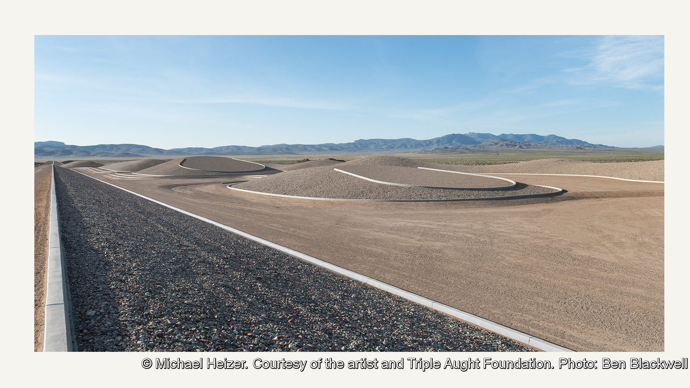

###### Monumental art

# A vast sculpture in the Nevada desert is finished at last 

##### Was Michael Heizer’s “City” worth 50 years of effort? 

 

> Aug 20th 2022 

“City”, a sculpture project in the Nevada desert, is so big and has taken so long that it has become something of a myth in the art world. Some observers thought it would never be completed. It is more than a mile and a half long and half a mile wide (2.4km x 800 metres). Yet “City” sits so discreetly in the landscape that from a distance it is almost invisible. Only when you step into it, and walk the length of the pebbled cinder base, do you get a sense of how vast the artwork is.

Artists have always thought big as well as long-term. With the help of 400 workers, Gutzon Borglum and his son spent 14 years (on and off) carving the presidential sculptures on Mount Rushmore. For the last 37 years of his life Auguste Rodin worked sporadically on a set of giant carved doors called “La Porte de l’Enfer”, modelled on Dante’s Hell, for a museum in Paris that was never built. Michael Heizer, the creator of “City”, more than matches them for vision and obsession.

Many artists began working outdoors with earth and rock in the 1960s, inspired by the photographs of Earth floating in a sea of black that were beamed back by the Apollo space missions. Some were drawn to the American West, with its broad skies and expansive landscapes. Robert Smithson headed to Utah for “Spiral Jetty”, completed on the shore of the Great Salt Lake in 1970. Walter De Maria’s most famous work is “The Lightning Field” (1977), a grid of stainless-steel poles in New Mexico.

Theirs was a particularly American art, full of energy—the land equivalent of Jackson Pollock’s action painting. “I don’t think there’s ever been such invention in art as the late 1960s,” says Michael Govan, director of the Los Angeles County Museum of Art (lacma), a crucial supporter of America’s land artists. “You’d have to go back to the early teens of the 20th century, when abstraction was invented, or maybe to the invention of perspective.”

“City” is the most ambitious land-art project of the lot. America was still fighting the Vietnam war when Mr Heizer started work on it in 1972. Fascinated by drawing from an early age, as a young teenager he helped his father, an anthropological archaeologist, who was excavating at La Venta, an ancient Olmec site on the Yucatan peninsula. Then he spent a year in Paris, mostly in its museums. “I saw it all first-hand,” he has said. “You can’t go to school and learn about art by looking at a bunch of slides projected on a wall.”

After taking a few courses at the San Francisco Art Institute, he focused on making large geometrical paintings. But he was most interested in the uncharted possibilities of monumental sculpture. Like others, he looked West; but in his case the landscape was part of his family’s story. He was descended on both sides from men who had made a living from mining, and was gripped by the idea of digging into the ground to create “negative sculpture”. He called his new works “ultra-modern art”. His partner, Kara Vander Weg, a senior director at the Gagosian gallery—and co-vice president of the Triple Aught Foundation, which owns and runs “City”—says he wants his tombstone to read “Totally Negative”. 

In 1969 Mr Heizer gouged out over 200,000 tonnes of earth and rock from the Mormon Mesa in Nevada. He called the work “Double Negative”. Its influence can be seen in the long tapered memorial to the casualties of the Vietnam war created by Maya Lin in Washington, and in the seemingly bottomless pools at the centre of Michael Arad’s tribute to the victims of the attacks of September 11th 2001 in New York.

Riddle in the desert

When Mr Heizer conceived “City” he began at one end, with a section he called “Complex One”—a rectangular slope surrounded by concrete struts. “I worked entirely intuitively,” he says, “with no ongoing thought or consecutive way of planning.” For years he operated diggers and earthmovers alone or with a small band of construction workers, breaking off only to do commissioned works for other people in order to raise money.

After more than two decades, the project reached a crisis point. “Complex One” was crumbling and Mr Heizer was broke and in hospital. His friends feared he might die. A small initial donation solicited by Mr Govan from the Lannan Foundation, a family foundation that supports artists and culture, helped reinvigorate him. When Mr Heizer went back to work, Mr Govan says he had recast the project to make it much larger. For his part, in 2015 Mr Govan spearheaded a campaign to turn the surrounding land into a conservation area. (The Lannan family have contributed half of the $40m that the project has cost. A new $30m endowment, partly funded by lacma, is meant to secure its future.) 

Now finished, the work is as much a garden—albeit one with no flowers—as a city. There are mounds and walkways, as well as discrete spaces that could be neighbourhoods. Your perceptions, as you stand at the foot of the rising steles or lie at the bottom of the huge pebbled bowl known as the “Teardrop”, are constantly jolted.

Jokes and visual puns abound. From one angle, “Complex One” seems to be a simple earthen wall with struts sticking out; move farther back and the struts come together to frame the wall as if it were a painting. Mr Heizer may be playing with geometry and sightlines, but he is also teasing self-important galleries and museum curators. “Growing up with his father’s work,” says Mr Govan, “he knew there were other ways to think about art: especially architectonic-scale art, which has a different feeling to it. It’s not about its size, it’s about what it means and how it makes you feel.”

On September 2nd “City” will at last open to the public—though to maintain its solitary aura, Mr Heizer has insisted that only six people a day will be allowed in to see what all his labour has achieved. Whatever his motivation for the past 50 years, it was not the lure of the crowd. Now 77, the artist himself has made his last visit to the site. He lives far away, at sea level, for the sake of his damaged lungs. Dressed in workmen’s trousers and ostrich-skin cowboy boots, he does not look decrepit. Only a nasal cannula attached to an oxygen pump betrays his frailty.

His stubbornness is undimmed. Asked if he thinks environmental concerns add extra significance to his work, or whether “City” may inspire people more interested in experiences than in things, he is blunt: “It’s the visitor who does the interpretation. I don’t give a damn.” ■

