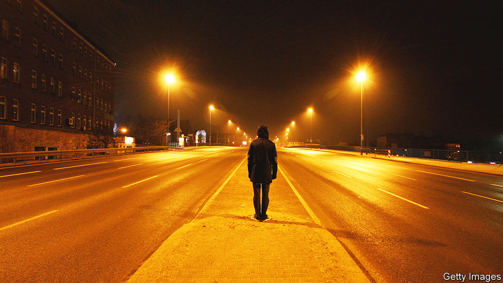

###### Urban fiction

# In Amit Chaudhuri’s new novel, an Indian writer visits Berlin 

##### The narrator of “Sojourn” takes in the city as his inner self crumbles 

 

> Aug 25th 2022 

By Amit Chaudhuri. 

“It was evening, and I didn’t know the name of the road I was taken to.” Disorientation arrives in the very first line of “Sojourn” and percolates through this short, memorable book. Its narrative follows a winding path that will be familiar to readers of Amit Chaudhuri’s previous seven novels. It is 2005, and the unnamed narrator, an Indian writer like the author, is a visiting professor at a university in Berlin, where a revolving cast of ordinary, mostly friendly people wander in and out of his life.

An exiled Bangladeshi poet takes him shopping and to meals. He is briefly involved with Birgit, a woman who attends his seminar. He strives to communicate with his housekeeper without a common language. In short, he does not do all that much. But all the time he keeps his eyes and mind firmly trained on the world around him. 

The characters are subtly and evocatively drawn. The narrator and Birgit climb stairs “with the urgency of childhood friends”; his poet pal, Faqrul, has a laugh “like a kettle’s hiss”. But Berlin itself has the main role.

This too is in keeping with Mr Chaudhuri’s earlier work, which has often been preoccupied with cities he has known and left, from Mumbai to London, and with the way in which urban landscapes can act as repositories of personal memory. In Berlin it is the burden of history, lurking behind the placid modernity, that weighs on the narrator’s mind. An acquaintance tells of being beaten up by neo-Nazis at the Holocaust memorial, made up of “flat stones, like rockery on an abandoned shore”. 

With its eventful past and capacity for endless reinvention, Berlin has bewitched many foreign authors, from Christopher Isherwood to John le Carré and beyond. On the surface, Mr Chaudhuri’s version is a sleek metropolis from which squalor and serious political strife have vanished: a world of department stores, university cafeterias, dance halls brimming with content, swaying locals. The edgy cultural scene that in recent years has made the city a beacon for artists and clubbers is nowhere to be found. The narrator prefers a quieter life. When he muses that Berlin gives him “licence to experiment”, he is referring only to a spontaneous decision to order rice pudding. 

As winter progresses, and the days grow emptier, the narrator begins to crumble inwardly, falling unconscious in public and, at times, forgetting his own name. Mr Chaudhuri’s writing, limpid and sparse, neatly illustrates this struggle to navigate the inner life: the fight to hold onto a fragile sense of self that can quickly disintegrate, as the surrounding world remains unperturbed, moving indifferently forward and away. 

