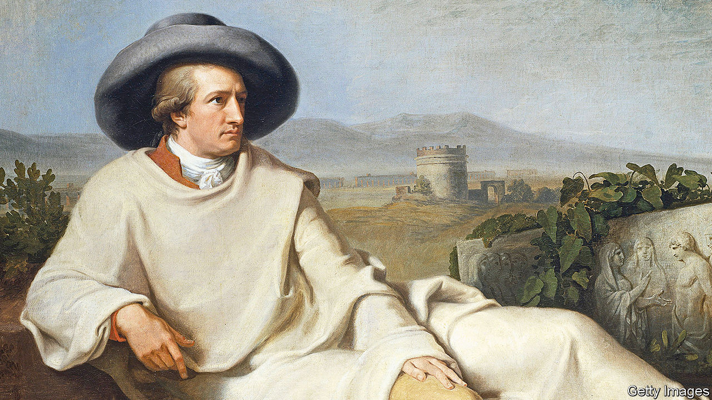

###### Home Entertainment

# Revisit the musings of the greatest writer in the German language 

##### A new edition of “Conversations with Goethe” attests to his genius and charisma 

 

> Aug 25th 2022 

Anyone who worries that the media spotlight kills true art is in good company. In 1824 Europe’s most revered writer complained that “our present generation of talents live their lives in the full glare of publicity”, which blights creativity like “toxic rain”. Yet Johann Wolfgang von Goethe uttered those remarks during interviews with a fan that would fill a vast, three-volume compendium of talk. By the 1820s the author of “Faust” and “The Sorrows of Young Werther” was venerated as the godfather of German literature. He may have damned upscale arts journalism, but Goethe still spent nine patient years helping invent the genre. 

Interview-based portraits of the great were not unknown in 1836, when Johann Peter Eckermann first published his “Conversations with Goethe”. Both Napoleon and Lord Byron inspired unofficial memoirs by associates. James Boswell’s “The Life of Samuel Johnson” had appeared in 1791. Eckermann, however, fixed on a format—quotation mixed with character sketches and background scene-painting—that profile-writers would follow for two centuries. From 1823 until Goethe’s death in 1832, this devoted disciple transcribed the thoughts of the author. An entrepreneurial autodidact who worked as Goethe’s assistant-cum-editor, Eckermann blended star-struck worship of a “heroic figure” with close-up observation of his idol’s habits, quirks and deeds.

Previously, English-language readers of the “Conversations” have had to hunt down an archaic translation. Now Penguin Classics has published Allan Blunden’s companionable new version. It lets readers grasp not just the mental might of the sage of Weimar, but his charisma. Goethe worked tirelessly, ate simply and preferred his “old wooden chair” to “plush living and pampering”. He reflects on a lifetime of unremitting toil, “like rolling a heavy stone”, and justly concludes: “I have done more than my fair share.”

Eckermann recorded their dialogues honestly but wrote them up with artistic licence—“more like a painting” than a photograph, suggests Ritchie Robertson in his introduction. Verbatim or not, Goethe’s talk roams with wit, charm and hard-headed sense across literature, art, nature, science and statecraft. He adores Byron, Molière, Scott, Shakespeare and Voltaire. He wants French social grace and English reason to enrich German life, and admires the Germans’ ability to “appreciate everything foreign”. He snipes at provincialism, pedantry and metaphysics. Meeting Hegel, he tells the philosopher pointedly: “I am a great believer in the study of nature; it keeps you sane.”

Eckermann’s Goethe has his head in the heavens but his feet on the ground. He loves gardens, picnics, birds and mountains—and takes up archery, aged 75, like an excited child. A moderate in politics, sceptical of power, he presciently tells his amanuensis that he can never see a statue of some worthy without imagining it “being pulled down and smashed by a future generation”. The “Conversations” help Anglophone readers understand why Goethe stays on his pedestal. ■

