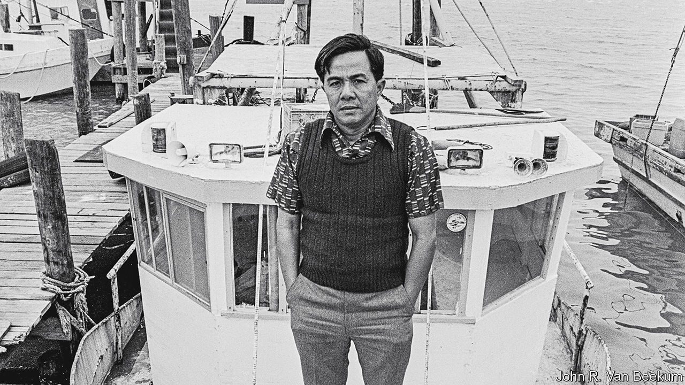

###### Immigration and xenophobia

# When Klansmen in Texas targeted Vietnamese fishermen 

##### The tensions in “The Fishermen and the Dragon” are queasily topical today 

 

> Aug 25th 2022 

By Kirk Wallace Johnson. 

A shocking photo from 1981 opens this account of nationalist violence in south-east Texas. It shows a boat patrolling Galveston Bay, near Houston; the occupants include robed, hooded and armed members of the Ku Klux Klan. Their aim was to menace Vietnamese fishermen who had recently arrived in the Gulf of Mexico. Hanging by the neck from one of the boat’s outriggers is an effigy of an immigrant.

Kirk Wallace Johnson traces this ugly turf war in “The Fishermen and the Dragon”, a thoughtful and thoroughly researched work of social history. Tensions emerged in the mid-1970s with the arrival of Vietnamese migrants in the small harbour town of Seadrift, 150 miles south-west of Galveston Bay. A community blossomed as enterprising newcomers learned to shrimp, bringing unwelcome competition to the locals. Some Texans responded by race-baiting the new fishermen and destroying their boats.

After a campaign of harassment, an immigrant shot one of the nationalists and was acquitted of murder charges on a finding of self-defence in 1979. After that, the Klan arrived in force. 

Between racist oaths, some Texans insisted they were defending their way of life against foreign communists. Ironically, many of the newcomers had fought against the North Vietnamese before moving to America. Mr Johnson points out that the good ol’ boys were “lashing out against capitalism all along”. Contrary to baseless claims, the Vietnamese “weren’t receiving secret government support; they were just willing to work harder, for longer hours and less pay, while spending less.” Racism and xenophobia were always the foundation of the terror campaign.

The immigrants fought back in court. Aided by the Southern Poverty Law Centre, they obtained injunctions to stop the Klan’s harassment and disband the group’s paramilitary training camps. Mr Johnson skilfully recounts the outrageous litigation tactics of the Texas Klan’s “grand dragon”, Louis Beam. He arrived for his deposition in full robed regalia and tried to have an African-American federal judge recused for alleged prejudice against Klansmen. 

Although many of these events occurred more than 40 years ago, there is a queasy topicality to the fight for the Texas Gulf. Mr Johnson pointedly reports the use by white nationalists of phrases that have re-entered the political lexicon. Before burning a cross and a mock-up of a Vietnamese boat, Klansmen chanted “America First”, among other slogans. Beam whipped up a rally by describing the Vietnamese as “your replacements”. “As I look over the crowd here today,” he said at another event, “I see some very fine people.” 

The passages on environmental decay along the Gulf coast are resonant, too. A report of 1989 by the Environmental Protection Agency declared Texas to be America’s gravest offender in industrial air pollution; Calhoun County, home to Seadrift, was the worst in the state. Less well-judged are the closing chapters on Diane Wilson, an activist whose hunger strikes helped bring about reduced-discharge agreements and settlements with industrial firms in the area. Her tale would have served better as Mr Johnson’s next book rather than as an epilogue to this powerful story. ■

