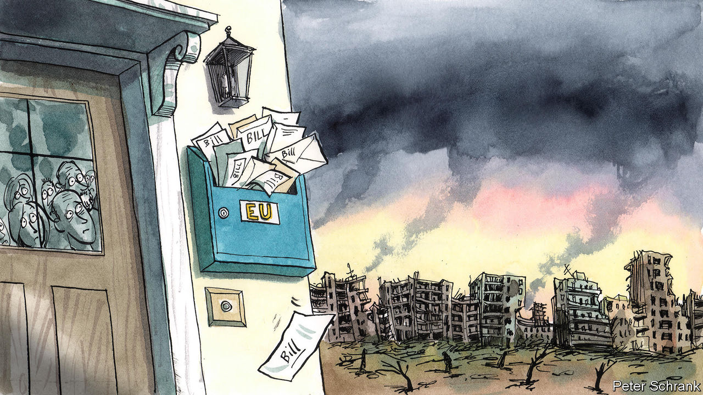

###### Charlemagne

# As the war in Ukraine drags on, the costs for Europe are mounting 

##### Six months of fighting on its doorstep has strained the EU 

 

> Aug 25th 2022 

A downside of the leisurely European summer is the intimidating to-do list that awaits one’s return. With war still raging on the eu’s doorstep, this  feels particularly daunting. Regular meetings of the union’s ministers are about to resume, just days after the six-month anniversary of Vladimir Putin’s invasion of Ukraine on February 24th. Ukraine has defended itself against its massive neighbour more effectively than many in Europe thought possible back then. But as winter looms, Europe is starting to feel the war’s side-effects more keenly. Keeping the eu united despite painfully high energy prices will be a challenge. 

Nobody sitting around an eu summit table is in any doubt over who has borne the brunt of Russia’s aggression. Ukrainians have been slaughtered, and Ukraine will one day need the kind of financial aid western Europe received after the second world war to rebuild its shattered cities. The price tag for Russia has also been hefty. Its army has been humbled, it is heavily sanctioned, most of its remaining civil liberties have been snuffed out and Mr Putin has been proved incompetent as well as despotic. 

The cost for Europe is harder to pin down. Part of it relates directly to the conflict, such as the cheques written by the eu to keep the Ukrainian government afloat. This money has not been as important as America’s supply of weapons and intelligence to the Ukrainian army, which has kept Ukraine in the war. But European generosity has helped, too. 

Still, the largest costs to Europe have been indirect. Top of the list is the economic damage it is incurring: Russia has retaliated against Western sanctions by throttling the flow of gas on which Europe depends. There is also a cost associated with adjusting to a geopolitical environment in which most eu countries can no longer scrimp on defence. And politically the continent is feeling the effects of operating in crisis mode for six months. This has tested—and will continue to test—the mettle of the union.

The economic cost is the most immediate. European energy prices have spiked again this week as Russia announced that its Nord Stream 1 pipeline is to undergo further “maintenance” from August 31st, rousing suspicions that it may never be re-opened. In parts of Europe gas is now trading at what would equate to over $1,000 per barrel of oil, an absurd level. Governments face a choice: either to foot the power bills that would otherwise break many household budgets, or suffer a recession as consumers are left broke. Either way, public finances will be clobbered just as inflation—also caused in part by rising energy prices—has put an end to the era of free borrowing. (To make matters worse, the euro has fallen to below parity with the dollar, its lowest level in two decades.) For most people and businesses, the vague summertime prospect of having to pay more to keep homes warm and factories humming is about to become a harsh wintertime reality. Politicians trying to arrange another tranche of aid to Ukraine will not find it so easy when pensioners are shivering at home. 

The strain on public finances will come just as the need to spend more on defence will be most acutely felt. The war has underlined just how little military equipment Europe could spare to succour Ukraine, and how ill-prepared many countries would be to defend their own territory. Germany has been most vocal about a need for a new approach: its , a change in the spirit of the times, will result in a €100bn (just $100bn these days, alas) boost for its military in the coming years. Others are promising to juice up their defence budgets, including more spending coordinated at the eu level. A short, sharp conflict might have resulted in such promises being forgotten soon after they had been made. The drawn-out fighting means they will have to be acted on. 

The cost in terms of European cohesiveness is the hardest to quantify. Crises have the potential to forge unity within the eu, but they can also stir division given time. The early response to the war showed Europe acting as one. Refuge was granted to all who needed it, Ukraine was given the morale-boosting status of eu candidate country, and sanctions were agreed on. The need for urgent action concealed fissures in Europe, notably between hawkish member states on the bloc’s eastern fringe, who think the fate of the continent is being decided in Ukraine, and most western eu members, who worry about the risks of escalation. 

After six waves of painstakingly negotiated sanctions since February, nobody expects much more in the absence of some new outrage on Russia’s part. In recent weeks the likes of Poland and the Czech Republic have pushed for a ban on visas issued to Russians. The proposal, which will be discussed by eu foreign ministers on August 31st, has been largely batted away by western Europeans, to whom it smacks of collective punishment. The resulting inaction will tend to widen the fissures. If America reduces its support for Ukraine after the mid-term elections in November, questions will be raised about how Europe needs to fill the gap—or whether it can.

The price is right

In the early stages of the war, Europe was in denial about its costs: even asking citizens to adjust the thermostat felt like too much of an imposition. That is changing. Public lighting is being dimmed, cold showers encouraged. Emmanuel Macron, France’s president, pleaded on August 19th for a willingness to “pay the price for our freedom and our values”. The Belgian premier has warned of five to ten difficult winters ahead, just to be on the safe side. 

This is a welcome change in rhetoric. Better to make the costs of supporting Ukraine explicit than pretend they do not exist. For Europe has little choice but to remain steadfast. No matter what hawks in Warsaw or Prague fear, it would be far too dangerous to nudge Ukraine into capitulation in order for Russia to restore its gas flows. The cost of countering aggression on the continent is high. But it must not be dodged. ■


 


