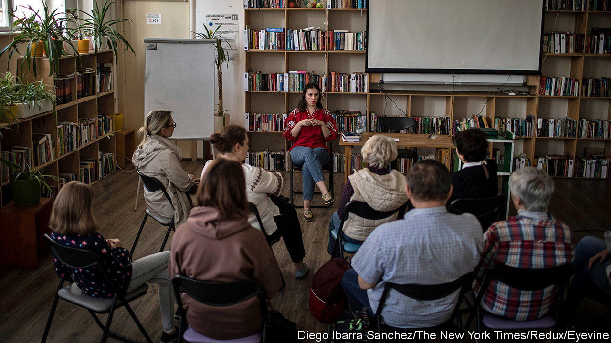

###### Lost in invasion

# Russian-speakers in Ukraine are struggling to learn a new tongue 

##### The two languages are more different than Vladimir Putin pretends 

 

> Aug 25th 2022 


In the run-up to his invasion, Vladimir Putin tried to justify his predatory intent by saying Russia needed to protect Russian-speakers in cities like Odessa. His self-serving argument is now the butt of local humour. “Two old Odessites meet and one of them suddenly starts speaking in Ukrainian,” starts one joke currently doing the rounds. “‘What’s the matter?’ asks his friend. ‘Are you afraid of Ukrainian nationalists?’ ‘No,’ he replies. ‘I’m afraid to speak Russian—in case Putin thinks he needs to liberate me.’” 

Language has been a contested issue in Ukraine for decades, with allegiances and resentments tending to be stirred up for political advantage ahead of elections or during revolutions. In broad terms, the west of the country is largely Ukrainophone, while the south and the east tilt Russian. In between, the country has always been ambiguously bilingual, with border constituencies speaking a mix of the two called Surzhyk. But the invasion is now crystallising what had been a complicated issue. Millions of Russian-speaking Ukrainians, appalled at what is being done in their name, are making a point of switching to Ukrainian. 

In Odessa, a traditionally Russian-speaking city, the central library is extending its Ukrainian conversation club to two sessions a week due to the increased demand. A recent visit showed that the classes attract a certain type of Odessite: eyelined, permed, and the other side of 50. Oleksandr, the only man attending the classes, quips that the local ladies flock to any forum that gives them a chance to chat. But Tanya Mozgova, the librarian running the club, insists the city is undergoing a much wider linguistic shift. “Rockets have a way of persuading people whatever their sex or background. Vladimir Putin has fired the starting pistol on Odessa becoming a Ukrainian-language city.”

In a lengthy essay on the supposed unity between the Ukrainian and Russian peoples published in July 2021, and in hindsight a clear signal that war was on the way, the Russian president dismissed Ukrainian as a “regional language peculiarity”. But in his desire to assert influence over the country, he overlooked some basic facts. Russian and Ukrainian do indeed share a common linguistic ancestor, a language now known to scholars as Old East Slavic. But the two have been distinct languages since at least the 17th century. An analysis of their vocabularies shows that lexically they are about as aligned as Spanish is with Portuguese. Visitors to Ukraine can and have mistaken its widespread and relaxed bilingualism for linguistic interchangeability. But just as important, Ukraine’s linguistic identity has been undermined by centuries of first tsarist and then Soviet policy that portrayed the local tongue as a kind of bad Russian, a language of the village. 

Losing the argument

All that is now changing, thinks Ms Mozgova. The main shift in Odessa itself came three to four years ago, she says. That was when she first noticed that her invitations to speak Ukrainian were no longer being met with gruff expressions of incomprehension. For most of the members of her conversation group, the lightbulb moment came later. Olena Nikulina, a retired teacher, started learning the language only after the invasion in February. Larysa (surname withheld) started just a month ago. Lyudmila Grigorieva, a fashion designer, first took up Ukrainian in 2020, but says that she became “a much better student” once Russian tanks crossed the border. She says the homeliness of Ukrainian reflects a different mindset. “The Russian word for hospital is , which comes from the word pain. The Ukrainian is , from the word to cure. That tells you a story, and there are many other examples like this.”

Surveys by a Kyiv- and Lviv-based sociological group called Rating show the switch from Russian to Ukrainian is accelerating in all areas of the country. Only 20% of people now call Russian their native language, down from 42% ten years ago. Support for the demand to make Russian a state language, an objective pushed by Moscow-friendly forces for the past two decades, has also plummeted. Just 7% of people think it is a good idea, compared with a quarter before the war. The youngest generations are now almost exclusively schooled in Ukrainian, and Russian is no longer the lingua franca of popular culture. The Russian-language department in Kyiv’s main university has even been renamed the “Department for East Slavonic and Applied Information Studies”.

But perhaps most of all the change is visible in politics. Volodymyr Zelensky, Ukraine’s Russophone president, once visibly struggled with Ukrainian. Now, even Odessa’s formidable ladies say they are impressed with his proficiency. “He’s learned to speak without an accent and it’s becoming more natural for him,” says Valentina, approvingly. She cautions that he doesn’t know enough about local history, but not everyone agrees. In slow, heavily accented Ukrainian, Ms Grigorieva suggests giving the president some slack. He has enough on his plate, she says, and it’s better to know no history than invent it. Her allusion isn’t hard to decipher.

“One of Putin’s advisers should just go to him and tell him that he’s won, that he’s conquered us,” she continues. “Change the nuclear button for a toy one, and let him press it to his heart’s content. Tell him everything is great. Tell him there’s no more Ukraine. Tell him there’s nothing to worry about. Then we can all get on with our lives.” ■

