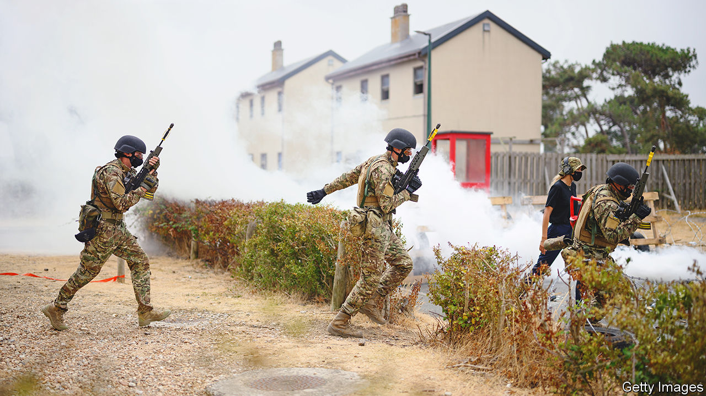

###### The manpower race

# Ukraine and Russia both need more soldiers 

##### Who can train them faster? 

 

> Aug 25th 2022 


The setting, a sleepy village. Three smoke grenades go off in rapid succession. As the smoke settles, a round from an assault rifle cuts through the grey sky. Men in military fatigues rush to clear a building. Cars lie overturned. A wounded soldier on a stretcher groans in agony. These are not scenes from Ukraine but from Kent, the usually tranquil “Garden of England”. Britain is helping Ukraine train its soldiers. 

After six months of war, the Russian and Ukrainian armies are both bruised and battered. Perhaps 15,000 Russians have been killed and 45,000 have been wounded, said Bill Burns, the head of the cia, last month. Ukrainian casualties were only “a little less”, he estimated. These depleted forces are stretched along a front that is over 1,000km long; its contours have barely changed in weeks. The war will depend, in part, on which side can replenish and expand its army more quickly. 

Ukraine aspires to launch a large-scale offensive in the coming weeks. That would require it to establish around half a dozen new mechanised and tank brigades, says Franz-Stefan Gady of the International Institute for Strategic Studies, a think-tank in London (a brigade has around 4,000 men). Oleksii Reznikov, Ukraine’s defence minister, says the army has 700,000 personnel in hand, with police, border guards and gendarmerie bringing the total to a million. The catch is that only a small proportion of this force has the skills and experience for serious fighting.

That is where the training comes in. Britain has pledged to train 10,000 Ukrainian recruits in 120 days, in the relative safety of several camps across Britain. Canadian troops could be seen milling around the facility in Kent. Denmark, Estonia, Finland, Norway, New Zealand and Sweden have said they will send trainers, too. Over 2,000 soldiers have already been trained and sent back to Ukraine. The vast majority of the recruits have no previous military experience. They are taught the rudiments of infantry tactics from early in the morning to late at night. The training is slow and deliberate, says Major Craig Hutton, one of the British trainers, with an emphasis on the basics such as marksmanship and treating injuries. 

Ukraine does at least have an ample supply of willing men. Russia is in a trickier spot. Western officials say that more than half of its brigades and regiments in Ukraine are now at less than 60% of their original manpower and equipment, making them technically “combat ineffective” for their intended missions. Vladimir Putin, Russia’s president, is unwilling to declare a formal war, which would allow him to conscript young men and send them into combat and also call up reservists. Instead, he is scraping together volunteers, which requires offering large pay packets.

Around half of Russia’s provinces are generating battalions in this way, some of them manipulating local pride to cobble together units. Many of the new battalions are being grouped under the 3rd Army Corps, a new formation based in Mulino, a town in Nizhny Novgorod. Yet names can be misleading. A corps typically has 15,000-20,000 men. The new one looks threadbare. “Even the name ‘volunteer battalion’ is a misnomer,” says Tom Bullock of Janes, a defence-intelligence firm. He points to the “Tigr” battalion from Primorsky Krai. It had just 65 men who had completed training before being sent to Rostov, near the Ukrainian border, where another 130 or so green recruits were added.

These new units are better trained and equipped than many of those that Mr Putin threw into battle in April and May, often with only a few days of training, says Rob Lee of King’s College London. But they are far from being crack soldiers. In theory, the 3rd Army Corps’ new battalions are supposed to get several weeks of training. Grumbling on social media suggests some of them get as little as a week.

Standards have dropped precipitously. “A lot of the guys they are getting in are old, broke and out of shape,” says Mr Bullock. In contrast, Ukrainian recruits in Britain are in their 20s, on average, and are currently getting several weeks of basic training. That is far short of the two to three months that American and European soldiers—and, before the war, Russian ones—would get; but the quality of instruction is likely to be higher than in Mulino. 

The British training is focused on urban warfare of the sort that the soldiers might encounter in Kherson, the presumed target of a future counter-offensive, or in the eastern Donbas region, where Russia’s army is approaching the city of Bakhmut. Urban warfare tends to be highly destructive; the training considers how soldiers might fight without leaving infrastructure in ruins. “We’re not demonstrating the same firepower and destruction that you’ve seen in Mariupol,” insists Brigadier Justin Stenhouse, the commander of the brigade in charge of the training. “This is the Ukrainian homeland, they want to maintain their houses.” British tactics are blended with Ukrainian ones, and the instruction is adapted according to intelligence coming back from the front lines. 

The balance shifts

Some of these freshly minted soldiers will fill out Ukraine’s new reserve brigades; others will be quickly thrown into battle as replacements for casualties. There is a danger that these very keen, under-trained soldiers will be injured or killed because they have not had enough training or seasoning, warns a British general familiar with the training programme. Nor are soldiers enough. There could be bottlenecks in the supply of armoured vehicles, ammunition and officers. Even the most enthusiastic infantry need protection, firepower and leadership.

But Ukraine’s manpower position is, at least, steadily improving—on August 29th eu defence ministers will discuss the possibility of setting up another big training mission. Russia’s may be plateauing. Its mobilisation of volunteers has generated enough men to sustain its slow gains in Donbas and to hold the line in the south. One Western official warns that a sizeable proportion of wounded Russian soldiers, potentially running into the tens of thousands, will be fed back into units in due course. But it is storing up longer-term problems, says Mr Lee. The most desperate or enthusiastic men have already signed up. Moreover, this year’s new conscripts are being starved of training, because the best officers are in Ukraine. Fewer than usual are likely to sign professional contracts when their term ends.

The longer the conflict drags on, the worse these issues will get. In Alchevsk in Russian-occupied Luhansk province, where men have been plucked from the streets and even from hospital wards, there are signs of mutiny: one militia has refused to be sent to fight in neighbouring Donetsk province, and a coking plant has tried to halt the conscription drive among its staff. Even if Mr Putin were to mobilise Russia for war, it would take several months, and probably closer to a year, for that to make a big difference, adds Dara Massicot of rand, another think-tank, given shortages of officers and equipment. 

Nor do the numbers tell the whole story. Soldiers fighting for national survival tend to be highly motivated. Major Hutton, who has been training soldiers for three decades, says he is impressed by their work ethic. “What I’ve found is that the Ukrainians lap it up, they love it, they want to practise more and more and more, and that enthuses our instructors to take it to the next level.” The key, he says, is to get the basics right. “As long as they keep to those core principles of moving together, communicating well, shooting straight, and then being able to look after one another, then they will win the day.” ■


