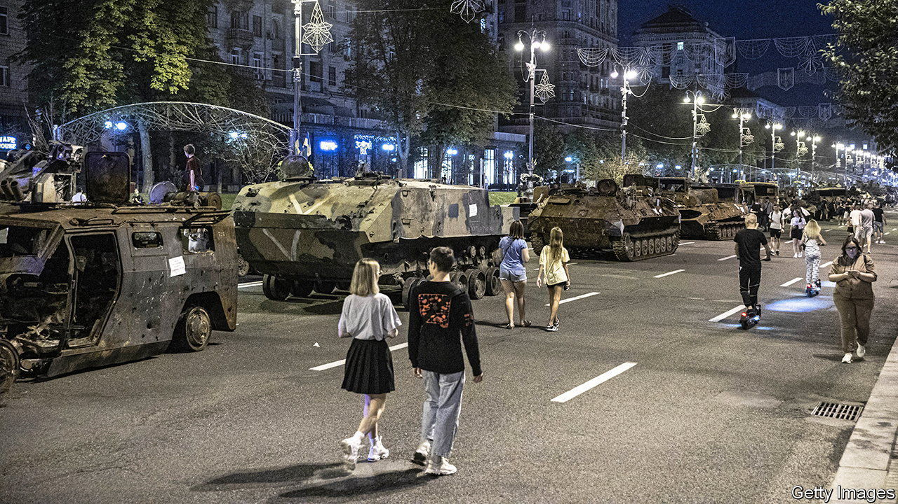

###### Forging a nation

# Ukraine’s defiant independence day mocks Vladimir Putin 

##### The country marks its 31st anniversary even as it fights off Russian invaders 

 

> Aug 25th 2022 


Military parades are a complicated affair in Ukraine, long tainted by association with Soviet pomp and oppression. Holding one for independence day on August 24th this year, while Ukrainian troops fight real, bloody battles in the south, east and north, would have been a particularly tricky sell. Instead, President Volodymyr Zelensky&#39;s office served up a twist, presenting an open-air exhibition of destroyed Russian military hardware on Khreschatyk, the wide street that runs through central Kyiv, the capital. Chewed, broken up and spat out by the Ukrainian army, the exhibits mock Vladimir Putin, who reportedly planned to stage his own victory parade there. Macabre and irreverent, the show mirrors life in a nation that is somehow surviving. 

The show draws different reactions from locals. Some people chant the lyrics of “Ukraine Will Win”, a cheesy patriotic number made famous on YouTube: “Burn, burn and keep on burning.” But most people just stare aimlessly at the rows of scorched tanks, artillery pieces, armoured personnel carriers, air-defence systems and rocket-launchers. Some visitors leave messages, white paint on rusted steel. “Shame they couldn’t say ,” reads one, a reference to the code word used to distinguish Ukrainians from Russians in the early days of war. Other scrawls list the battles that have already earned their place in Ukraine’s history books: Kyiv, Mariupol, Kharkiv, Severodonetsk, Snake Island, Bucha. 

Natalka Osmak, 80, inspects the weaponry methodically. A pensioner now, she spent her working life as a civil engineer, designing some of Kyiv’s main infrastructure. She says she is impressed by the effort that had been put into designing the machines. “Huge monsters to kill little men.” The Russian invasion was personal, she says. Her father, Kyrylo Osmak, a hero of the Ukrainian resistance, died in a Russian prison in 1960, 16 years after being jailed by Soviet authorities. “History shows even little men can defeat evil. Little men can win. Eventually.”

Fear had hung over Ukraine’s approaching 31st anniversary for days. Many people predicted that Russia would lob cruise missiles at Kyiv to spoil it. Mr Zelensky said intelligence suggested the enemy was planning “something especially cruel”, without giving any more details. Government workers in Kyiv were told to vacate the government quarter. America advised its citizens to leave the country immediately, language last used in the frightening early days of the invasion. 

A murky assassination in Moscow added to the sense of foreboding. Much about the killing of Daria Dugina, a nationalist pundit, remains unclear. But Mr Putin’s propagandists have already used her death to call for escalation in Ukraine. On August 23rd Dmitry Kiselev, a tv anchorman known as “Putin’s mouthpiece”, called for “the uncompromising denazification and demilitarisation of Ukraine”, whatever that meant. But on August 24th the feared Russian barrage never hit Kyiv, though targets elsewhere in the country were pounded.

Far from breaking Ukraine, as Mr Putin had hoped, his brutality has done a lot to unite it. Serhiy Leshchenko, a presidential adviser, says the nation has bonded in a way he never expected. The glue is not so much shared woe as a shared desire to survive, he said. “War has touched every Ukrainian. That mobilisation has helped us become self-sufficient. For the very first time since gaining independence in 1991, we believe we are a subject in world politics. And we are influencing the entire northern hemisphere.” 

Polling seems to underline the point. Every year since 2012, Rating, a polling and sociological-analysis outfit, has asked Ukrainians a simple question: “Do you support independence?” It’s an odd question to be asking in a sovereign country, but the answers have a tendency to surprise. In 2012, just 62% said they were committed to the Ukrainian project. The latest figures, published on August 24th, show a dramatic turnaround: 97% now say they support independence. Alexei Antipovich, who heads the group, says the polling points to the emergence of a new kind of nation. Ukrainians are now overwhelmingly proud of their country (75%). They also largely identify as Europeans: up from 35% before the war to 60% today. When asked to name their priorities, locals name “independence” first, and , an untranslatable term that combines the notions of freedom and free will, second. Money comes a distant third, the pollster finds.

That is just as well, for the economic outlook is bleak. The direct physical damage from Russian shells, bombs and missiles is already estimated to be at least $113bn, and continuing to rise. The war is causing immense indirect damage, too. The central government is running a budget deficit of $5bn-7bn a month, which it is meeting with a mix of foreign loans, grants, and by printing money. Inflation is thought to be above 30%; interest rates are 25%. “The big picture is this is unsustainable,” says Tymofiy Mylovanov, a former economy minister. Ukraine needs a lot more international support, which may or may not be forthcoming. It also needs to raise taxes, cut social payments and mobilise its economy better, he says. “The standard of living is going to go down quite a bit for many people.”

In six months of war, Ukraine has startled the world by holding off a much more powerful attacker. Mr Putin has yet to achieve any of his main aims, and was humiliated in the battle for Kyiv. Russia has gained some ground in subsequent battles in the east, but Ukraine has found a way of countering its advantage in heavy artillery by zapping its logisitics with precision rockets. Public confidence that Ukraine will win the war is sky-high: 92% of Ukrainians think so, according to the latest Rating figures. It remains to be seen if Ukraine’s soldiers will prevail. A long-hailed counter-offensive around Kherson is faltering, with Russia even reclaiming some territory north-west of the city. 

Any serious reverses would test Ukraine’s economic pressure points. But Ms Osmak says she is convinced the nation has passed a point of no return. Completing her meticulous inspection of the once high-tech, but now outclassed, Russian Pantsir surface-to-air missile system, she declares the “green monsters of Khreschatyk” to be monuments to a new Ukrainian statehood. Perhaps that is what her revolutionary father might have thought, too. “I think he would be really very, very sad at the hundreds of thousands who have lost their lives. But he would be happy that we have a state. And we do have a state. The monsters are proof.” ■


