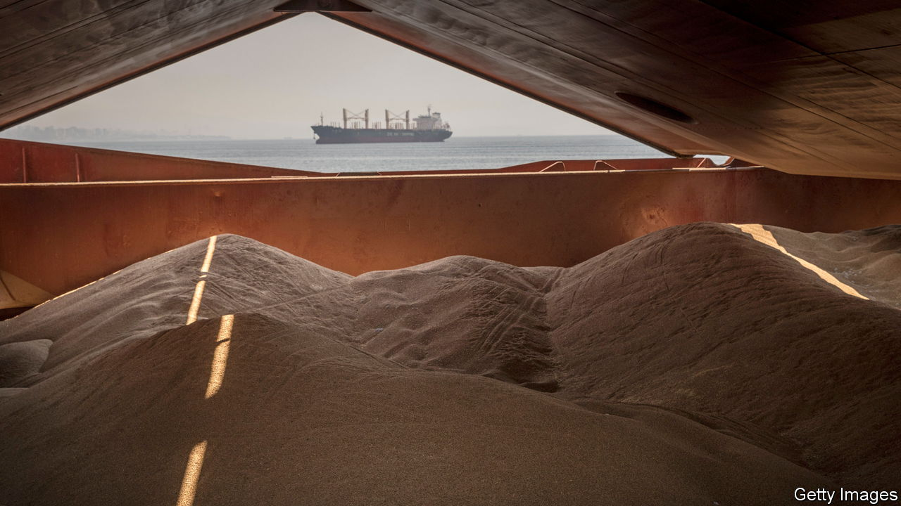
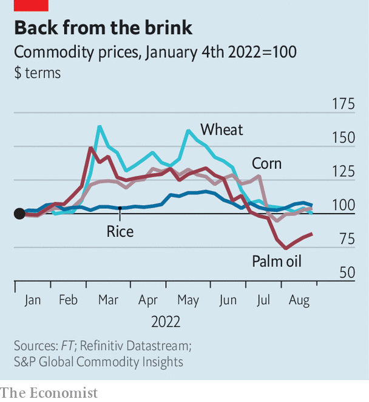

###### Commodities

# Against expectations, global food prices have tumbled 

##### Why the war in Ukraine has caused less disruption than feared 

 

> Aug 22nd 2022 


Six months after Russian tanks rolled into Ukraine, an inflationary shock is still ripping through boardrooms, finance ministries and households. But in one crucial area, prices have come back to Earth. The cost of grains, cereals and oils, staples of diets around the world, has returned to levels last seen before the war began. 

Russia and Ukraine are agricultural powerhouses—until recently, the world’s largest and fifth-largest exporters of wheat and two largest exporters of sunflower oil. It was not, therefore, a surprise that  in February and March, driven by fears that exports would be disrupted by war; indeed, the worry was that shortages would persist, decimating grain stocks and causing mass starvation.

 


That terrible outcome now appears to have been been avoided. Last week wheat futures in Chicago, for delivery in December, dropped to $7.70 per bushel, far below the $12.79 they reached three months earlier and back to their level in February. Corn is also back to its pre-war price. Meanwhile, palm oil, found in thousands of dishes from ice cream to instant noodles, has dropped back not only to its pre-war price, but below it (see chart). 

The  brokered by the United Nations, allowing Ukrainian grain exports to leave the port of Odessa, can only explain a fraction of the shift: it was signed in late July, after most of the decline in prices. More can be credited to the strength of Russian wheat exports. America’s agriculture department suggests that Russian farms, far from being disrupted, will export a record 38m tonnes in 2022-23, some 2m tonnes more than they managed the previous year. A bumper harvest is underway, in part due to good weather earlier in the year, and there is strong demand from traditional importers in north Africa, the Middle East and Asia.

The worries about shortages may have been overstated in the first place. Charles Robertson of Renaissance Capital, an investment bank, argued at the time that cereal traders were overexcited—wrongly grouping together long-term disruption to oil-and-gas supplies and less plausible prolonged disruption to the food supply. “Global wheat stocks were extremely high,” says Mr Robertson, “which told us either that the relationship between stocks and prices had broken down or...that speculation had got ahead of itself.”

The sheer volume of speculation on futures markets may also help explain the volatility. Michael Greenberger of the University of Maryland, formerly a division director at the Commodity Futures Trading Commission, a regulator, notes that rules limiting speculation are routinely avoided by American banks, which assign swaps to their foreign subsidiaries.

The drop in prices will not immediately feed through to consumers. Wheat and other cereal prices have returned to their pre-invasion levels when priced in dollars, but not in many other currencies. The greenback has climbed this year on the expectation of more rapid interest-rate rises by the Federal Reserve, leaving some  struggling. The Turkish lira is down by 27% against the dollar this year and the Egyptian pound is down 18%. The countries are two of the three largest wheat importers in the world. 

Prices were high by historical standards even before the war, and there is no guarantee they will not rise again. Droughts across much of the world will affect crop yields. Meanwhile, fertilisers are still expensive. Urea, a compound used in the production of nitrogen-based ones, currently runs to $680 per tonne—down from $955 in mid-April, but still a lot more than the $400 it cost a year ago. That reflects the surging cost of natural gas, an ingredient in fertilisers. With fuel prices in Europe continuing to hit record highs, there may be more nasty surprises in store. ■


