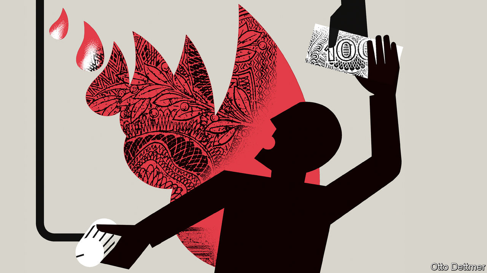

###### Free exchange

# How to avoid energy rationing 

##### Politicians should pay attention to the latest economic literature 

 

> Aug 25th 2022 

Across europe, two questions will set the political weather this winter. How high will my energy prices go? And what will the government do to protect me? Attempting to shelter from the gathering storm, French and Spanish politicians, among others, have already capped or otherwise lowered gas and electricity prices. With wholesale gas futures for early 2023 still climbing—up to more than €300 ($299) per mwh, from less than €30 last summer—and Europe’s economic indicators blinking red, more will follow suit. That prospect is enough to drive economists to despair.

Politicians want to protect voters from big bills, but also need to cut energy use, so as to avoid blackouts and reduce Russia’s oil-and-gas revenues. Price caps help voters, but do so inefficiently and reduce the incentive to cut energy use. Until recently, however, economists would have said that their impact on fuel consumption was minor and their impact on gas consumption uncertain. A body of research had found that consumers were largely unresponsive to higher petrol prices: they need to drive to work, and will do so even if expensive. In this analysis, capping prices would not make a huge difference to energy consumption.

Yet a new batch of studies have overturned the conventional view, suggesting prices really do matter. The difference reflects a change in research methods. The earlier generation of studies analysed aggregate data, such as weekly sales and prices in a region, not demand from individual consumers or even driving patterns. This is a problem because crucial information gets lost when aggregating data. A mild increase in the weekly average price could hide a drop at the start of the week. If that drop encourages more demand, an aggregate analysis might find that a higher price leads to more consumption, not less. And prices at the pump are not set in isolation. They respond to demand, making the price-demand relationship two-way. Disentangling this is tricky.

More recent research analysing micro data has produced striking results. To assess how consumers react to higher petrol prices, Laurence Levin of Visa, a payments firm, and co-authors looked at daily card transactions from 243 American cities in the late 2000s. They found a sizeable response. For a 10% rise in petrol prices, consumption fell by about 3%. They also showed that, if they had used aggregate data, they would have concluded there had been a much smaller drop. Christopher Knittel of the Massachusetts Institute of Technology and Shinsuke Tanaka of Tufts University used even more granular data, looking at a Japanese fuel-economy app, and found similar results with one extra detail: drivers not only responded to higher prices by driving less, they also drove more carefully to save fuel. 

Natural gas, like petrol, is also an essential good. But here, too, new research finds that consumers cut back when prices are higher. Maximilian Auffhammer of the University of California, Berkeley, and Edward Rubin of the University of Oregon looked at 300m energy bills in California. In some parts of the golden state similar households are supplied by two different gas firms, which employ different price-adjustment mechanisms—providing the researchers with something akin to the treatment and control groups that are often used in medical research. They established that a 10% rise in gas prices led to an average 2% drop in consumption. An interesting variation hid behind these figures. During summer months, there was hardly any response to prices; in winter, households cut use by 4%

California’s price changes were small compared with those Europe is facing. How households respond to enormous price shocks has rarely been studied, owing to a lack of real-world data. One exception is that produced by Ukraine, which Anna Alberini of the University of Maryland and co-authors have studied, looking at price rises in 2015 after subsidies were cut. They found that among households that did not invest in better heating or insulation a doubling of prices led to a 16% decline in consumption.

Policies to help households cope with high prices have also been studied—and the results are bad news for politicians capping prices. In California, where a government programme cut the marginal price of gas for poor households by 20%, households raised their consumption by 8.5% over the next year to 18 months. Ukraine has found a better way to help. Households struggling to pay their bills can apply for a cash transfer. Since such a transfer is unrelated to consumption, it preserves the incentive for shorter showers, and thus does not blunt the effect of high prices on gas use. Another option is a halfway house between a price cap and a transfer. An Austrian state recently introduced a discount on the first 80% of a typical household’s consumption, which means people retain an incentive to cut back on anything over that.

Spilt milk

Households are not the only consumers of gas. Early in the war, manufacturers and agricultural producers argued against doing anything that might risk supplies, since production processes took time to alter and output losses could cascade through the economy. But initial evidence from the German dairy and fertiliser industries suggests that even heavy users respond to higher prices. Farmers have switched from gas to oil heating; ammonia, fertiliser’s gas-intensive ingredient, is now imported instead of being made locally. 

Over time, households and industry will adapt more to higher prices, meaning that with every passing month demand for gas will fall. If Europe’s politicians are serious about cutting gas use, they should heed the latest research and avoid price caps. There is even a self-interested case for doing so. Without high prices to encourage households and industry to cut back on their energy consumption, governments will have to find ways other than the price mechanism to allocate scarce resources. Who wants to be the politician to have introduced rationing? ■


