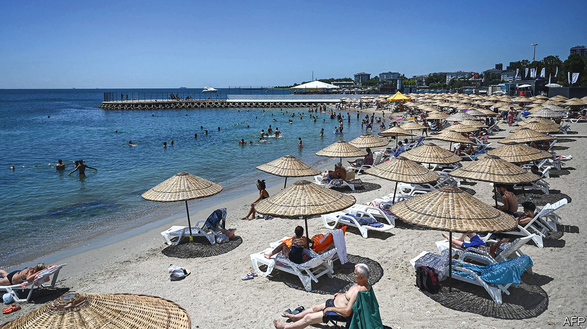

###### Mates’ rates

# The connection between Russian sanctions and bizarre Turkish monetary policy 

##### Russian cash has uses beyond the obvious 

 

> Aug 25th 2022 

Many countries are moving away from Russia, but one is getting closer: Turkey. Russian tourists and émigrés are pouring into Istanbul and the country’s coastal resorts, snapping up properties by the thousand. Russia is helping to fund a nuclear plant costing $20bn in Akkuyu, in the south. While many countries have cut exports to Russia since its invasion of Ukraine, Turkey’s have surged by 60% in dollar terms. Western firms, constrained by sanctions, appear to be using Turkey as a go-between to export to Russia.

Turkey’s bizarre monetary policy is one reason why the country is so keen on Russian cash. Despite inflation soaring to 80%, on August 18th Turkey’s central bank cut its interest rate from 14% to 13%—the opposite response to what any sane economist would recommend. Recep Tayyip Erdogan, Turkey’s president, wants lower borrowing costs in order to goose the economy, and thus improve his chances at the election next summer. But loose monetary policy has caused the lira to slide. It has lost three-quarters of its value against the dollar since 2018, and a weaker currency adds to Turkey’s inflation difficulties by raising the cost of imports still higher.

Enter the sanctions-busting gambit. Turkey desperately needs foreign currencies in order to buy lira on financial markets, thus supporting the currency’s value without raising rates. The central bank has probably spent tens of billions of dollars in this way in recent months. Russia is swimming in hard currency from exports of hydrocarbons, and is short on friends and foreign goods. Turkish exports to Russia help bolster Mr Erdogan’s foreign reserves, since exporters now have to exchange some of their foreign earnings with the government for domestic currency. Sanctions-busting and madcap monetary policy are thus two sides of the same coin. 

American politicians have signalled their unease at Turkey’s strategy. Analysts warn it risks secondary sanctions. But Mr Erdogan sees money as more important than warm relations with the West. “He has an election to win,” says Timothy Ash of BlueBay Asset Management. “He is going to push it to the limit”. 


