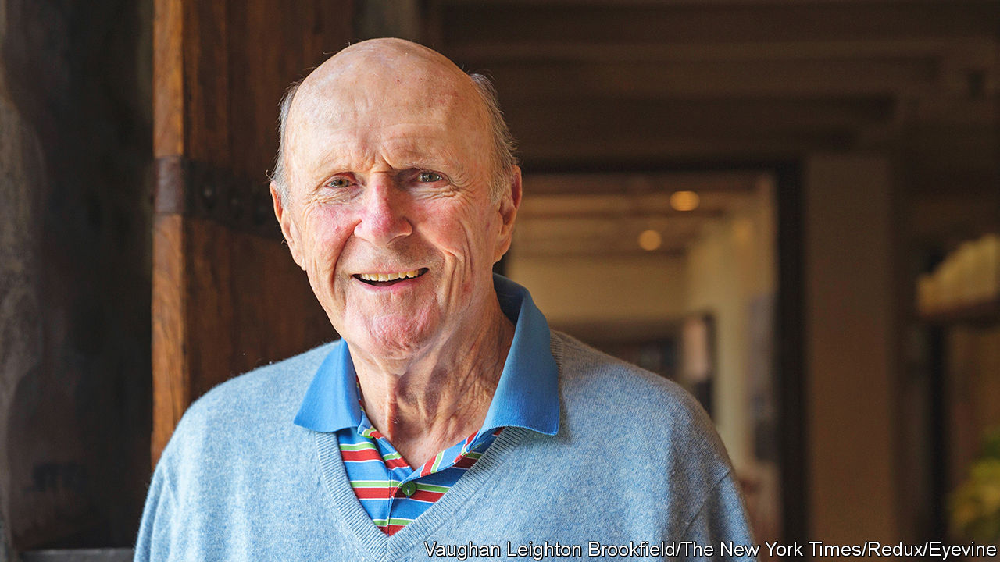

###### Animal spirits

# The hedge-fund manager who embodied an era 

##### Julian Robertson was a jock; today’s funds are run by nerds 

 

> Aug 25th 2022 

Julian robertson was the archetypal hedge-fund manager. He had the kind of Southern charm that inspired fierce loyalty and opened the wallets of Wall Street titans. He was competitive, energetic and athletic—in short, a classic jock—who flew his staff out west on his private jet for gruelling hikes, mountain climbs and dips in icy lakes. 

He founded the archetypal hedge fund, too. Mr Robertson picked stocks—buying firms he liked and going short on those he did not. And he was exceptionally good at it. He set up his fund, Tiger Management, in 1980 aged 48, with just $8m. Between then and its peak in 1998 its annual returns averaged 32% after fees (the s&amp;p 500 delivered 13%). By 1998, the fund managed $22bn.

This expansion may have been his undoing. Tiger began betting on currencies. In 1998 it lost almost $2bn in a single day when the yen surged against the dollar. The fund then bet against the tech boom. It lost 19% in 1999 and a further 14% in the first few months of 2000, before Mr Robertson shut it down.

“I didn’t want my obituary to read ‘he died getting a quote on the yen’,” he recalled in 2013. So he invested in young managers, often former employees. His pawprints are all over Wall Street. A litter of “tiger-cub” funds flourished, and 200-odd hedge funds can trace their roots to him in some form or another.

But his death on August 23rd comes as the cubs are struggling. Last year Bill Hwang blew up Archegos, his family office. This year a fund run by Chase Coleman, another cub, is down by 50% or so. Today the most successful hedge funds are mostly run by quants who rely on algorithms not instinct. Mr Robertson was the archetype of an era, but that era has come to an end.


