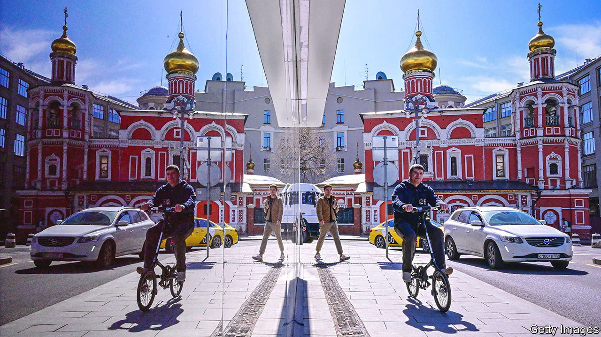
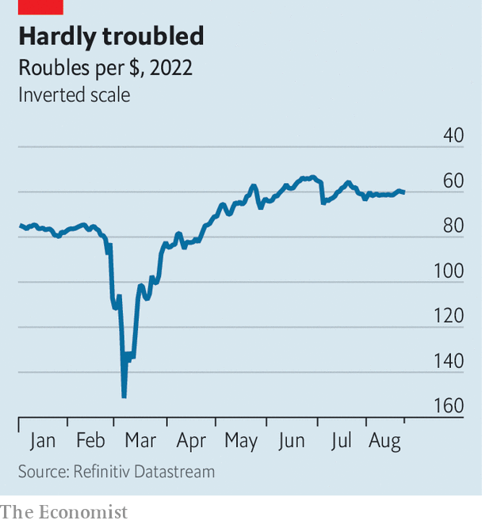

###### A one-way ticket to nowhere

# Western sanctions will eventually impair Russia’s economy 

##### The most potent are the least talked about 

 

> Aug 24th 2022 

When russia invaded Ukraine on February 24th, “Oleg”, a senior executive at a Russian airline, braced for turbulence. It did not take long to arrive. Within days Western countries had barred his firm’s aircraft from entering their airspace. They also prohibited exports of plane parts and semiconductors to Russia: a problem, since three-quarters of the country’s commercial fleet comes from America, Europe or Canada and parts are needed for repairs. Many analysts predicted the industry would crash before the summer. In fact, airlines have managed to rotate their planes to keep viable routes open. But they will not be able to defy gravity for ever. Some are starting to cannibalise grounded aircraft for parts. Oleg expects many planes to be unsafe to fly within a year or two. 

The delayed but dangerous descent of Russian aviation illustrates the insidious power of Western sanctions. Since February America and its allies have unleashed an unprecedented arsenal to try to squash Russia’s economy, the world’s 11th largest, hoping to stall the war effort, prod people and plutocrats to protest and deter other foes (namely China) from similar escapades. Some sanctions, such as freezing the assets of Kremlin cronies, are old tactics on a new scale. Those meant to cut Russia from the financial system—the exclusion of commercial banks from swift, a messaging network, and the immobilisation of $300bn in central-bank reserves—are novel bazookas. A third type, comprehensive export bans, had previously targeted single firms, not an entire country. 

Yet wave after wave of penalties—the eu passed its seventh package in July—. Meanwhile, as gas prices rocket, the sanctions’ political costs are mounting. So is the West losing the economic war? Not quite. As with the aviation industry, it will take time for the damage to materialise. Russia, a country with low external debt and heaps of foreign-exchange reserves, was always unlikely to succumb to a financial heart attack. Even when sanctions are most successful, such as when they forced Libya to abandon weapons of mass destruction in 2003, past regimes have taken years to work. To assess how effective the West’s arsenal is proving,  has ranked a trio of measures—the freezing of oligarch assets, financial sanctions and trade restrictions—on a scale from pretty useless to truly hurtful. Our analysis suggests that they will, in time, start to seriously impair Russia’s economy.

The least effective sanctions are those that have won the most publicity: the blacklisting of apparatchiks deemed close to the Kremlin. World-Check, a data firm, reckons that 1,455 members of Russia’s kleptocratic elite are now unable to travel to some or all Western countries, or to access their possessions there, or both. The frozen assets comprise bank deposits and market securities, held in escrow accounts at Western banks. They also include must-have tycoon toys such as country cottages, football clubs, jewellery and yachts, seized by live-streamed crews of policemen at rivieras around the planet. 

Targeting oligarchs is an attractive approach for governments that need to be seen to be doing something. It also gives Russia few direct means of retaliation. Western moguls own little there; many American and European firms have already written off their Russian investments. Accordingly, Western enforcers are seeking greater powers to go after the Fabergé eggs. America’s Department of Justice wants to use anti-mafia laws to liquidate the assets seized and give the proceeds to Ukraine. The eu is proposing to make the violation of sanctions a crime, which would toughen up enforcement across the bloc. 

Yet most of the assets targeted by the West end up slipping through the net. Anders Aslund, a former adviser to the Russian and Ukrainian governments, reckons that just $50bn, out of $400bn of offshore assets that are blocked on paper, has so far been frozen. Oligarchs have hidden some of their offshore treasures behind as many as 30 layers of shell companies incorporated in the Cayman Islands, Jersey and other havens, with redacted disclosure documents in multiple languages. Others keep a grip on assets they ostensibly no longer control by transferring ownership to kin or placing puppets on the board. 

Missing the boat

Meanwhile, the enforcement of these sanctions is left to the private custodians of said assets, from Swiss wealth managers to marinas in St Tropez, which often lack the means or inclination to probe all that deeply. Big banks often refuse to move funds on behalf of suspicious entities if they are found to be at least 25% controlled by designated Russians (the legal threshold is 50%). Yet smaller fintech and crypto firms are less diligent; companies supposed to monitor physical assets, such as harbour managers, are generally clueless. A similar discrepancy exists between jurisdictions. America recently scolded Switzerland and the uae, where dozens of Russian-owned private jets are grounded in the desert, for not doing enough to uncover sanction-evaders. 

It is not clear that freezing such assets does much to hobble Russia’s economy anyway. Most oligarchs hold little political influence. A former Ukrainian energy boss reckons that Vladimir Putin, Russia’s president, is quite happy to see them taken down a notch. Meanwhile, efforts to confiscate the assets and send the proceeds to Ukraine have gone nowhere.

Financial measures, the second type of sanctions, target the nerve centres of the Russian economy: commercial lenders and the central bank. The former have faced a sliding scale of prohibitions since the invasion, depending on their size and proximity to the Kremlin. Capital-market sanctions, the softest kind, bar Western investors from buying or selling bonds or shares issued by 19 Russian banks. Ten lenders, including the two biggest by assets, have been kicked out of swift, which more than 11,000 banks use globally for cross-border payments. Twenty-six can no longer facilitate international transfers in American dollars, after Uncle Sam banned its own banks from offering “correspondent-banking” services to them. 

Such measures have bite. Research by Stefan Goldbach and colleagues at the Bundesbank shows that, between February 1st and April 30th, the swift suspensions caused a near-total collapse of money transfers between the excluded Russian banks and the German branch of Target 2, the system for clearing payments between euro-zone banks. Alternatives to swift, such as telex, are clunky and slow. Bans on correspondent banking are powerful, too. Not only is the dollar used directly to settle about 40% of cross-border trade, but it also serves as a staging post in many transactions involving second-tier currencies. Now Russia must sometimes resort to barter, a cumbersome and risky option. 

Yet financial sanctions have failed to choke off most payments. Banks that process Europe’s voluminous purchases of Russian fuel, notably Gazprombank, are still allowed to use swift. Much of the rest is being channelled, legally, through smaller banks that remain connected to the network. Doing without dollars is trickier. India, which has been guzzling Russian oil since February, is still looking for a viable way to pay for it in rupees. But a jump in payment volumes going through cips, China’s home-grown swift, from May to July suggests China is having more luck. Trading volumes in the yuan-rouble pair on the Moscow exchange have reached records of late. 

 


Freezing the reserves held by the Central Bank of Russia (cbr) in the West, equal to about half of its $600bn-worth total stash, has had similarly mixed results. Within hours of the measure being announced, the rouble’s value against the greenback, which the central bank could no longer defend, cratered by more than 30% (see chart). As the cbr cranked up interest rates to halt the fall, from 9.5% to 20%, domestic credit tightened, hurting demand and pushing Russia into recession. In June the sanctions also forced Russia into its first major foreign-debt default for more than a century after they prevented the central bank from processing $100m in payments due to bondholders. 

Yet it took just a few weeks for the rouble to rebound, allowing the cbr to slash rates fast, to 8% on July 25th. The official exchange rate does not reflect the true appetite for the currency: capital controls, first imposed in the wake of the cbr freeze, remain largely in place. But it still points to a flaw in the West’s original plan. While the cbr’s foreign stash of dollars and euros remains off-limits, Russia earns fresh hard currency every day, thanks to its giant oil-and-gas exports. This means it does not need to borrow, making its default largely inconsequential. 

Which leaves trade restrictions, another two-pronged measure. Actions to curb Russia’s oil-export revenues, which last year contributed 36% of its federal budget, have received more attention than they deserve. America no longer imports any Russian oil, but it bought little in the first place. The eu has pledged to stop buying seaborne crude oil from Russia in December, and refined petroleum in February. It is already buying a little less: a combined 2.4m barrels per day (bpd) in July, against 2.9m before the war. Most of those barrels, however, are being picked up by India and China, albeit at a discount of around $25 relative to the price of Brent crude, the global benchmark currently at $101. No embargo is planned on Russian gas, which is harder to replace and brings in less than 10% of the Kremlin’s revenue.

Whether Russia is earning less now than it would without sanctions is debatable. Rystad Energy, a consultancy, reckons it will lose up to $85bn in oil-and-gas tax income this year, out of a potential bounty of $295bn, because of the discount. Then again, it is partly the threat of a Western embargo that has kept global oil prices at such high levels. Capital Economics, another consultancy, estimates that Russia has sold its oil at an average price of $85 per barrel since February, higher than 90% of the time since 2014. And contrary to early expectations, Russia is continuing to export nearly as much petroleum as it has in recent years.

Might that change when the eu’s import ban comes into force in the next few months? Finding new buyers to mop up the 2.4m bpd shunned by the bloc will be difficult. Moreover, from December 31st eu and British insurers, which dominate the oil-shipping market, will be barred from serving tankers carrying Russian cargo. That could prove a big obstacle. Many ports and canals may not allow ships through if the risk of oil spills is not covered. Reid l’Anson of Kpler, a data firm, thinks such frictions will force Russia to cut production by 1.1m bpd by the end of 2022, equivalent to about 14% last year’s exports.

Yet there is already talk that Europe will delay its bans if the winter proves too harsh. Commodity traders say that, at such discounts, there will always be buyers. China and India may self-insure; Russia has said it will offer reinsurance. If its oil exports really do dwindle, the market is so tight that prices may jump, nullifying the impact. America, realising this, is trying to convince its allies to impose a price cap on Russian oil—something which could prove hard to implement. Shadowy traders in Bahrain or Dubai may cheat to secure bigger volumes. Russia may retaliate by withholding oil for a short period, provoking a price spike and putting pressure on the West to back down.

Let the chips fall

The most potent sanctions are, in fact, the least discussed: export controls. In successive salvos since February, Western governments have made it compulsory for a range of domestic industries to seek licences before selling to Russia, and they are rarely granted. The restrictions go well beyond “dual-use” products—those with both military and commercial applications, like drones and lasers—to cover advanced kit such as chips, computers, software and energy equipment. They also target low-tech goods, such as chemicals and commodities, that are usually restricted only if set for Iran or North Korea. 

The breadth of such sanctions is remarkable. What makes America’s particularly vicious, however, is the “Foreign Direct Product Rule” (fdpr), which extends the controls not just to products made in the United States, but also to foreign ones made using American software and tools or containing American inputs. When America pioneered the fdpr in 2020 to prevent Huawei, a Chinese telecoms giant it suspected of spying, from acquiring advanced semiconductors, it hammered the firm, even though plants in America account for just 15% of global chipmaking capacity. This time America claims that global chip exports to Russia are down 90% from last year.

That is bad news for the country’s manufacturing sector, which needs imported inputs. Mr Putin has worked hard since 2014 to insulate Russia’s financial system against Western sanctions—by de-dollarising its trade, diversifying its central-bank reserves and developing home-grown payment networks—but the same is not true of the country’s industry, which up until the war began remained woven into the global trading order, even if less so than other countries. 

Chips and other electronic components from 70 different American and European firms have been found in Russian weaponry. Other industries, from mining to transport, require foreign parts and expertise to carry out maintenance. A German supplier to the Moscow metro reckons that, if it stopped providing servicing, the network would see disruptions within a month and be paralysed after three. Russia also needs nifty software and hardware to develop new products, from consumer electronics to electric cars. 

Some effects are already visible, even though export controls kicked in late (most had a one-to-three-month grace period). Manufacturing output fell by 7% between December and June, led by carmaking (a 90% fall), pharma (25%) and electrical equipment (15%). In May Russia eased safety standards to allow for the production of cars without airbags and anti-lock brakes. A lack of high-tech kit has hampered Russia’s 5g roll-out. The country’s cloud-computing champions, such as Yandex, an internet firm, and Sberbank, a lender, are struggling to expand data centres. The chip shortage is hindering new plastic-card issuance on mir, the domestic payment system. A lack of specialised vessels may hobble Russia’s Arctic drilling plans; a dearth of foreign technology and know-how could even slow down old-school oil-and-gas extraction. Basic industries, such as the mining and refining of metals, have slumped, too. 

Russia is trying to fight back. Previously it tapped the unauthorised grey market to source sensitive Western tech and military kit, often from resellers in Asia and Africa. In June it went further by legalising “parallel” imports, allowing Russian firms to bring in goods, such as servers and phones, without the trademark holder’s consent. Artem Starosiek of Molfar, a Ukrainian intelligence firm, says there has been a boom in “credit-card tourism”, as tour operators that once organised covid-vaccine trips for Russians now fly them to buy Visa-issued cards in Uzbekistan. Trade between Western countries and Russia’s neighbours, such as Georgia and Kazakhstan, has grown rapidly since the invasion. 

Yet it is hard for an entire economy to be run on smuggled goods, especially when some of them are scarce everywhere. Chinese firms, which usually supply a quarter of Russia’s imports, have been slow to help, since they too fear losing access to essential Western parts. Even Huawei has curtailed its links with Russia. The shortages will therefore last, with their effects compounding over time as wear and tear takes its toll and the rot spreads from one industry to the next. The result will be a slow, grinding degradation of Russia’s economy.

This degradation will be compounded by the sanctions’ less tangible effects. Konstantin Sonin of the University of Chicago reckons several hundreds of thousands of Russians—many of them highly skilled—have left the country since the invasion. More than 1,200 foreign firms have also pledged to leave, according to scholars at Yale University. The imf forecasts that the country’s growth rate in 2025-26 will have fallen by roughly half, compared with estimates from before the outbreak of war. So long as America and its allies maintain their sanctions, Russia’s industrial backbone, intellectual brawn and international links will fade, and its future will be one of sagging productivity, little innovation and structural inflation. Economists were wrong to predict an instant crash. What Russia is getting, instead, is a one-way ticket to nowhere. ■


