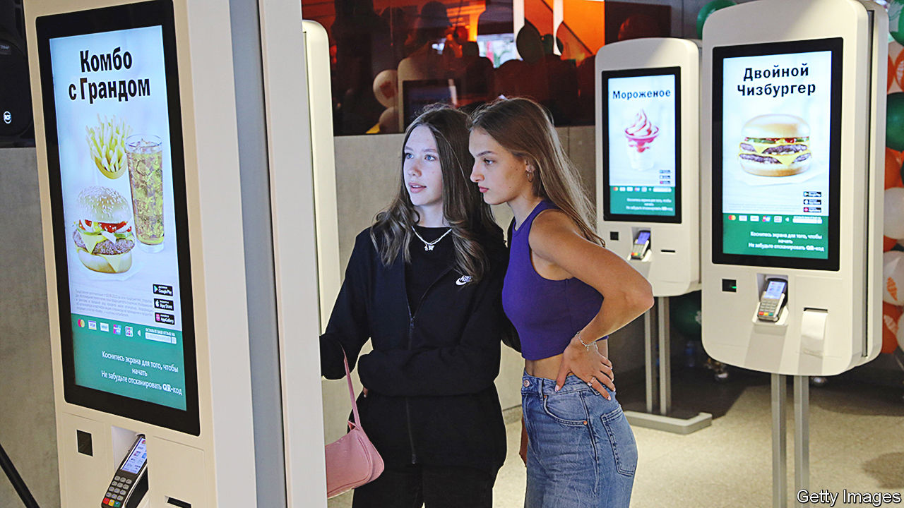

###### Grin and bear it

# Why the Russian economy keeps beating expectations 

##### Few thought it would be holding up six months into the war 

 

> Aug 23rd 2022 


Even in normal times, the Russian economy is about as transparent as a Siberian snowstorm—and these are not normal times. Since  the Central Bank of Russia (cbr), and Rosstat, the official statistics agency, have stopped publishing data on everything from trade to investment; many question the reliability of those numbers that are still emerging. Investment banks, no longer advising clients on Russian companies, have pared back their research efforts. Multilateral organisations have pulled economists .

In the blizzard, a furious debate has erupted about how the Russian economy is performing. A recent paper by five researchers at Yale University, which has drawn widespread attention, says that a retreat of Western firms, plus sanctions, are “crippling” it. Any apparent economic  are a mirage. “Putin-selected statistics are then carelessly trumpeted across media and used by reams of well-meaning but careless experts in building out forecasts which are excessively, unrealistically favourable to the Kremlin,” the researchers argue. Others are less gloomy. “The economy is not collapsing,” wrote Chris Weafer, a respected Russia-watcher, in a recent paper. Where does the truth lie?

After Russia invaded Ukraine, its economy went into free fall. The rouble lost more than a quarter of its value against the dollar. The stockmarket crashed, forcing regulators to suspend trading. Western companies pulled out of Russia, or pledged to do so, by the hundred, as their governments slapped on sanctions. Within a month analysts had revised down their forecasts for Russian gdp in 2022 from growth of 2.5% to a decline of close to 10%. Some were even gloomier. “Experts predict Russia’s gdp will contract up to 15% this year, wiping out the last 15 years of economic gains,” the White House reported. 

Both sides of the debate agree the country is still hurting. Massive increases in interest rates in the spring, designed to stabilise the collapsing rouble, along with the withdrawal of foreign businesses, have pushed it into recession. In the second quarter gdp fell by 4% year on year, according to official figures. Many of the country’s 300 single-industry cities hurt by sanctions are in a full-blown depression. Lots of people, especially educated types, have fled; others are shifting assets out of the country. In the first quarter of 2022, the latest available data, foreigners pulled out $15bn-worth of direct investment, easily the worst figure on record. In May 2022 Russian remittances to Georgia were an astonishing ten times higher in dollar terms than the year before. 

 


But ’s analysis of data from a wide variety of sources suggests that Russia’s economy is doing better than even the most upbeat forecasts predicted, as sales of hydrocarbons have fuelled a record current-account surplus. Take, for example, a “current-activity indicator” published by Goldman Sachs, a bank, a real-time measure of economic growth (see chart 1). This declined dramatically in March and April, if not on a scale comparable with the global financial crisis of 2007-09 or even the invasion of Ukraine in 2014. In subsequent months it has recovered.

Other measures tell a similar story: of a recession, but not a deep one, at least by Russia’s volatile standards (see chart 2). In June industrial production was 1.8% down on a year earlier, according to a paper published by JPMorgan Chase, another bank. An index of service-sector growth, compiled by sending surveys to managers, shows a smaller hit than during previous crises. Electricity consumption seems to be growing again, after an initial decline. The number of railway loadings, a proxy for goods demand, is holding up. 

Meanwhile, inflation is easing. From the start of 2022 to the end of May consumer prices rose by about 10%. The fall in the rouble made imports dearer; the withdrawal of Western companies cut supply. But prices are now falling, according to Rosstat. An independent source, published by State Street Global Markets, a consultancy, and PriceStats, a data firm, derived from online prices, shows similar trends. In its public statements, the cbr now worries about falling prices as well as inflation. 

 


A stronger rouble has cut the cost of imports. And Russians’ inflation expectations have fallen. A data set from the Cleveland Federal Reserve, Morning Consult, a consultancy, and Raphael Schoenle of Brandeis University shows expected inflation over the next year has dropped from 17.6% in March to 11% in July (see chart 3). With plentiful gas, Russia is also unlikely to see a European-style surge in inflation produced by higher energy prices.

Falling prices are not the only thing helping households. True, the unemployment rate, at an all-time low of 3.9% in June, is misleading. Many companies have furloughed staff, some without pay, in order to avoid registering redundancies. But there is not much evidence of a jobs calamity. Data from HeadHunter, a Russian jobs site, suggest that the economy-wide ratio of jobseekers to vacancies rose from 3.8 in January to 5.9 in May—making it harder to find a job than before—and then fell back a bit. Data from Sberbank, Russia’s largest lender, indicate that median real wages have sharply increased since the spring. 

In part because the labour market is holding up, people can keep spending. Sberbank’s data suggest that in July real consumer spending was pretty much unchanged from the start of the year. Imports fell in the spring, partly because many Western firms stopped supplying them. Yet the decline was not severe by the standards of recent recessions, and imports are now bouncing back fast (see chart 4).

Three factors explain why Russia keeps beating the forecasts. The first is policy. Vladimir Putin has little understanding of economics, but he is happy to delegate economic management to people who do. The cbr is stuffed with highly qualified wonks who took swift action to prevent economic collapse. The doubling of interest rates in February, in combination with capital controls, shored up the rouble, helping to cut inflation. The general public know that Elvira Nabiullina, the bank’s governor, is serious about keeping a lid on prices, even if this does not make her a popular figure.

The second factor relates to recent economic history. Sergei Shoigu, Russia’s defence minister, may have been on to something in February when, according to the , he told the British government that Russians “can suffer like no one else”. This is the fifth economic crisis the country has faced in 25 years, after 1998, 2008, 2014 and 2020. Anyone older than 40 has memories of the extraordinary economic tumult brought about by the fall of the Soviet Union. People have learned to adapt, rather than panic (or revolt). 

Parts of Russia’s economy have long been fairly detached from the West. That comes at the cost of lower growth, but it has made the recent increase in isolation less painful. In 2019 the stock of foreign direct investment in the country was worth about 30% of gdp, compared with the global average of 49%. Before the invasion only about 0.3% of Russians with a job worked for an American firm, compared with more than 2% across the rich world. The country requires relatively few foreign supplies of raw materials. Thus the extra isolation has not had much of an impact on the figures to date.

The third factor relates to hydrocarbons. Sanctions have had a limited impact on Russian oil output, according to a recent report by the International Energy Agency. Since the invasion, Russia has sold in the region of $85bn-worth of fossil fuels to the eu. The way in which Russia spends the foreign currency thus accumulated is something of a mystery, given sanctions on the government. There is little doubt, though, that these sales are helping Russia to continue to buy imports—not to mention pay soldiers and buy weapons.

Until Mr Putin leaves office, Western investors will be reluctant to touch Russia. Sanctions will remain. The cbr acknowledges that while Russia does not rely much on foreign materials, it is desperate for foreign machinery. Over time, sanctions will take a toll, and Russia will produce goods of a worse quality at a higher cost. But for now its economy is stumbling along. ■


