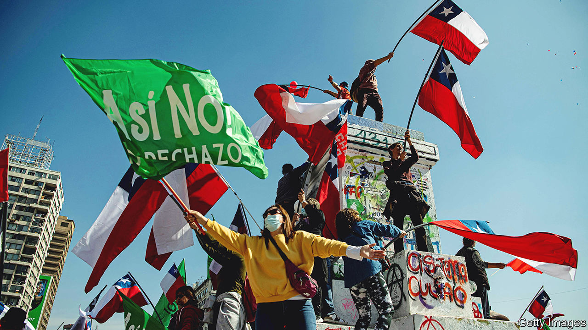
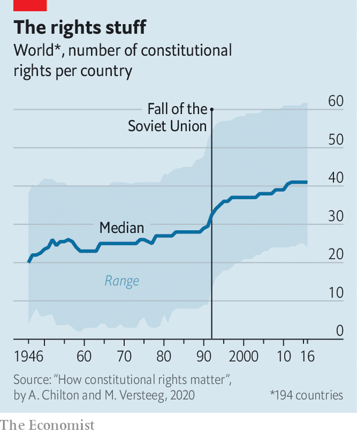

###### The temptation to tinker

# Dictators and utopians are fond of fiddling with constitutions 

##### Both are bad, though for different reasons 

 

> Aug 25th 2022 

In 2014 tunisia adopted a new constitution, three years after Zine El Abidine Ben Ali, the country’s dictator, was ousted in a revolt. It made Tunisia into a democracy that guaranteed religious freedom and equality between men and women. With the failure of the Arab spring, Tunisia’s enlightened charter became a beacon. 

On July 25th Tunisia’s current president, Kais Saied, snuffed it out. Mr Saied had already suspended parliament. Last month he held a referendum on a new constitution. Amid boycotts, it was approved by just 28% of potential voters, which was nonetheless enough to make it law. It allows Mr Saied to declare an indefinite state of emergency and rule by decree. Parliament can no longer impeach him. Military courts can try civilians.

Tunisia’s rewritten constitution empowers a despot to act as he pleases. On the other side of the world, Chile’s democratic government may soon find its hands tied. On September 4th Chileans will vote on a new constitution of their own. Written after protests against inequality in 2019, it reads more like an activist’s wish-list than a set of ground rules for government. Besides rights to education, health, housing, work and leisure, Chileans would enjoy rights to “nutritionally complete” food, “neurodiversity” and the “free development” of their “personality, identity and life projects”. One study by the Centre for Public Studies, a Chilean think-tank, concluded that implementing the new charter could raise government spending by between 9% and 14% of gdp.

Despite their very different outcomes, both Tunisia’s and Chile’s constitutional changes spring from popular disillusionment with democracy. Tunisians had lost faith when their new democracy failed to bring prosperity; their apathy let Mr Saied get away with a power grab. Chileans’ trust in political parties was low for years before the protests began. 

Nor are they isolated examples. Since 2015 over a dozen presidents in Africa have ignored or weakened term limits, some through constitutional amendments. There has been a string of both amendments and full-blown rewrites in Latin American countries in the relatively recent past, including in Bolivia, Ecuador and Venezuela. But whereas previous waves of constitutional reform—in Africa after the end of colonialism, for instance, or ex-Soviet states after the fall of the ussr—enshrined liberal principles, this latest wave travels in the other direction.

Scholars identify two kinds of illiberal reform. The first has been called “abusive constitutionalism” by Rosalind Dixon at the University of New South Wales in Sydney and David Landau at Florida State University. “There is an emerging tendency for authoritarian actors to use the forms of liberal democracy to erode its substance,” says Dr Dixon. The second is a trend towards micro-management, with charters guaranteeing an ever-growing number of highly specific rights that, in more stable countries, are usually left to lawmakers. 

The letter and the spirit

Start with the first trend. Before he invaded Ukraine, Vladimir Putin, Russia’s president, was busy fortifying his position at home. In 2020 Russia’s parliament rubber-stamped a batch of amendments that could let him rule until 2036. To make sure Mr Putin would win a referendum on the amendments, the Kremlin pressed public sector workers to vote and bussed in eastern Ukrainians to whom they had given Russian passports. 

The real purpose, which was to prolong and strengthen Mr Putin’s power, was obscured by dozens of crowd-pleasing promises to make pensions inflation-proof, ban gay marriage, protect the Russian language and so on. Such omnibus amendments are “really new constitutions masquerading as amendments,” says Richard Albert of the University of Texas at Austin.

Turkey’s president, Recep Tayyip Erdogan, is another fan of such tactics. In 2017 a package of 18 amendments was approved in a referendum stacked in his favour. Dr Albert estimates they rewrote or repealed around 40% of the original constitution. The new charter allows the president to appoint judges, weakens parliament, and erases the office of prime minister. Mr Erdogan could rule until 2034. 

Tunisia was following in the footsteps of Egypt, which rewrote its constitution in 2012 after throwing out a dictator who had been in charge for 30 years. That text was replaced in turn when the military retook power in 2013, with a document limiting the president to two four-year terms. In 2019 Abdel-Fattah al-Sisi, the holder of that office, made a series of changes that cleared the way for him to rule until 2030.

“Incumbents use referendums when they’ve struggled to get support from parliament or the courts—and usually they package the amendments in ways that hide their true intentions,” says Nic Cheeseman, a professor of democracy and international development at the University of Birmingham. In Uganda in 2005, for instance, President Yoweri Museveni presented measures that bolstered multiparty politics, while also scrapping term limits. “He mixed the good with the bad to muddy the waters,” says Dr Cheeseman.

 


Another trend is the proliferation of rights (see chart). Constitutions have become longer since the United States first codified one in 1787 (it ran to seven articles). Most of the growth comes from an expansion of so-called “social rights”, to things like housing, health care, food and work. Rights for the environment and specific ethnic groups are also spreading. Chile’s proposed constitution would, at 388 articles, include all of these and be among the longest in the world (India’s 145,000-word epic holds the crown). 

But in Latin America, it would not be out of place. The Comparative Constitutions Project, led by Zachary Elkins, Tom Ginsburg and James Melton, a trio of academics, analyses charters around the world. It reckons that of the ten countries that enshrine the most rights in their constitutions, five are in Latin America. Ecuador’s constitution of 2008 leads the ranking with 99 rights, including to locally produced food and the “commendable and steady exercise of cultural and artistic activities”. Bolivia, Venezuela, Mexico and Brazil also feature. 

While abusive constitutionalism undermines democracy, stuffing charters with rights seems less obviously bad. Putting rights into a constitution can encourage reluctant governments to actually enforce them. Empirically, though, it can often be a worrying indicator. “There is a correlation: the more rights you have on paper, the less they are protected in practice,” says Mila Versteeg, director of the Centre for International and Comparative Law at the University of Virginia. 

Syria’s constitution, for instance, mandates that the state should create jobs and enforce “social justice”. It is scant comfort to the government’s critics languishing in dungeons that it also promises to protect freedom of expression. Venezuela’s constitution bestows the right to comfortable housing and to salaries sufficient to enable workers to “live with dignity”. None of that has stopped Nicolas Maduro’s regime from plundering state coffers and reducing the country to penury. 

Autocrats can also use promised rights as bribes, says Dr Dixon. Ecuador’s constitution of 2008 includes rights for indigenous groups to be consulted over mining and logging projects on their lands. That won then-president Rafael Correa support from activists. Yet the constitution also gave the president the power to outline a “national development plan” and dissolve Congress if it obstructed it. When indigenous people protested against mining projects on their lands, Mr Correa had them charged with terrorism, disbanded environmental and indigenous organisations, and threatened judges who ruled that the mines were unconstitutional. 

Despite the hopes of their left-wing authors, research suggests that, in practice, the benefits of extensive social rights often flow mostly to the rich. A paper by Octavio Luiz Motta Ferraz, a researcher at King’s College London, notes that, of 4,343 lawsuits in Brazil citing the constitutional right to health between 2005 and 2009, 85% originated in the country’s richest states, though these hold just 57% of the population. In 1997, a man with a rare disease sued the government for not providing a treatment only available at a private clinic in America. Brazil’s taxpayers were forced to cover treatment, transportation, accommodation and food costs of around $64,000 ($118,000 in today’s money).

Necessary, not sufficient

There is no template for how to write the ideal constitution. America’s Supreme Court has nine justices with lifetime appointments. Switzerland’s has 38 justices who change every six years. Both documents work reasonably well. Japan’s constitution has similar amendment rules to Alabama’s. Yet it has never been altered since it was ratified in 1946, while Alabama’s has been amended almost 1,000 times since 1901. Britain, New Zealand and Israel dispense with the idea of a single written charter altogether. 

The idea that the text of a constitution, if perfect enough, can ensure success has also proved wrong. Tunisia is sliding towards dictatorship not because its old constitution was ill-drafted but because terrorism, an economic downturn and covid-19 hurt citizens’ belief in their young democracy. “We don’t know which way the causal arrow goes: Do you have a good system because you never rewrote your constitution or do you never rewrite your constitution because you have a good system?” says Adam Chilton, a constitutional scholar at the University of Chicago. 

But academics have noticed patterns. Frequently changed constitutions are often a symptom of political corrosion, and tinkering can cause chaos in turn. Attempts to amend charters have led to violence in Burkina Faso, Burundi and Togo among others in recent years. The world’s longest charters, such as India’s and Brazil’s, are also among the most changed. 

There is a strong case for brevity, too, in which constitutions establish the ground rules of how a state functions and leave the specifics to politicians. Overly long constitutions often create conflicts between articles that can only be resolved with further tampering. And “if everything is highest law, then nothing is highest law anymore,” points out Dr Versteeg. Omnibus amendments require voters to balance the merits and drawbacks of many changes at once, making it harder to generate consensus. 

Indeed, that seems to be one of the lessons from Chile’s experience. Polls suggest the new constitution will be rejected. The experience of trying to write it has left the country more polarised today than it was when it started. ■

