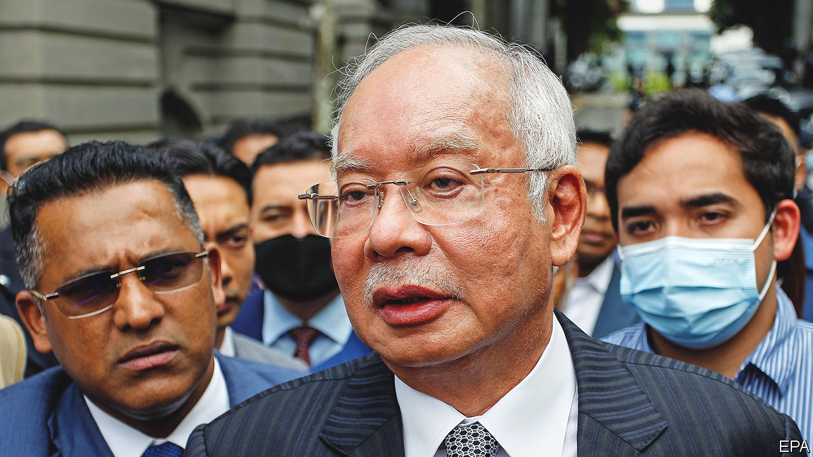

###### Impunity at bay

# A brazen kleptocrat has gone to jail in Malaysia. He must stay there 

##### Najib Razak’s comeuppance strengthens the rule of law, but could still be undone 

 

> Aug 25th 2022 

It was a case to make kleptocrats blush. Some $4.5bn of public funds were stolen—more than the entire annual revenue of almost half the world’s governments. Much of the money was squandered on high living: a superyacht, gambling sprees, a $23m diamond necklace. Some was even spent making a film about financial fraud, “The Wolf of Wall Street”, as if to taunt the investigators trying to track the stolen funds around the world.

In the end, however, the gumshoes got their man. Malaysia’s highest court this week upheld  of Najib Razak, the country’s prime minister at the time of the theft, through whose personal accounts more than $700m of the stolen funds passed. He has been  for his part in the scandal and ordered to pay a fine of $47m.

It is a gigantic victory for the rule of law, not just in Malaysia, but globally. America’s Department of Justice was among the first to implicate Mr Najib, and it has since zealously hunted for the money extracted from 1mdb, a state investment fund. The investigation spanned at least six countries, including financial centres such as Singapore and Switzerland. Goldman Sachs, a big investment bank, paid the Malaysian government $3.9bn to settle lawsuits related to its role. Seldom, if ever, have so many governments co-operated to bring a sticky-fingered foreign potentate to book. Many a crooked leader must be reading the headlines with a shudder.

Within Malaysia, the reverberations are all the louder. Mr Najib, the son of a former prime minister, had for decades been a leading light of the United Malays National Organisation (umno), the party that ruled the country from independence in 1957 until 2018, when voters ejected it because of the scandal. Malaysians were so appalled by the scale of the theft that they repudiated the politics of ethnic and religious division, which umno had used to distract them from cronyism and corruption. 

However, umno has since clawed its way back to power, owing to the fractiousness of the opposition. Although the prime minister, Ismail Sabri Yaakob, has distanced himself from Mr Najib and refrained from intervening in the judicial process, a big faction within the party has been militating for the rehabilitation of its former leader. The jailing should strengthen Mr Ismail Sabri’s hand and avert a return to baseness-as-usual.

Unfortunately, the battle against impunity is not yet over. For one thing, many other high-profile corruption trials remain under way. A verdict is imminent in an influence-peddling case involving Rosmah Mansor, Mr Najib’s wife. Ahmad Zahid Hamidi, the president of umno and an ally of Mr Najib, is the subject of two trials, facing a total of 87 charges of corruption. They deny the charges against them. And several other cases involving Mr Najib himself have yet to conclude. A thorough reckoning is required if Malaysia is really to shed its culture of graft. 

There is also the question of whether Mr Najib might be able to wangle a royal pardon. Sultan Abdullah, Malaysia’s king, has the power to expunge his conviction completely. The two are from the same state, Pahang, and appear friendly. Mr Najib has tried to depict himself as a pious ally of the little guy, persecuted by the elites—a claim that has, astonishingly, won him some sympathy among voters disillusioned by the political upheaval since his fall.

In short, a comeback is not impossible. That would be a horrifying turn of events. Not only would it set Malaysia back on a path to looting disguised as politics; it would also signal to kleptocrats everywhere that there is always a way out. A man whose guilt has been so clearly and meticulously established, and upheld by several courts, yet who has not shown any remorse or even admitted his crime, must not be allowed to walk free. It is hard to imagine a worse precedent for Malaysia and the world. The king, at the apogee of Malaysia’s institutions, must stand by them, not by his felonious fellow dynast. ■

