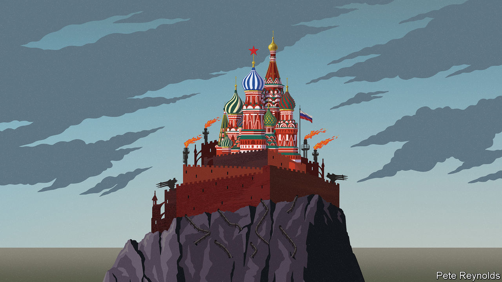

###### Russia, geopolitics and the world economy

# Are sanctions on Russia working? 

##### The lessons from a new era of economic warfare 

 

> Aug 25th 2022 

Six months ago Russia invaded Ukraine. On the battlefield a war of attrition is taking place along a thousand-kilometre front line of death and destruction. Beyond it another struggle is raging—an economic conflict of a ferocity and scope not seen since the 1940s, as Western countries try to cripple Russia’s $1.8trn economy with a novel . The effectiveness of this embargo is key to the outcome of the Ukraine war. But it also reveals a great deal about liberal democracies’ capacity to project power globally into the late 2020s and beyond, including against China. Worryingly, so far the sanctions war is not going as well as expected. 

Since February America, Europe and their allies have unleashed an unprecedented barrage of prohibitions covering thousands of Russian firms and individuals. Half of Russia’s $580bn of currency reserves lies frozen and most of its big banks are cut off from the global payments system. America no longer buys Russian oil, and a European embargo will come fully into effect in February. Russian firms are barred from buying inputs from engines to chips. Oligarchs and officials face travel bans and asset freezes. America’s “KleptoCapture” task-force has seized a superyacht that may have had a Fabergé egg on board.

As well as satisfying Western public opinion, these measures have strategic objectives. The short-term goal, at least initially, was to trigger a liquidity and balance-of-payments crisis in Russia that would make it hard to finance the Ukraine war and thus alter the Kremlin’s incentives. In the long run the intent is to impair Russia’s productive capacity and technological sophistication so that, if Vladimir Putin aspires to invade another country, he would have fewer resources to hand. A final aim is to deter others from warmongering.

Behind such ambitious goals lies a new doctrine of Western power. The unipolar moment of the 1990s, when America’s supremacy was uncontested, is long gone, and the West’s appetite to use military force has waned since the wars in Iraq and Afghanistan. Sanctions seemed to offer an answer by allowing the West to exert power through its control of the financial and technological networks at the heart of the 21st-century economy. Over the past 20 years they have been deployed to punish human-rights abuses, isolate Iran and Venezuela and hobble firms such as Huawei. But the Russia embargo takes sanctions to a new level by aiming to cripple the world’s 11th-biggest economy, one of the biggest exporters of energy, grain and other commodities.

What are the results? On a three- to five-year horizon isolation from Western markets will cause havoc in Russia. By 2025 a fifth of civil aircraft may be grounded for want of spares. Upgrades to telecoms networks are being delayed and consumers will miss Western brands. As the state and tycoons seize Western assets, from car plants to McDonald’s outlets, more crony capitalism beckons. Russia is losing some of its most talented citizens, who recoil at the reality of dictatorship and the prospect of their country becoming a petrol station for China. 

The trouble is that the knockout blow has not materialised. Russia’s gdp will shrink by 6% in 2022, reckons the imf, much less than the 15% drop many expected in March, or the slump in Venezuela. Energy sales will generate a current-account surplus of $265bn this year, the world’s second-largest after China. After a crunch, Russia’s financial system has stabilised and the country is finding new suppliers for some imports, including China. Meanwhile in Europe, an energy crisis  a recession. This week natural-gas prices rose by a further 20% as Russia squeezed supplies.

It turns out the sanctions weapon has flaws. One is the time lag. Blocking access to tech the West monopolises takes years to bite, and autocracies are good at absorbing the initial blow of an embargo because they can marshal resources. Then there is the blowback. Although the West’s gdp dwarfs Russia’s, there is no wishing away Mr Putin’s chokehold on gas. The biggest flaw is that full or partial embargoes are not being enforced by over 100 countries with 40% of world gdp. Urals oil is flowing to Asia. Dubai is brimming with Russian cash and you can fly with Emirates and others to Moscow seven times a day. A globalised economy is good at adapting to shocks and opportunities, particularly as most countries have no desire to enforce Western policy.

You should therefore discard any illusions that sanctions offer the West a cheap and asymmetric way to confront China, an even bigger autocracy. In order to deter or punish an invasion of Taiwan, the West could seize China’s $3trn of reserves and cut off its banks. But, as with Russia, China’s economy would be unlikely to collapse. And the government in Beijing could retaliate by, say, starving the West of electronics, batteries and pharmaceuticals, leaving Walmart’s shelves empty and triggering chaos. Given that more countries depend on China than America as their largest trading partner, enforcing a global embargo would be even harder than with Russia.

Instead the lesson from Ukraine and Russia is that confronting aggressive autocracies requires action on several fronts. Hard power is essential. Democracies must cut their exposure to adversaries’ choke points. Sanctions play a vital role, but the West should not let them proliferate. The more that countries fear Western sanctions tomorrow, the less willing they will be to enforce embargoes on others today. 

Beyond blockades

The good news is that, 180 days after the invasion, democracies are adapting to this reality. Heavy weapons are , nato is fortifying Europe’s borders with Russia, and Europe is securing new sources of gas and speeding up the shift to clean energy. America is reducing its dependence on Chinese tech and urging Taiwan to improve its military defences. The catch is that every autocracy, not least Xi Jinping’s China, is also studying the sanctions war with Russia and is busy learning the same lessons. Ukraine marks a new era of 21st-century conflict in which the military, technological and financial elements are intertwined. But it is not an era in which the West can assume it has pre-eminence. Nobody can counter aggression through dollars and semiconductors alone. ■


