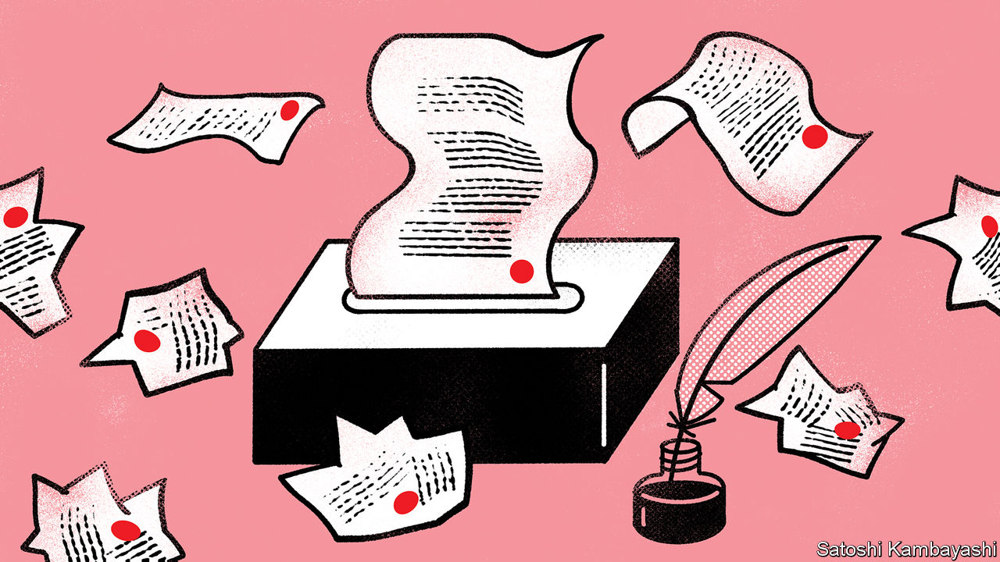

###### Promises and power grabs

# Fiddling with constitutions is usually a risky distraction 

##### Most of the time they should be left alone 

 

> Aug 25th 2022 

A man walks into a library and asks for a copy of the French constitution. “I’m sorry,” replies the librarian. “We don’t stock periodicals.” By one count, France has had 16 constitutions since its first in 1791. Its current version, which dates from 1958, has been amended dozens of times. But it is a beacon of stability compared with many other places. On September 4th Chileans will vote on a new charter. If it is approved, which it should not be, it would replace a document that has been amended 60 times since 1980. The rest of Latin America is equally keen on change. One calculation in 2009 put the average lifespan of a Latin American constitution at 16.5 years, compared with 77 in western Europe. A string of changes in the intervening years will have done little to close that discrepancy. 

In Africa around a dozen countries have amended their constitutions since 2015, mostly to boost or prolong the powers of incumbent leaders. In July Tunisians voted to gut their country’s democratic charter, which dates only from 2014. Kais Saied, Tunisia’s president, can now rule by decree. 

Constitutional change is not always bad. Many of the alterations to France’s constitution have been to conform with rules of the European Union. Ireland’s  in 2018 of its abortion ban was both democratic and wise. America’s introduction of presidential term limits in 1947 was a sensible tweak. Even some of Chile’s  made sense.

But most fiddling is unhelpful. This week . One is the tendency of autocrats—like Vladimir Putin in Russia, Recep Tayyip Erdogan in Turkey and Mr Saied in Tunisia—to amend charters to grant themselves more power. The second is the habit of Utopians to pack constitutions with growing numbers of highly specific “social rights”. Both should be resisted.

The risks of making strongmen stronger are obvious. Constitutions embody the idea of rule by law, not rule by a fallible individual. It is dangerous to entrust any leader with untrammelled power, which is why leaders who seek it usually disguise their aim. Mr Putin, when asking voters in 2020 to rubber-stamp his increased powers and to  until 2036, bundled them with others to make pensions inflation-proof and bolster the minimum wage. Russians voted yes; it was a rotten bargain.

A constitution should establish basic rights, such as freedom of speech and fair trials. It should lay the ground rules for how a state works, such as: is it a presidential system or a parliamentary one? Then it should stop. The ever-shifting details of public policy—pensions, minimum wages and so forth—should be left to the government of the day. Policies must adjust to changing circumstances; budgets must add up. That is harder if lots of big items are set in stone. 

Packing a constitution with inessential things weakens respect for it. If almost every law is the highest in the land, then none is. And the more “rights” are included, the greater the likelihood of a clash. Ecuador’s constitution of 2008, for example, protects both the rights of landowners to oppose resource extraction, and the right of the government to develop the economy. When those conflicted, indigenous landowners’ rights were trampled. Chile’s new draft charter may not be a naked power grab like Russia’s, but it is a confusing mess of micromanagement. It would require the state to enforce a right to sports, for children to be taught empathy for animals and for the joys of Chilean cooking to be promoted. It proclaims a right to housing, but also bans property speculation, making it hard for anyone except the government to invest in building homes. 

Drafters of new charters and the voters who are consulted on them should bear two principles in mind. The first is simplicity. Constitutions are best when the rules are clear and short. The second is caution. The more a constitution is changed, the more prone it is to change in the future; once again, this tends to undermine its authority. 

No real-life constitution is perfect. America’s is admirably short but too hard to update, which is one reason the Supreme Court keeps reinterpreting it. Voters in many countries are unhappy with their governments, so the idea that a fresh constitution might reshape their societies for the better is appealing. But it is usually an illusion. A constitution is a starting-point; governments must still navigate the daily complexities of governing. A flawed or dated constitution can be incrementally improved, as Chile’s old one should be. But unless a society has undergone a revolution, such as the end of communism or apartheid, it is rash to rewrite its basic law from scratch. ■

