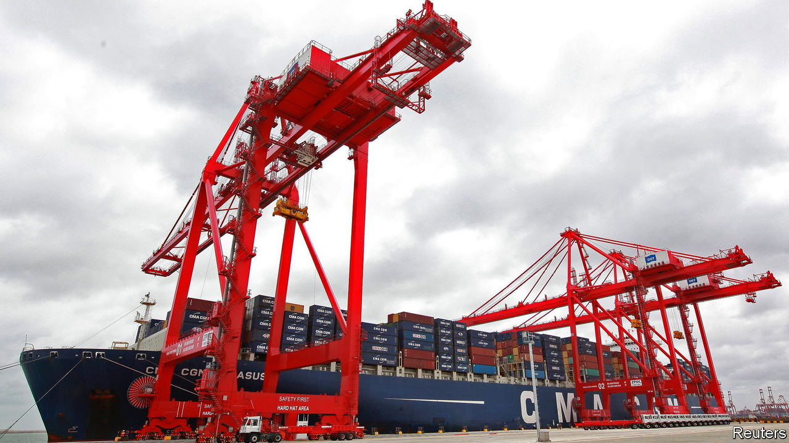

###### Distressing debt

# How China should handle its bad loans to poor countries 

##### Time to work with Western creditors 

 

> Aug 25th 2022 

How big is China’s ? It is hard to pin down a number. The programme has been running for nearly a decade, during which time China has financed hundreds of infrastructure projects in dozens of countries. These include railways in Africa, ports in Asia and roads in Latin America. President Xi Jinping has called it the “project of the century”. The lofty rhetoric and opaque numbers fuelled fears that China was trying to reshape the world, by putting itself at the centre.

In one sense, it succeeded. The developing world is suffering a sovereign-debt crisis and China is at the heart of it. Buffeted by the pandemic, inflation and the war in Ukraine, dozens of countries involved in the Belt and Road Initiative are struggling to pay back loans from China and other creditors. Ethiopia and Zambia are among those restructuring their debts; Sri Lanka needs China’s co-operation to do the same; in time, Cambodia, Kenya and Laos may follow. China’s ruthlessly self-interested  share some of the blame. The country must work with other creditors to resolve the crisis. 

Such teamwork does not come naturally to China. An early test is Sri Lanka, where it has provided cash for ambitious projects. Some of these endeavours, such as big roads and expressways, seem to be worthwhile. But others have been costly flops. A new international airport in Hambantota, in the south, built with a $190m loan from China, has at times struggled to keep the lights on. A Chinese-funded seaport nearby also looks like a dud. Struggling to service its debts, Sri Lanka’s government handed control of the port, on a 99-year lease, to a state-backed Chinese firm in 2017.

White elephants alone did not cause the debt crisis. The blame lies mostly with Sri Lanka’s government for slashing taxes in 2019 and with covid-19 for crushing tourism. But China provided a shovel to burrow deeper into debt. Early in the pandemic, as the island’s debt woes mounted, some officials wanted to approach the imf for a bail-out. But China stepped in, offering emergency loans to boost liquidity. That strategy failed spectacularly this year, when Sri Lanka ran out of dollars to pay for basic imports. By the time it approached the fund in April, its economy was in free-fall. Three months later big protests forced the president .

The hope is that China learns the lesson Western creditors were taught in the 1980s and 1990s, when they repeatedly rescheduled loans, instead of writing them down, prolonging the economic pain in several developing countries. Better still if China learned to work with Western and other rich creditors, which are grouped together in the Paris Club and tend to co-ordinate sovereign-debt restructurings, often in tandem with the imf. China has long resisted such efforts, resenting America’s leading role in those organisations, as well as the club’s commitment to consensus, transparency and “comparable treatment” for all creditors.

However, there are some reasons to be optimistic. China financed a splurge on infrastructure in Zambia similar to the one in Sri Lanka. And it frustrated debt-restructuring efforts after Zambia, too, ran into financial trouble. In 2020, though, it backed the “Common Framework” agreement between the g20 and the Paris Club to co-operate on debt treatments for poor countries. In July, after months of talks, China and other government creditors agreed to provide  in the first such deal under the framework. Now comes talk of China co-chairing a creditor committee with Japan and perhaps India to resolve Sri Lanka’s debt. 

China’s stress test

That would be welcome, as more tests are coming. China has scaled back the Belt and Road Initiative. But it is still not clear if the crisis has prompted a serious rethink in Beijing. In the past China has claimed to offer a better model of development finance, free of the conditions that Western and multilateral lenders impose. It is true that those lenders need to improve their own practices. America, in particular, should not let geopolitical tensions hamper co-operation on debt relief. The onus, however, is now on China as the world’s biggest official lender to take a more responsible approach to dispensing loans abroad—and to work with other creditors when things go bad. ■

