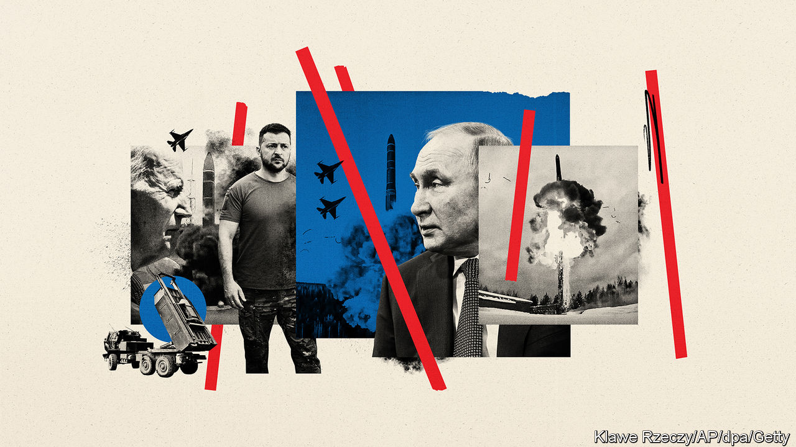
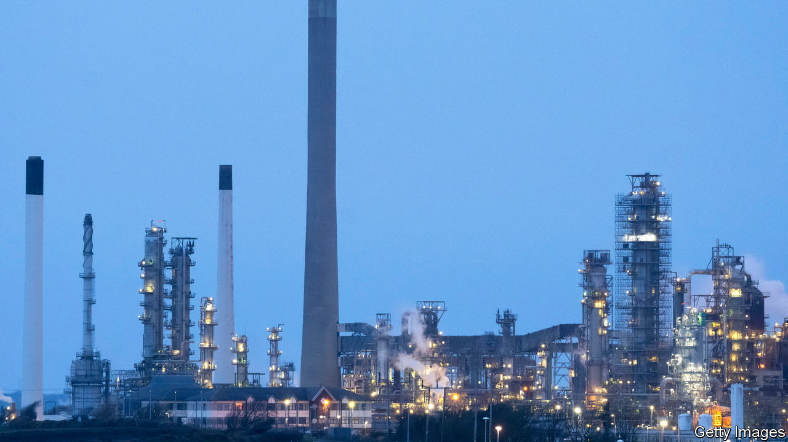
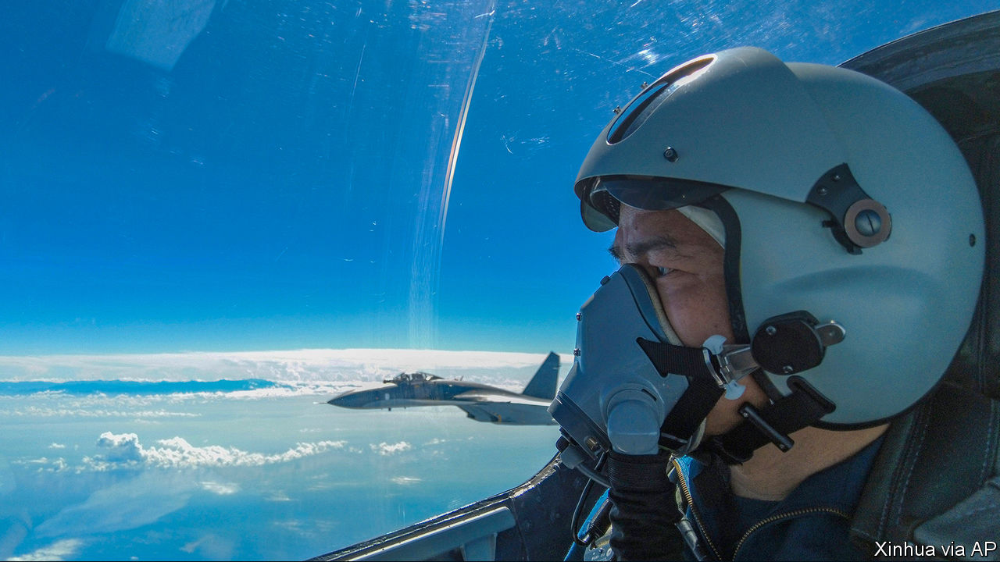
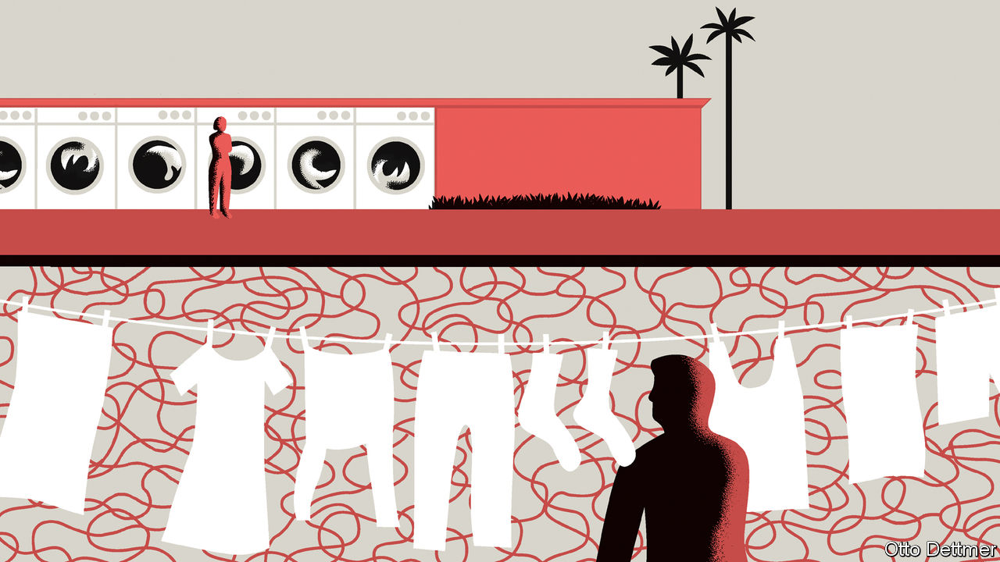

###### On Russia and Ukraine, defence startups, energy bills, China and Taiwan, font selection, leisure time, currency conversions

# Letters to the editor 

##### A selection of correspondence 

 

> Aug 25th 2022 


Increase help to Ukraine

You laid out the case for America not risking escalation of the war in Ukraine to the point where Russia might use nuclear weapons (“”, August 13th). But you did not address the consequences of Washington doing no more than seeing the war continue in Ukraine, which is bearing all the destruction and all the civilian casualties. 

The declaration at the nato summit in Bucharest in 2008 that Ukraine and Georgia will become members of the alliance was the actual moment of commitment. But behind closed doors in many allied capitals, questions are being asked about whether the United States would indeed act on Article 5 if a formal member of nato were subject to Russian aggression. The required American and nato reaction, especially in response to Russian aggression against the Baltic states and Finland, could only be vertical escalation of one form or another, including military action, with the risk of nuclear use. By providing military support to Ukraine in dribs and drabs America is reinforcing doubts about its strategic commitment to any of nato’s members in eastern Europe. If America is so risk-averse for a country to which it has consistently promised full nato membership, what does that tell Vladimir Putin if he extends his aggression?

What America does now militarily for Ukraine has strategic and political implications for the alliance far beyond what happens in the Donbas region, implications which the Biden administration does not seem to understand. This is not an argument for direct nato engagement or facilitating Ukrainian military attacks into Russia, but it is an argument for America doing far more to support Ukrainian armed forces than it is currently doing. 

robert hunter

Former American ambassador to nato

 

The assessments of Russian threat you cited appear to be obsolete. Russia’s invasion of Ukraine this February was already a massive act of escalation that has not been exceeded by Moscow’s response to Western military shipments or Ukrainian counter-attacks. The air strikes following the sinking of the , the flagship of Russia’s Black Sea fleet, and the bombing of Kharkiv following the ammunition depot blasts in the Crimea still pale in comparison to the ferocity of Russia’s initial assaults and to the horrors of Mariupol. 

The clear indicator of Moscow’s response to Western military aid for Ukraine is not Mr Putin’s threat to use weapons never known in history but the recent shift of Russia’s Black Sea fleet to a defensive posture and its retreat towards the Russian port of Novorossiysk. Moreover, the Kremlin’s switch to the war-of-attrition strategy since withdrawing from most of Ukraine’s north makes Russia’s use of tactical nuclear weapons counter-productive. At the heart of this strategy is the expectation that Western support would wear out over time. Bringing Ukraine back into the spotlight under the looming mushroom cloud would achieve the opposite effect. In other words, the Kremlin has more to fear and to lose if it resorts to nukes than if it does not.

mikhail alexseev

Professor of political science

San Diego State University

 


East west defence

Less than half of the 13 firms you highlighted in your article on defence technology operate from Silicon Valley (“”, August 13th). New England is another innovation hub, home to numerous defence hardware and software startups, venture capital, prime subcontractors and labs. The Massachusetts Institute of Technology, not Stanford, has the only top mba programme with a defence tech-focused club. At Harvard, Ash Carter teaches a course on tech competition between America and China. 

This year students at mit and Harvard hosted their first tech and security conference. You should come to the second next April to see that the American business community will help our soldiers and spies defend democracy, without San Francisco if we must.

austin gray

Co-president

mit Sloan Global Security Tech Club


 


Variable energy bills

Another interesting idea that could help households cope with rising energy costs comes from Gabriel Felbermayr, head of the Austrian institute of economics (“”, August 13th). He proposes setting a price ceiling for a standard amount of energy consumed. Every household would get the standard amount of gas or electricity cheaply; any additional consumption would be charged at the much higher market price. The idea is being considered by Austria’s climate minister. 

The proposal has two main advantages: immediate relief for the consumer and maintaining an incentive to save energy. That is in stark contrast to measures such as the German fuel-tax cuts. Of course it would need to be accompanied by additional financial help for the poorest, but that is better than undifferentiated subsidies to everybody.

stefan schulreich

Department of cognitive psychology

University of Hamburg

 


China and Taiwan

Your leader on China and Taiwan claimed that “no country has done more to wreck the status quo than China” (“”, August 13th). We cannot help but ask: who is changing the status quo in the Taiwan Strait, who is threatening peace and stability?


It is America that has been playing the “Taiwan card” to contain China. America has been approving arms sales to Taiwan, stepping up its official exchanges with Taiwan, distorting, obscuring and hollowing out the one-China principle and emboldening “Taiwan independence” activities. It is the Taiwan authorities that have kept seeking American support for their independence agenda. They refuse to recognise the 1992 consensus, which embodies the one-China principle, and go all out to advance de-Sinicisation and promote “incremental independence”. What would you call these moves if they were not changing the status quo and threatening peace in the Taiwan Strait? 


You also said that China is using the crisis “to set new boundaries for its encroachments into what Taiwan considers its airspace and territorial waters” and “could also attempt to impose even stricter limits on the island’s dealings with the rest of the world”. The fact is that Taiwan is part of China’s territory. China has conducted normal military drills in the waters off its own territory. This action is open, transparent and professional and China’s relevant authorities have issued public notices in a timely manner. It is consistent with China’s domestic law, international law, and established international practices. It is both a warning sent to the provocateurs and a legitimate step to uphold China’s sovereignty and territorial integrity. 


Peaceful cross-Strait reunification is in the interest of not only the Chinese nation but also peoples of the world and the international community. The reunification of China will not harm the legitimate interests of any other country, including any economic interests they might have in Taiwan. On the contrary, it will bring more development opportunities to all countries; it will create more positive momentum for prosperity and stability in the Asia-Pacific and the rest of the world; it will contribute more to building a global community of shared future and to peace, development and human progress.


ZENG RONG

Spokesperson of the Chinese embassy


 


A knowledge of font

I must raise an objection to Bartleby mentioning font selection as an example of excessive perfectionism (). Max Miedinger, the designer of Helvetica, the 20th century’s most influential typestyle, once said to me: “We designers are sellers of details too small to be seen, and that is precisely what gives typography its power. The message is somehow warmer, more memorable. The average viewer does not see it, but they do feel it. The last little refinements are what make [the message] sing.” Given how many thousands of blandly typeset lines we all consume each day, font selection could use more attention, not less. 

david calvin laufer

Consulting creative director

Computer Museum of America


 


Theory of the leisure class

There is no way of slicing the data to make Europe’s biggest economies richer than America, you say (, August 13th). Actually, one factor not mentioned is that Americans work much longer hours. For instance, the average German worked 1,349 hours in 2021, and the average American 1,791 hours, according to the oecd. If you then consider that leisure is a matter of choice and has value (specifically, the opportunity cost of not working those extra hours), the gdp of at least some European countries will exceed that of America.

michael witt

Senior affiliate professor of strategy and international business

insead


Devaluing the pound

Adrian Fogarty scolded you for obsessive precision by converting the £1 that Sajid Javid’s father had in his pocket after arriving from Pakistan to $1.20 (, August 13th). Alas, it is worse than mere pedantry. When Mr Javid’s father emigrated to Britain in the 1960s a pound was worth $2.80. Precision without accuracy, now that’s prosody. 

john astell


