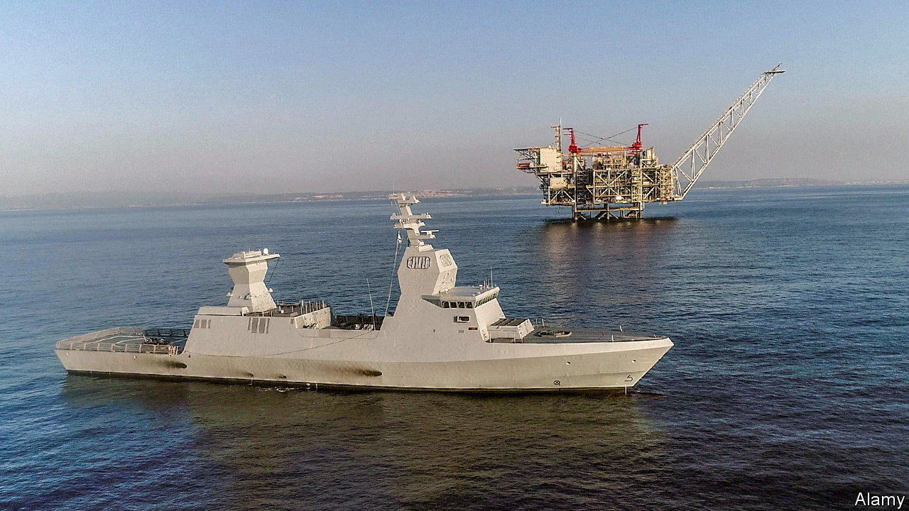
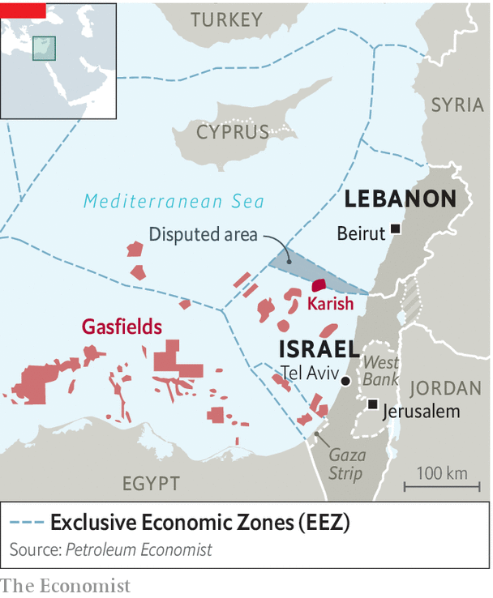

###### An alarming smell of gas

# Mediterranean gas sends sparks flying between Lebanon and Israel 

##### A row over exploration rights is turning violent 

 

> Aug 21st 2022 

In a region with no lack of eternal battlefields, the Mediterranean waters off the shores of Israel and Lebanon could become a new one. A row between the two countries over energy-exploration rights in a disputed triangle of the sea risks spiralling into war. Hassan Nasrallah, leader of Hizbullah, the Iranian-backed Shia movement based in southern Lebanon, warned on August 9th that “any arm” reaching out to rob Lebanon of its wealth “will be cut off”.

 


Mr Nasrallah has no official role in Lebanon’s government but is arguably the most powerful man in the country. Hizbullah’s military force is more powerful and sophisticated than the Lebanese army, with a punchy rocket arsenal and drones supplied mainly by Iran. In early July three of those drones were launched towards a gasfield known as Karish (Hebrew for shark), about 90km off Israel’s coast, partially inside the disputed area. A Greek-owned company, Energean, operating on an Israeli licence, is on the verge of tapping the field. Israeli missiles intercepted and dished the drones, but Mr Nasrallah’s message was clear. He is insisting that Israel must not begin extracting gas in September, as it had planned.

Although Israel has been carrying out air strikes against Hizbullah’s weapons depots and convoys in Syria for over a decade, it has refrained from fighting on Lebanese territory since the end of a ferocious campaign against the militants there in 2006. Neither side wants to repeat that confrontation. Hizbullah managed to withstand Israel’s month-long onslaught and continued to fire missiles at Israeli towns, even though Israel’s air force clobbered Lebanon’s civilian infrastructure. 

Lately, however, Hizbullah has been seeking to boost its credentials as a “resistance” organisation. “Hizbullah has lost a lot of its popularity in Lebanon and needs to regain legitimacy as an armed group,” says Tamir Hayman, a former commander of Israeli military intelligence who now runs the Institute for National Security Studies in Tel Aviv. Iran, Hizbullah’s patron, also wants to keep Israel distracted from the latest negotiations to revive  with America and five other world powers. Aware of this, America has been trying to broker a demarcation of the two countries’ exclusive economic zones in the sea.

Lebanon’s caretaker government under Najib Mikati has called on Hizbullah to keep out of the dispute. But Israeli officials are worried that Hizbullah will be tempted to attack the gas-production platforms again. That could spark a wider conflagration. “Picking a fight with Israel over offshore exploration rights is a convenient way to claim that there is an ‘Israeli occupation’ of the sea and that Hizbullah’s rocket arsenals are justified. It doesn’t mean Hizbullah wants a war, but it could escalate into one,” says Mr Hayman. Both Israel and Egypt have been expanding their navies to defend their gasfields.

The natural gas under the eastern Mediterranean could also help prop up the floundering economies of  and . Offshore gas could fund much-needed infrastructure projects for the Palestinians in Gaza. It has already served to bolster alliances between Israel, Egypt and Jordan, which now have a joint gas pipeline system. Saudi Arabia may be another beneficiary, since its futuristic city, Neom, is being built near the border with Jordan.

Weaving Lebanon into the energy network in the eastern Mediterranean makes sense, but cannot happen as long as Lebanon has no official ties with Israel. The untapped reservoir of natural gas under the sea could also provide a fine alternative for European countries facing energy crises, as they struggle to wean themselves off Russian supplies. But few oil companies would risk conducting exploration work, building production platforms and laying down pipelines if the very process threatened to spark a conflagration. ■

