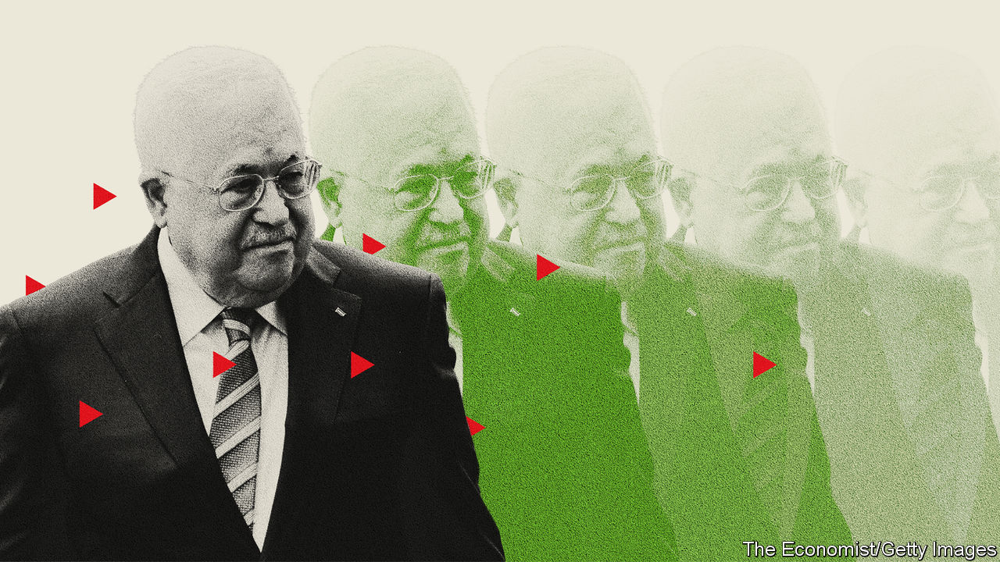

###### Crumbling authority

# The ageing, ailing Palestinian leader does not do much governing 

##### Someone, some day, will have to replace Mahmoud Abbas 

 

> Aug 23rd 2022 

Once a year or so, the Palestinian president puts out something that resembles a proof-of-life video in which he is both kidnapper and captive. Mahmoud Abbas disappeared from public view for almost a week in early June. Social media were rife with rumours about his health. He surfaced on June 8th, delivering a speech by telephone and releasing photos of himself giving it: perhaps not hale and hearty, but at least alive.

This is almost an annual routine for Mr Abbas, who at 86 has a history of heart problems and has had prostate cancer. In 2014, after reports of a stroke, he dragged photographers along as he browsed for baguettes in a bakery by the presidential compound.

Yet rumours of his death always prove exaggerated. He is the world’s fourth-oldest head of state and in the 18th year of a four-year term, in office almost as long as most Palestinians have been alive. Of the four Israelis and Palestinians who stood on the White House lawn in 1993 to announce the Oslo peace accords, he is the lone survivor. An official from Islamic Jihad, a militant Islamist group, jokes that Mr Abbas has induced a crisis of faith. “I thought God decides when it is your time,” he says. “But the president decides for himself.”

Mr Abbas has never named a successor, and the topic preoccupies both Israelis and Palestinians, albeit in different ways. For Israel the question of succession raises fears of instability in the West Bank. For Palestinians it offers the long overdue possibility of change—or perhaps not, because the president may want to ensure that his replacement is a carbon copy of himself.

Some Palestinians wonder why Mr Abbas persists in a job he does not seem to be enjoying. He has delegated many of his responsibilities to aides. On his watch the Palestinian national movement has : there have been no direct negotiations with Israel since 2014, and few efforts to challenge the Israeli occupation through protest or diplomacy. He avoids the press-the-flesh part of politics, too. There is little need to meet your constituents when you are president for life.

He spends a good chunk of time abroad, at his home in Jordan or visiting foreign leaders. This summer he made official visits to France, Romania and Jordan. Most recently he was in Germany, where he was scolded for claiming that Israel had committed “50 Holocausts” against the Palestinians. “They welcome him as an equal,” quips a businessman in Ramallah, the Palestinians’ administrative capital, “even if he controls zero outside his compound.”

Another motivation lies closer to home. His sons, Tareq and Yasser, run an array of businesses in the occupied West Bank, with interests in everything from tobacco to insurance. They are loathed by most Palestinians. The Palestinian Authority, over which Mr Abbas presides, is widely seen as corrupt. “When a new leader comes, the previous regime is completely erased,” says Mkhaimar Abusada, a Palestinian academic. “He’s trying very much to safeguard the interests of the family.”

In theory, the next president will have to be elected (Mr Abbas’s term technically ended in 2009). Fatah, his nationalist party, will have to settle on a candidate. Plenty of names have been floated over the years, among them Jibril Rajoub, a former security boss; Mahmoud al-Aloul, an ex-governor of Nablus; and Mohammed Shtayyeh, the prime minister. If Palestinians had a free vote, they would probably plump for Marwan Barghouti, a charismatic leader of Fatah’s military wing, but he is languishing in an Israeli jail, serving five life sentences. Mr Abbas has managed to outlive another putative replacement, Saeb Erekat, the Palestinians’ longtime chief negotiator, who died in 2020.

Over the past few months a new front-runner has emerged. In May Mr Abbas appointed Hussein al-Sheikh to the number-two job in the Palestine Liberation Organisation. He accompanies the president at many of his meetings with foreign leaders, and his politics mirror those of his boss: a preference for talking with Israel rather than confronting it. The president seems to be grooming him for the top job.

Since 2007 Mr Sheikh has run an office that co-ordinates with the Israeli army, processing work permits and the like for Palestinians. That has made him a trusted figure among Israeli officials. American diplomats, too, describe him as someone they know and like.

The one group that would be unhappy with Mr Sheikh is the one that ought to matter most: his Palestinian constituents. A June poll found that just 3% of them want him as their next president. His work with the Israeli army seems, to many Palestinians, like working with the enemy.

Palestinians have not had the chance to vote in national elections since 2006. A growing number of them want not only a new president but a radically different approach to the conflict. Some 47% of them support dissolving the Palestinian Authority (pa), the government Mr Abbas heads. Support for such a drastic step is always higher in Gaza, where the ruling Islamists of Hamas allow the pa no writ at all, than in the West Bank, where the pa is in charge under Israel’s watchful eye. But even in the West Bank 45% of Palestinians support the idea, according to the Palestinian Centre for Policy and Survey Research, a respected pollster in Ramallah.

Getting rid of the pa would deprive Israel of security co-ordination with the Palestinian police and force it to provide services to Palestinians in the West Bank. It would also put 150,000 people out of a job, since the pa is easily the largest employer in the occupied territories.

That the idea has gained support shows just how unpopular the pa has become under Mr Abbas: to many Palestinians it is less a government than a vehicle for corruption and collaboration. “There are still Palestinians who benefit from the pa, but they’re a small minority,” says Mr Abusada.

Therein lies a paradox. Even if Palestinians wanted to abolish the pa, neither Mr Sheikh nor the other men vying to replace Mr Abbas would be likely to decree themselves out of a job. One day the rumours will prove true and Mr Abbas’s tenure will end. But his replacement may just be a slightly newer model. ■

